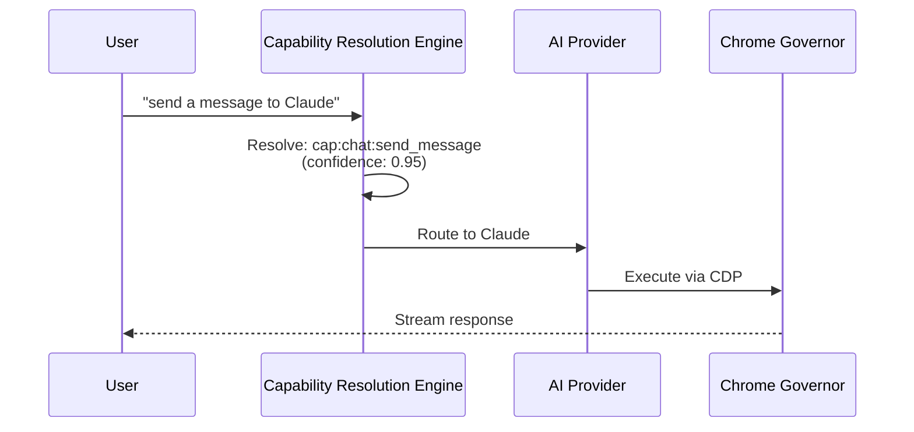
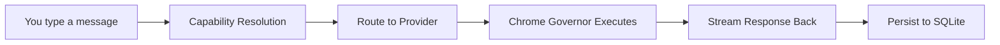

<div align="center">

# 🚀 Vivim

### **Talk to every AI from one place.**

[](https://github.com/owenservera/vivim-final/releases)
[](LICENSE)
[](https://bun.sh)
[](https://nextjs.org)
[](https://www.typescriptlang.org)

**Local-first • Multi-provider • Capability-driven • Open source**

[📥 Download](#download) &nbsp;|&nbsp; [⚡ Quick Start](#quick-start) &nbsp;|&nbsp; [🏗️ Architecture](#architecture) &nbsp;|&nbsp; [📚 Documentation](#documentation) &nbsp;|&nbsp; [🤝 Contributing](#contributing)

</div>

---

## 🌟 What Is Vivim?

> **Vivim is a local-first AI conversation platform** that unifies ChatGPT, Claude, Gemini, DeepSeek, Qwen, and Grok into a single, powerful interface. Run entirely on your machine — no cloud account required.

Instead of juggling multiple tabs or writing provider-specific code, Vivim introduces a revolutionary **capability system**: every AI interaction becomes a typed, composable operation with a unified API. Simply describe what you want in natural language, and the system intelligently figures out how to execute it.

### ✨ Key Features

| Feature | Description |
|---------|-------------|
| 🎯 **Universal Access** | Connect to 16+ AI providers from one interface |
| 🔒 **Local-First** | Your data stays on your machine — privacy by default |
| ⚡ **Real-Time Streaming** | Live response streaming from all supported providers |
| 🧩 **Capability System** | Natural language commands resolved to typed operations |
| 🛠️ **Multi-Surface** | CLI, HTTP API, WebSocket, MCP, and Desktop UI |
| 🔍 **Fully Debuggable** | Complete trace logging via Chrome Governor |

---

## 🎯 How It Works

Vivim's architecture rests on three foundational pillars:

### 1️⃣ Capabilities

A **capability** is an atomic operation — `send_message`, `select_model`, `create_chat`, `upload_file`. Each capability has:
- A unique ID (e.g., `cap:chat:send_message`)
- A category and taxonomy
- Bindings to multiple surfaces (CLI, API, MCP, UI)

When you type *"send a message to Claude"*, the **Capability Resolution Engine** translates that intent into a resolved capability with a confidence score, then executes it against the appropriate provider.



### 2️⃣ Providers

Each AI provider is defined by a **manifest** — a declarative JSON document specifying:
- Endpoints and browser selectors
- Streaming parsers
- Model lists
- Supported capabilities

Vivim currently supports **16 registered providers** with full streaming support for ChatGPT, Claude, Gemini, DeepSeek, Qwen, and Grok. Providers connect through authenticated Chrome browser profiles, interacting exactly as you would manually — but automated.

### 3️⃣ Chrome Governor

The **ChromeGovernor** is the single point of control for all browser automation:
- Manages Chrome processes
- Proxies commands through Chrome DevTools Protocol (CDP)
- Logs complete traces for debugging
- Enforces a strict architectural rule: **no other engine touches the browser directly**

This ensures predictability, debuggability, and maintainability.

---

## 📥 Download

### Windows Installer (Recommended)

Get up and running in seconds with the official installer:

[](https://github.com/owenservera/vivim-final/releases/latest/download/vivim-desktop-setup.exe)

**vivim-desktop-setup.exe** (~44 MB)
- ✅ Includes backend server, frontend UI, and desktop launcher
- ✅ Installs to `%LOCALAPPDATA%\Vivim`
- ✅ Creates Start Menu and Desktop shortcuts
- ✅ Auto-updates enabled

### Manual Installation

Prefer building from source?

```bash
git clone https://github.com/owenservera/vivim-final.git
cd vivim-final

bun install
cd frontend && bun install && cd ..

cp .env.example .env
bun run prisma:generate
bun x prisma migrate dev
bun run seed
bun run dev
```

This launches:
- **Backend** at `http://localhost:9420` (API + WebSocket)
- **Frontend** at `http://localhost:3000` (Next.js)

Open `http://localhost:3000` to start chatting!

---

## ⚡ Quick Start

### Step 1: Install

Choose your preferred method above (Windows installer or manual clone).

### Step 2: Configure

Set your API keys in `.env` (defaults work for local development — keys only needed for live provider connections):

```bash
OPENAI_API_KEY=sk-...
ANTHROPIC_API_KEY=sk-ant-...
GOOGLE_API_KEY=...
DEEPSEEK_API_KEY=...
QWEN_API_KEY=...
```

### Step 3: Launch

```bash
bun run dev
```

### Step 4: Use

Open `http://localhost:3000` in your browser and start a conversation.

**Prefer the command line?** The CLI is also available:

```bash
bun run src/cli/index.ts
```

---

## 🏗️ Architecture

### System Layers

```
┌──────────────────────────────────────────────────────┐
│                   SURFACES                            │
│   CLI  ·  HTTP API  ·  WebSocket  ·  MCP  ·  UI     │
├──────────────────────────────────────────────────────┤
│                CAPABILITY LAYER                       │
│   Resolution  ·  Execution  ·  Taxonomy  ·  Events  │
├──────────────────────────────────────────────────────┤
│               PROVIDER LAYER                          │
│   Registrar  ·  Health  ·  Parsers  ·  Chrome Gov.   │
├──────────────────────────────────────────────────────┤
│                 DATA LAYER                            │
│   Prisma (SQLite)  ·  Node Model  ·  Store Contracts │
└──────────────────────────────────────────────────────┘
```

### Core Engines

Vivim is built around **13 core engines** organized in layers, with 455+ engine files total:

| Layer | Engines | Responsibility |
|-------|---------|----------------|
| **Provider KG** | ProviderRegistrar, ProviderHealthKernel | Register providers, track health status |
| **Capabilities** | CapabilityResolutionEngine, CapabilityEngine | Resolve & execute operations |
| **Session** | ConversationManager, StreamBlockStore | State management, history, streaming |
| **Chrome** | ChromeGovernor | Browser automation, CDP proxy |
| **Cross-cutting** | EventBus, ConfigManager, StreamParser | Shared infrastructure |

### Data Flow



📖 See [Architecture Docs](docs/architecture/overview.md) for the complete deep-dive.

---

## 📚 Documentation

Comprehensive documentation is available in the [`docs/`](docs/) directory:

| Category | Document | Coverage |
|----------|----------|----------|
| **Architecture** | [Overview](docs/architecture/overview.md) | 30-second mental model |
| | [Engines](docs/architecture/backend.md) | Every engine and code path |
| | [Data](docs/architecture/data-model.md) | Schema, Node model, store contracts |
| | [API](docs/architecture/api-philosophy.md) | Routes, WebSocket, surfaces |
| | [Frontend](docs/architecture/frontend.md) | React UI, canvas, slots |
| **Modules** | [Engines](docs/modules/engines.md) | Core computation engines |
| | [Storage](docs/modules/storage.md) | Data persistence layer |
| | [API](docs/modules/api.md) | HTTP API layer |
| | [Desktop](docs/modules/desktop.md) | Tauri desktop application |
| **Runbooks** | [Dev](docs/runbooks/dev.md) | Local development workflow |
| | [Desktop](docs/runbooks/desktop.md) | Tauri build & testing |
| | [Providers](docs/runbooks/providers.md) | Provider setup & testing |
| **Decisions** | [ADR Index](docs/decisions/) | Architecture decision records |
| **Reference** | [Glossary](docs/GLOSSARY.md) | Domain terms and shorthand |

---

## 🛠️ Development

### Prerequisites

| Tool | Version | Install |
|------|---------|---------|
| **Bun** | 1.3.14+ | [Install](https://bun.sh) |
| **Node.js** | 20+ | [Install](https://nodejs.org) |
| **Git** | Latest | [Install](https://git-scm.com) |

### Setup

```bash
git clone https://github.com/owenservera/vivim-final.git
cd vivim-final

bun install
bun run prisma:generate
bun run seed
bun run dev
```

### Available Scripts

| Command | Description |
|---------|-------------|
| `bun run dev` | Start dev server (backend + frontend) |
| `bun run build` | Production build |
| `bun run test` | Run all tests |
| `bun run test:fast` | Unit + architecture tests |
| `bun run typecheck` | Type-check the codebase |
| `bun run lint` | Lint with Biome |
| `bun run format` | Format code with Biome |
| `bun run seed` | Re-seed database |
| `bun run stop` | Kill orphaned dev processes |

### Desktop Build

```bash
# Full desktop build (NSIS installer)
pwsh scripts/tauri/build.ps1

# DevOps toolkit (hash-gated rebuild + test)
bun run devops desktop-loop run --version <x.y.z>
```

📘 See [Desktop Runbook](docs/runbooks/desktop.md) for complete details.

### Testing Strategy

```bash
bun test                    # All tests
bun run test:unit           # Unit only
bun run test:integration    # Integration only
bun run test:e2e            # E2E (Playwright)
bun run test:arch           # Architecture boundary tests
```

---

## 📁 Project Structure

```
vivim-final/
├── src/
│   ├── engines/          # 455+ engine files (core logic)
│   ├── server/           # HTTP API + WebSocket
│   ├── cli/              # CLI entry point
│   ├── storage/          # Database contracts + implementations
│   ├── schema/           # Zod validation schemas
│   └── mcp/              # Model Context Protocol
├── frontend/
│   └── src/
│       ├── app/          # Next.js App Router
│       ├── components/   # React components
│       ├── canvas/       # Canvas live-config
│       ├── engines/      # Frontend engines
│       └── ui/           # Slot system
├── prisma/
│   └── schema.prisma     # 196 models, 3,800+ lines
├── seeds/                # Provider manifests, parsers, capabilities
├── tests/                # Unit, integration, E2E
├── docs/                 # Documentation
├── devops/               # DevOps toolkit
└── scripts/              # Build & utility scripts
```

---

## 🤝 Contributing

We welcome contributions from the community! Please see [CONTRIBUTING.md](CONTRIBUTING.md) for detailed guidelines.

### Quick Start for Contributors

```bash
git clone https://github.com/owenservera/vivim-final.git
cd vivim-final
bun install && bun run prisma:generate && bun run seed
bun run dev
```

### Areas We Need Help

| Area | Opportunities |
|------|---------------|
| 🐛 **Bug Fixes** | Check [open issues](https://github.com/owenservera/vivim-final/issues) |
| 🧩 **New Capabilities** | Register in `src/engines/capability-bootstrap/` |
| 🌐 **Provider Support** | Add manifests in `seeds/providers/manifests.ts` |
| 📖 **Documentation** | Improve docs in `docs/` |
| ✅ **Tests** | Increase coverage in `tests/` |

### Code Standards

- **TypeScript** — Strict mode, no `any`
- **Biome** — Formatting and linting
- **Conventional Commits** — `feat:`, `fix:`, `docs:`, etc.
- **Store Contracts** — Never import `impl/` directly from engines

---

## 🔒 Security

Found a security vulnerability? Please report it responsibly:

1. ❌ **Do NOT** open a public GitHub issue
2. 📧 **Email** security@vivim.dev with full details
3. ⏳ **Wait** for our response before any public disclosure

See [SECURITY.md](SECURITY.md) for our complete security policy.

---

## 📄 License

This project is licensed under the **MIT License** — see the [LICENSE](LICENSE) file for details.

---

<div align="center">

### Ready to get started?

[📥 Download Vivim Desktop](https://github.com/owenservera/vivim-final/releases/latest/download/vivim-desktop-setup.exe) &nbsp;•&nbsp; [📚 Read the Docs](docs/) &nbsp;•&nbsp; [🐙 View on GitHub](https://github.com/owenservera/vivim-final)

**Built with ❤️ by the Vivim Team**

</div>
