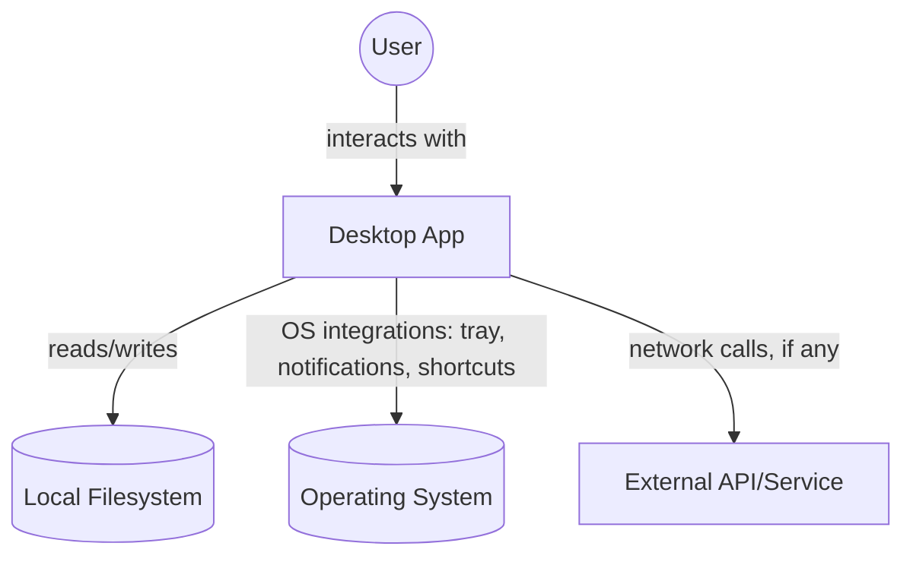
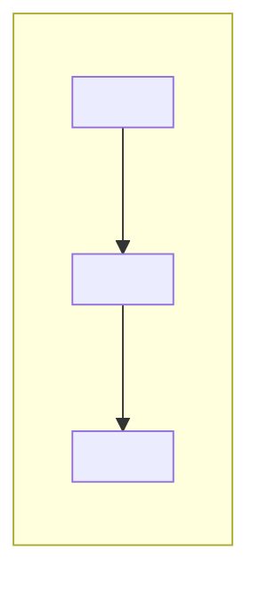
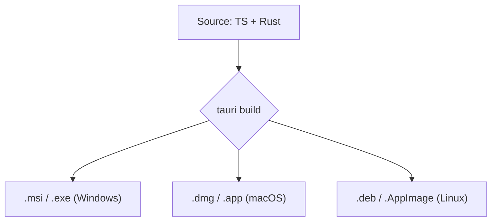
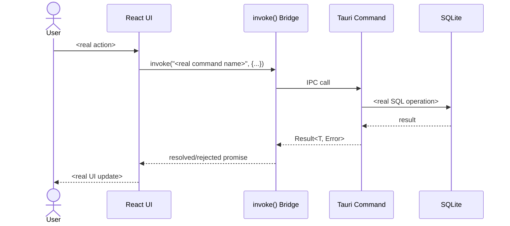
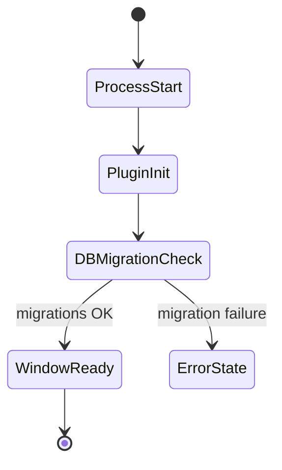
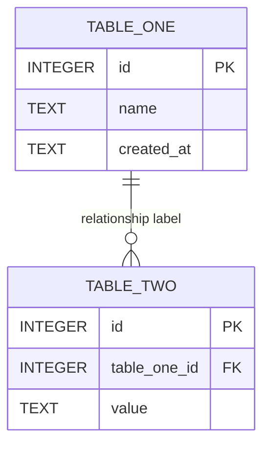

# 02 — ARCHITECTURE & DIAGRAM SPEC
### Generates: ARCHITECTURE.md, DATA-FLOW.md, DATA-MODEL.md

Every diagram below is **mandatory unless genuinely inapplicable** (e.g., no auth means skip the auth sequence diagram, but say so explicitly). Diagrams must be internally consistent with each other and with the inventory from Phase A — same component names everywhere.

---

## 1. `docs/architecture/ARCHITECTURE.md`

### Required diagrams (in this order)

**1.1 System Context (C4 Level 1)** — the app as a black box plus its external actors/systems (user, OS, filesystem, any external APIs, auto-update server, etc.)


Replace nodes/edges with the real ones found in discovery. Remove `ExtAPI` if the app is genuinely offline-only, and state that explicitly in prose above the diagram.

**1.2 Container Diagram (C4 Level 2)** — the process boundary split: Webview (Next.js/React frontend), Tauri/Rust core, SQLite database, any sidecar processes.

```mermaid
graph TB
    subgraph "Webview Process (Next.js / React)"
        UI[React Components]
        State[Client State: e.g. Zustand/Query]
        IPCClient[Tauri invoke() bridge]
    end
    subgraph "Native Process (Rust / Tauri Core)"
        Commands[Tauri Commands]
        Plugins[Tauri Plugins]
        BizLogic[Domain Logic]
    end
    DB[(SQLite Database)]
    UI --> State --> IPCClient
    IPCClient <-->|IPC: invoke/emit| Commands
    Commands --> BizLogic --> DB
    Plugins --> DB
```
Annotate every edge with the actual mechanism name (e.g. `invoke('save_project')`, `tauri-plugin-sql`, specific event names from `emit`/`listen`).

**1.3 Component Diagram — per major subsystem**
For each subsystem identified in discovery (e.g., "Project Management," "Sync Engine," "Settings"), produce one component-level diagram showing its internal modules/files and their call relationships. Use real file/module names as node labels.



**1.4 Deployment / Packaging Diagram**
Show build targets and how the single codebase produces each platform artifact.


Only include targets actually configured in `tauri.conf.json`'s bundle section.

**1.5 Technology Stack Table**
A table: Layer | Technology | Version | Purpose — pulled from actual `package.json`/`Cargo.toml` versions, not generic "Next.js" without version.

### Prose requirements for ARCHITECTURE.md
- A "How a request/action travels" narrative walking one concrete real feature end-to-end through every layer in 1.2, cross-referenced by diagram node names.
- A section on **why** the boundaries are drawn where they are, if inferable (e.g., "all filesystem access is confined to Rust commands; the webview never touches the FS directly" — only state if true).
- A section explicitly listing every trust boundary (webview↔native IPC surface is the main one in Tauri) and what validation happens at each, referencing the security posture noted in discovery.

---

## 2. `docs/architecture/DATA-FLOW.md`

### Required diagrams

**2.1 Sequence diagram per major user journey** (one per journey identified in Phase A/B, minimum: app launch/bootstrap, primary create/read/update flow, primary delete flow, any sync/export/import flow, error path for at least one flow)



**2.2 Event-driven flow diagram** for any `emit`/`listen` usage (background jobs, file-watcher, push-style updates from Rust to UI) — sequence or flow diagram showing the async, non-request/response nature explicitly.

**2.3 Application bootstrap/lifecycle diagram** — state diagram from process start to ready state (DB migration check, window creation, splashscreen if any, plugin init order).



**2.4 Error/failure flow** for at least the most critical operation — what happens to data and UI state when the Rust command returns an error, when the DB is locked/corrupt, when a network call (if any) times out.

### Prose requirements
- For each sequence diagram, one paragraph stating what invariant must hold for the flow to be considered correct (e.g. "the DB write must complete before the UI optimistically-updates" or the reverse, if that's what the code actually does — note if it's optimistic vs. pessimistic).

---

## 3. `docs/architecture/DATA-MODEL.md`

### Required diagram

**3.1 Full ER diagram**, generated strictly from the schema source of truth found in discovery:


Include every real table, every real column with its real type, PK/FK markers, and every real relationship (including many-to-many junction tables, drawn explicitly).

### Required tables (prose, one per real table)
For each table: purpose in plain language, full column list with type/nullable/default/constraints, indexes, triggers, which app features read/write it (cross-link to FEATURE-LIST.md), and retention/lifecycle notes (is it ever purged, archived, user-deletable).

### Required sections
- **Migration history** — list of migrations in order, what each changed, current schema version, and how the app detects/applies pending migrations at runtime.
- **Data lifecycle diagram** — a flow diagram showing where data is created, how long it lives, what deletes/archives it.
- **Local vs. synced data** (if any sync exists) — which tables are local-only vs. synced, and the conflict-resolution strategy if any.

---

## General Mermaid hygiene (applies to all diagrams in the whole pack)
- Use double quotes around any label containing spaces, parentheses, or special characters to avoid parse errors.
- Prefer `graph TD` for hierarchical/system diagrams, `graph LR` for pipelines, `sequenceDiagram` for temporal interactions, `erDiagram` for schema, `stateDiagram-v2` for lifecycles.
- Keep any single diagram under ~25 nodes; split larger subsystems into multiple linked diagrams rather than one unreadable mega-diagram.
- Every diagram must be immediately preceded by one sentence stating what it shows and immediately followed by any caveats/simplifications made.
