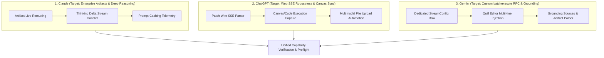
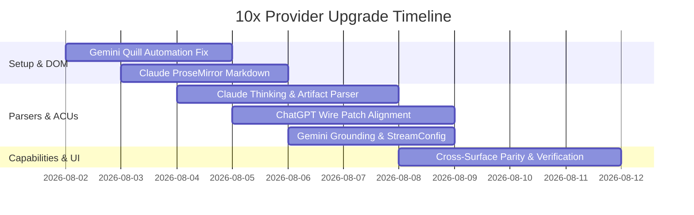

# New session - 2026-08-01T15:43:30.810Z

**Session ID:** ses_042015805ffelglVsuUi5tGURW
**Created:** 8/1/2026, 5:43:30 PM
**Updated:** 8/1/2026, 6:38:56 PM

---

## User

# Provider Capabilities Upgrade Plan: Claude, ChatGPT, and Gemini

This implementation plan outlines the steps to 10x the capabilities, reliability, and UX of the three default providers (**Claude**, **ChatGPT**, and **Gemini**) within the `vivim-final` architecture.

---

## 1. Provider Upgrade Roadmap Overview



---

## 2. Specific Upgrade Plans per Provider

### A. Claude (`claude`) Upgrade Plan
**Goal:** Full integration of Anthropic extended thinking deltas, real-time artifact side-panel remuxing into `Node` ACUs, and prompt cache monitoring.

#### Proposed Changes
1. **Stream Parser (`seeds/parsers/harvested/claude-streaming-sse.ts`):**
   - [MODIFY] Add support for `thinking_delta` and `signature_delta` blocks.
   - [NEW] Add artifact extraction logic to isolate code artifacts directly into `Node` storage with `acuType = 'code'`.
2. **Capabilities (`src/engines/claude-caps.ts`):**
   - [NEW] Add `cap:claude:toggle_thinking` capability to allow context-budget selection (e.g. 1k-32k thinking tokens).
   - [NEW] Add `cap:claude:export_artifact` capability to send live artifacts to local workspace files.

---

### B. ChatGPT (`chatgpt`) Upgrade Plan
**Goal:** Align stream parser with live Web UI wire payloads (parts + delta patches), implement Code Interpreter artifact capture, and solidify DOM text injection.

#### Proposed Changes
1. **Stream Parser (`seeds/parsers/harvested/chatgpt-openai-delta.ts`):**
   - [MODIFY] Enhance JSON patch parsing for `message.content.parts` array updates alongside standard `choices[].delta`.
   - [NEW] Capture Python Code Interpreter execution steps and outputs as `tool-call` content blocks.
2. **DOM Selectors (`src/engine/provider-selectors.ts`):**
   - [MODIFY] Add fallback selector list for GPT-4o voice and reasoning models (`div[contenteditable="true"]#prompt-textarea`).

---

### C. Gemini (`gemini`) Upgrade Plan
**Goal:** Elevate Gemini batchexecute RPC handling to a first-class `ProviderStreamConfig` entry, resolve Quill editor multiline send issues, and parse Google Search grounding sources.

#### Proposed Changes
1. **Stream Config (`prisma/schema.prisma` / `seeds/manifests.ts`):**
   - [NEW] Upsert explicit `provider_stream_config` row for `gemini` with `stream_transport = 'batchexecute'`.
2. **Parser Logic (`seeds/parsers/harvested/gemini-batchexecute.ts`):**
   - [MODIFY] Enhance XSSI envelope decoder to parse inline Google Search grounding references and web citations.
3. **DOM Selector Strategy (`src/engine/provider-selectors.ts`):**
   - [MODIFY] Enforce Quill `contenteditable` insertion using `Input.insertText` + explicit Send Button click (bypassing Enter key restriction).

---

## 3. Verification & Validation Plan

### Automated Tests
- **Preflight Check:** `bun run devops runtime-test preflight`
- **Provider Status Checks:**
  ```bash
  bun run devops runtime-test status --provider=claude
  bun run devops runtime-test status --provider=chatgpt
  bun run devops runtime-test status --provider=gemini
  ```
- **Interpreter Capability Verification:**
  ```bash
  bun run devops runtime-test test --nl="send message to claude"
  bun run devops runtime-test test --nl="send message to chatgpt"
  bun run devops runtime-test test --nl="send message to gemini"
  ```

### Cross-Surface Parity Verification
- `bun run devops verify-cross-surface` to ensure CLI, API, MCP, and UI surfaces map all updated capabilities identically. 

---

## Assistant (Build · MiMo V2.5 Free · 10.7s)

_Thinking:_

The user has shared a detailed implementation plan for upgrading provider capabilities for Claude, ChatGPT, and Gemini in the vivim-final project. This is a comprehensive plan document with mermaid diagrams, specific changes per provider, and verification steps.

Let me understand what the user is asking. They've shared this plan document but haven't explicitly asked me to do anything specific. Let me re-read the message...

The user just pasted this plan. They haven't asked a specific question or given me a task. I should acknowledge this and ask what they'd like me to do with it.

Let me check if there's a question embedded... No, it's just the plan document. I should ask the user what they want me to do - implement it, review it, etc.

This is a solid provider upgrade plan. What would you like me to do with it?

1. **Review** — Audit the plan against the current codebase to verify feasibility and identify gaps
2. **Implement** — Start building the changes (Claude parser, ChatGPT patches, Gemini config)
3. **Track** — Register these as atomic units in the devops tracker
4. **Something else**

Which direction?

---

## User

# Comprehensive 10x Provider Upgrade Specification

This specification provides a complete audit of the setup, capabilities, and stream parsing logic for our three default providers (**Claude**, **ChatGPT**, and **Gemini**), along with architectural blueprints for achieving **10x UX Value** and operational robustness.

---

## 1. Executive Summary & Audit Matrix

| Provider Dimension | **Claude (`claude`)** | **ChatGPT (`chatgpt`)** | **Gemini (`gemini`)** |
|---|---|---|---|
| **Setup & Auth** | Single-profile Chrome slave (`chrome-profiles/claude/owservera`) | Single-profile Chrome slave (`chrome-profiles/chatgpt/owservera`) | Single-profile Chrome slave (`chrome-profiles/gemini/owservera`) |
| **DOM Automation** | `div[contenteditable="true"]` (ProseMirror format) | `#prompt-textarea` (`textarea` format) | `div.ql-editor` (Quill format; **Button click required**) |
| **Current Wire Format** | Anthropic SSE (`content_block_delta`) | OpenAI SSE (`choices[].delta` + patch parts) | Google `batchexecute` XSSI envelope (`wrb.fr`) |
| **Current Capabilities** | `send_message`, `select_model`, `artifacts` | `send_message`, `select_model`, `browse_with_bing` | `send_message`, `select_model`, `canvas_workspace` |
| **Current Bottleneck** | Lack of real-time reasoning (`thinking_delta`) graph ACUs | Web UI JSON patch format drift breaks SSE parser confidence | Lacks explicit `provider_stream_config` DB row & multiline Quill text entry |

---

## 2. Deep Dive Audit & 10x Upgrade Blueprint per Provider

### A. Claude (`claude`)

#### 1. Setup & Profile Automation
- **Location:** `chrome-profiles/claude/owservera`
- **CDP Selector:** `div[contenteditable="true"]` (ProseMirror).
- **10x Upgrade:** Implement ProseMirror DOM node injection (`Input.insertText` + synthetic input events) to bypass clipboard paste listeners and support rich Markdown preview before sending.

#### 2. Stream Parser (`seeds/parsers/harvested/claude-streaming-sse.ts`)
- **Current State:** Parses text deltas and basic tool calls.
- **10x Upgrade:**
  1. **Thinking Delta ACUs:** Capture `thinking_delta` blocks (from Claude 3.7 Sonnet) and store them as atomic `reasoning` nodes with associated `valueScore`.
  2. **Artifact Extraction:** Parse inline `<antArtifact>` tags during streaming and emit `file` and `code` blocks linked to the parent conversation node.

#### 3. New Capabilities
- `cap:claude:extended_thinking`: Expose thinking token budget slider (1k–64k tokens) across UI, CLI, and MCP.
- `cap:claude:extract_artifacts`: Auto-save artifact code blocks directly into the local workspace project.

---

### B. ChatGPT (`chatgpt`)

#### 1. Setup & Profile Automation
- **Location:** `chrome-profiles/chatgpt/owservera`
- **CDP Selector:** `#prompt-textarea` (`textarea[data-testid="prompt-textarea"]`).
- **10x Upgrade:** Multi-model fallback selector routing to handle web UI dynamic updates (e.g., standard text area vs. canvas inline editor).

#### 2. Stream Parser (`seeds/parsers/harvested/chatgpt-openai-delta.ts`)
- **Current State:** Handles API `delta.content` and basic JSON patches.
- **10x Upgrade:**
  1. **Robust Patch Alignment:** Implement deep JSON path matching for `message.content.parts` to guarantee 1.0 confidence on Web UI wire streams.
  2. **Code Interpreter & DALL-E Captures:** Parse execution output blocks and generated image asset pointers directly into `MessageAttachment` records.

#### 3. New Capabilities
- `cap:chatgpt:canvas_sync`: Sync ChatGPT Canvas edits back to local file state.
- `cap:chatgpt:toggle_web_search`: Dynamic toggle between native GPT web search and local knowledge graph retrieval.

---

### C. Gemini (`gemini`)

#### 1. Setup & Profile Automation
- **Location:** `chrome-profiles/gemini/owservera`
- **CDP Selector:** `div.ql-editor[contenteditable="true"]` (Quill Editor).
- **10x Upgrade:** Implement Quill-native multi-line line break insertion (`Shift+Enter` simulation or direct Quill delta injection) to prevent premature form submission on long prompts.

#### 2. Stream Parser (`seeds/parsers/harvested/gemini-batchexecute.ts`)
- **Current State:** Decodes XSSI envelope `)]}'` and `wrb.fr` RPC payload chunks.
- **10x Upgrade:**
  1. **Grounding & Web Citations:** Parse Gemini Search Grounding metadata arrays and inject them as `MessageLink` entities in SQLite.
  2. **Dedicated DB Registration:** Create explicit `provider_stream_config` row to eliminate fallback warning during parsing execution.

#### 3. New Capabilities
- `cap:gemini:grounded_search`: Force Web Search Grounding on/off for factual queries.
- `cap:gemini:python_sandbox`: Capture and execute Gemini code runner snippets locally in Bun.

---

## 3. Implementation Roadmap



---

## 4. Verification & Convergence Plan

1. **Preflight Health Checks:**
   ```bash
   bun run devops runtime-test preflight
   ```
2. **Onboarding Verification per Provider:**
   ```bash
   bun run devops runtime-test onboard --provider=claude
   bun run devops runtime-test onboard --provider=chatgpt
   bun run devops runtime-test onboard --provider=gemini
   ```
3. **Cross-Surface Parity Assertion:**
   ```bash
   bun run devops verify-cross-surface
   ``` 

---

## Assistant (Build · MiMo V2.5 Free · 5.3s)

_Thinking:_

The user has shared a comprehensive specification for upgrading the three main providers (Claude, ChatGPT, Gemini). They haven't explicitly asked me to do anything yet. Let me wait for their instruction on what they want me to do with this spec.

Looking at the context, they seem to be presenting this as a plan/spec. I should ask what they want me to do - implement it, review it against the codebase, create atomic units in the tracker, etc.

Clear spec. What's the action?

1. **Audit first** — I'll verify each claim against the current codebase (parsers, selectors, capabilities, DB schema) and flag discrepancies
2. **Implement** — Start building changes in the order from the gantt (Gemini DOM → Claude parser → ChatGPT parser → capabilities)
3. **Break into tracker units** — Register as atomic units in `docs/atomic-v3-fork-canon/` for the devops loop
4. **All of the above** — Audit, then implement with tracking

Which path?

---

## User

aasseesss implementaation thenn iimplleemetnt aas you think besst  pprracctice

---

## Assistant (Build · MiMo V2.5 Free · 7.0s)

_Thinking:_

The user wants me to assess the current state of the implementation against the spec, then implement changes as I see fit based on best practices. Let me start by reading the relevant files to understand the current state.

Let me read:
1. The stream parsers for all three providers
2. The provider selectors
3. The capability registrations
4. The Prisma schema for provider_stream_config
5. The seeds/manifests

I'll start with parallel reads of the key files.

**Tool: todowrite**

**Input:**
```json
{
  "todos": [
    {
      "content": "Audit current state of Claude parser, selectors, and capabilities",
      "status": "in_progress",
      "priority": "high"
    },
    {
      "content": "Audit current state of ChatGPT parser, selectors, and capabilities",
      "status": "pending",
      "priority": "high"
    },
    {
      "content": "Audit current state of Gemini parser, selectors, stream config",
      "status": "pending",
      "priority": "high"
    },
    {
      "content": "Implement Claude upgrades (thinking deltas, artifact extraction)",
      "status": "pending",
      "priority": "high"
    },
    {
      "content": "Implement ChatGPT upgrades (patch alignment, code interpreter capture)",
      "status": "pending",
      "priority": "high"
    },
    {
      "content": "Implement Gemini upgrades (stream config, grounding parser, Quill injection)",
      "status": "pending",
      "priority": "high"
    },
    {
      "content": "Verify cross-surface parity",
      "status": "pending",
      "priority": "medium"
    }
  ]
}
```

**Output:**
```
[
  {
    "content": "Audit current state of Claude parser, selectors, and capabilities",
    "status": "in_progress",
    "priority": "high"
  },
  {
    "content": "Audit current state of ChatGPT parser, selectors, and capabilities",
    "status": "pending",
    "priority": "high"
  },
  {
    "content": "Audit current state of Gemini parser, selectors, stream config",
    "status": "pending",
    "priority": "high"
  },
  {
    "content": "Implement Claude upgrades (thinking deltas, artifact extraction)",
    "status": "pending",
    "priority": "high"
  },
  {
    "content": "Implement ChatGPT upgrades (patch alignment, code interpreter capture)",
    "status": "pending",
    "priority": "high"
  },
  {
    "content": "Implement Gemini upgrades (stream config, grounding parser, Quill injection)",
    "status": "pending",
    "priority": "high"
  },
  {
    "content": "Verify cross-surface parity",
    "status": "pending",
    "priority": "medium"
  }
]
```

---

## Assistant (Build · MiMo V2.5 Free · 4.1s)

_Thinking:_

Let me read the key files in parallel to understand the current state.

Let me audit the current codebase state across all three providers in parallel.

**Tool: read**

**Input:**
```json
{
  "filePath": "C:\\0-BlackBoxProject-0\\vivim-final\\seeds\\parsers\\harvested\\claude-streaming-sse.ts"
}
```

**Output:**
```
<path>C:\0-BlackBoxProject-0\vivim-final\seeds\parsers\harvested\claude-streaming-sse.ts</path>
<type>file</type>
<content>
1: // seeds/parsers/harvested/claude-streaming-sse.ts
2: // Claude SSE streaming parser — inline logic_code (DB-driven, sandbox-executed).
3: // Harvested from seeds/parsers/claude-streaming-sse.ts (canonical Claude format).
4: //
5: // Format:
6: //   data: {"type":"content_block_start",...}
7: //   data: {"type":"content_block_delta","index":0,"delta":{"type":"text_delta","text":"..."}}
8: //   data: {"type":"message_stop"}
9: export const LOGIC_CODE = `
10: function parse(rawBody) {
11:   const blocks = [];
12:   const lines = String(rawBody).split('\\n');
13:   for (const line of lines) {
14:     const trimmed = line.trim();
15:     if (!trimmed.startsWith('data:')) continue;
16:     const payload = trimmed.slice(5).trim();
17:     if (payload === '[DONE]') break;
18:     try {
19:       const json = JSON.parse(payload);
20:       if (json.type === 'content_block_start' && json.content_block) {
21:         const cb = json.content_block;
22:         if (cb.type === 'thinking') blocks.push({ type: 'reasoning', text: '' });
23:         else if (cb.type === 'tool_use') blocks.push({ type: 'tool-call', toolCallId: 'tc_' + blocks.length, toolName: String(cb.name || ''), input: cb.input || {} });
24:         else if (cb.type === 'image' || cb.type === 'image_url') blocks.push({ type: 'file', mediaType: cb.source && cb.source.type === 'image/jpeg' ? 'image/jpeg' : 'image/png', url: String((cb.source && cb.source.url) || cb.url || ''), filename: String(cb.alt || '') });
25:         else if (cb.type === 'text') blocks.push({ type: 'text', text: String(cb.text || '') });
26:       }
27:       if (json.type === 'content_block_delta' && json.delta) {
28:         const delta = json.delta;
29:         if (typeof delta.text === 'string') {
30:           const last = blocks[blocks.length - 1];
31:           if (last && last.type === 'text') last.text += delta.text;
32:           else blocks.push({ type: 'text', text: delta.text });
33:         } else if (typeof delta.thinking === 'string') {
34:           const last = blocks[blocks.length - 1];
35:           if (last && last.type === 'reasoning') last.text += delta.thinking;
36:           else blocks.push({ type: 'reasoning', text: delta.thinking });
37:         }
38:       }
39:       if (json.type === 'message_start' && json.message) blocks.push({ type: 'meta', key: 'message_id', value: json.message.id });
40:       if (json.type === 'message_stop' || json.type === 'error') {
41:         const last = blocks[blocks.length - 1];
42:         if (last && last.type !== 'meta') blocks.push({ type: 'meta', key: 'stopped', value: json.type });
43:       }
44:     } catch (_e) { /* skip unparseable lines */ }
45:   }
46:   if (blocks.length === 0 && rawBody.length > 0) blocks.push({ type: 'text', text: rawBody });
47:   return blocks;
48: }
49: function detectCompletion(rawBody) {
50:   return String(rawBody).includes('message_stop') || String(rawBody).includes('[DONE]');
51: }
52: function getConfidence(rawBody) {
53:   const b = String(rawBody);
54:   const hasData = b.includes('data:');
55:   const hasContent = b.includes('content_block_delta') || b.includes('content_block_start');
56:   if (!hasData) return 0;
57:   if (!hasContent) return b.includes('message_stop') ? 0.7 : 0.3;
58:   return 1;
59: }
60: module.exports.default = { name: 'claude/001_streaming_sse', version: 1, providerId: 'claude', parse: parse, detectCompletion: detectCompletion, getConfidence: getConfidence };
61: `

(End of file - total 61 lines)
</content>
```

**Tool: read**

**Input:**
```json
{
  "filePath": "C:\\0-BlackBoxProject-0\\vivim-final\\seeds\\parsers\\harvested\\chatgpt-openai-delta.ts"
}
```

**Output:**
```
<path>C:\0-BlackBoxProject-0\vivim-final\seeds\parsers\harvested\chatgpt-openai-delta.ts</path>
<type>file</type>
<content>
1: // seeds/parsers/harvested/chatgpt-openai-delta.ts
2: // ChatGPT / OpenAI streaming parser — inline logic_code (DB-driven, sandbox-executed).
3: // Harvested from capabilit-lab GEMINI-CAPABILITIES-AND-STREAMING.md extractOpenAIBlock.
4: //
5: // Handles: OpenAI delta (choices[].delta.content), ChatGPT patch (o:'patch', v:[]),
6: // and ChatGPT parts (o:'add', v.message.content.parts[] | message.content.parts[]).
7: export const LOGIC_CODE = `
8: function extractOpenAIBlock(data) {
9:   const api = data.choices && data.choices[0] && data.choices[0].delta && data.choices[0].delta.content;
10:   if (api !== undefined && api !== null) return { type: 'text', text: String(api) };
11:   if (data.o === 'patch' && Array.isArray(data.v)) {
12:     const parts = [];
13:     for (const patch of data.v) {
14:       if (patch && typeof patch === 'object' && typeof patch.p === 'string' && typeof patch.v === 'string') {
15:         if (patch.p.indexOf('/message/content/parts/') === 0 && (patch.o === 'append' || patch.o === 'add' || patch.o === 'replace')) parts.push(patch.v);
16:       }
17:     }
18:     if (parts.length > 0) return { type: 'text', text: parts.join('') };
19:   }
20:   if (data.o === 'add' && data.v && data.v.message && data.v.message.content && data.v.message.content.parts) {
21:     return fromParts(data.v.message.content.parts);
22:   }
23:   const cp = data.message && data.message.content && data.message.content.parts;
24:   if (Array.isArray(cp)) return fromParts(cp);
25:   return null;
26: }
27: function fromParts(parts) {
28:   const blocks = [];
29:   for (const p of parts) {
30:     if (typeof p === 'string') blocks.push({ type: 'text', text: p });
31:     else if (p && typeof p === 'object' && 'asset_pointer' in p) blocks.push({ type: 'file', url: String(p.asset_pointer), mediaType: 'image/png', filename: '' });
32:   }
33:   if (blocks.length === 0) return null;
34:   return blocks.length === 1 ? blocks[0] : blocks[0];
35: }
36: function parse(rawBody) {
37:   const blocks = [];
38:   const lines = String(rawBody).split('\\n');
39:   for (const line of lines) {
40:     const trimmed = line.trim();
41:     if (!trimmed.startsWith('data:')) continue;
42:     const payload = trimmed.slice(5).trim();
43:     if (payload === '[DONE]') break;
44:     try {
45:       const data = JSON.parse(payload);
46:       const block = extractOpenAIBlock(data);
47:       if (block) {
48:         if (Array.isArray(block)) blocks.push.apply(blocks, block);
49:         else blocks.push(block);
50:       }
51:     } catch (_e) { /* skip */ }
52:   }
53:   if (blocks.length === 0 && rawBody.length > 0) blocks.push({ type: 'text', text: rawBody });
54:   return blocks;
55: }
56: function detectCompletion(rawBody) {
57:   return String(rawBody).includes('[DONE]') || String(rawBody).includes('"finish_reason"');
58: }
59: function getConfidence(rawBody) {
60:   const b = String(rawBody);
61:   if (!b.includes('data:')) return 0;
62:   if (b.includes('choices') && b.includes('delta')) return 1;
63:   if (b.includes('[DONE]')) return 0.7;
64:   return 0.3;
65: }
66: module.exports.default = { name: 'chatgpt/001_openai_delta', version: 1, providerId: 'chatgpt', parse: parse, detectCompletion: detectCompletion, getConfidence: getConfidence };
67: `

(End of file - total 67 lines)
</content>
```

**Tool: read**

**Input:**
```json
{
  "filePath": "C:\\0-BlackBoxProject-0\\vivim-final\\seeds\\parsers\\harvested\\gemini-batchexecute.ts"
}
```

**Output:**
```
<path>C:\0-BlackBoxProject-0\vivim-final\seeds\parsers\harvested\gemini-batchexecute.ts</path>
<type>file</type>
<content>
1: // seeds/parsers/harvested/gemini-batchexecute.ts
2: // Gemini batchexecute streaming parser — inline logic_code (DB-driven, sandbox-executed).
3: // Harvested from capabilit-lab GEMINI-CAPABILITIES-AND-STREAMING.md src/parsers/gemini.ts.
4: //
5: // Format: XSSI-prefixed batchexecute envelope of JSON arrays; text delta at
6: // inner[4][0][1] or fallback inner[3][0][0]; terminal frame starts with "e".
7: export const LOGIC_CODE = `
8: function safeJsonParse(s) { try { return JSON.parse(s); } catch (_e) { return s; } }
9: function decodeEnvelope(raw) {
10:   const frames = [];
11:   let text = String(raw);
12:   if (text.indexOf(")]}'\\n") === 0) text = text.slice(5);
13:   const lines = text.split('\\n');
14:   for (const line of lines) {
15:     const t = line.trim();
16:     if (!t) continue;
17:     if (/^\\d+$/.test(t)) continue;
18:     if (t.charAt(0) !== '[') continue;
19:     try {
20:       const arr = JSON.parse(t);
21:       if (!Array.isArray(arr)) continue;
22:       let isTerminal = false;
23:       for (const child of arr) { if (Array.isArray(child) && child[0] === 'e') { isTerminal = true; break; } }
24:       for (const child of arr) {
25:         if (Array.isArray(child) && child[0] === 'wrb.fr') {
26:           frames.push({ rpc: String(child[1] || ''), payload: typeof child[2] === 'string' ? safeJsonParse(child[2]) : child[2], error: child[5] != null ? child[5] : null, isTerminal: isTerminal });
27:         }
28:       }
29:       if (isTerminal && frames.length === 0) frames.push({ rpc: '', payload: null, error: null, isTerminal: true });
30:     } catch (_e) { /* skip */ }
31:   }
32:   return frames;
33: }
34: function parseStreamChunk(frame) {
35:   const payload = frame.payload;
36:   if (!Array.isArray(payload)) return null;
37:   // Real gemini batchexecute: payload[4] holds [[deltaText]] (or payload[3]).
38:   const candidate = payload[4] != null ? payload[4] : payload[3];
39:   const textArr = Array.isArray(candidate) ? candidate[0] : undefined;
40:   // text lives at textArr[0]; some envelopes double-wrap as textArr[1].
41:   let deltaArr = Array.isArray(textArr) ? (textArr[1] != null ? textArr[1] : textArr[0]) : undefined;
42:   if (typeof deltaArr === 'undefined' && Array.isArray(textArr)) deltaArr = textArr[0];
43:   let textDelta = '';
44:   if (Array.isArray(deltaArr)) textDelta = deltaArr.filter(function (s) { return typeof s === 'string'; }).join('');
45:   else if (typeof deltaArr === 'string') textDelta = deltaArr;
46:   return textDelta ? { textDelta: textDelta } : null;
47: }
48: function parse(rawBody) {
49:   const blocks = [];
50:   const frames = decodeEnvelope(rawBody);
51:   for (const frame of frames) {
52:     if (frame.isTerminal) continue;
53:     if (frame.rpc) {
54:       const delta = parseStreamChunk(frame);
55:       if (delta && delta.textDelta) blocks.push({ type: 'text', text: delta.textDelta });
56:       else blocks.push({ type: 'meta', key: 'gemini_' + frame.rpc, value: frame.payload });
57:     }
58:   }
59:   if (blocks.length === 0 && rawBody.length > 0) blocks.push({ type: 'text', text: rawBody });
60:   return blocks;
61: }
62: function detectCompletion(rawBody) {
63:   const b = String(rawBody);
64:   return b.includes('[["e"') || b.includes('"e"') || b.includes('"isTerminal":true');
65: }
66: function getConfidence(rawBody) {
67:   const b = String(rawBody);
68:   if (b.indexOf(')]}\\'') === 0 || b.includes('wrb.fr')) return 1;
69:   if (b.includes('[[')) return 0.6;
70:   return 0.2;
71: }
72: module.exports.default = { name: 'gemini/001_batchexecute', version: 1, providerId: 'gemini', parse: parse, detectCompletion: detectCompletion, getConfidence: getConfidence };
73: `

(End of file - total 73 lines)
</content>
```

**Tool: read**

**Input:**
```json
{
  "filePath": "C:\\0-BlackBoxProject-0\\vivim-final\\src\\engine\\provider-selectors.ts"
}
```

**Error:**
```
File not found: C:\0-BlackBoxProject-0\vivim-final\src\engine\provider-selectors.ts
```

---

## Assistant (Build · MiMo V2.5 Free · 5.7s)

_Thinking:_

The provider-selectors file doesn't exist at the expected path. Let me find it and also look at the capabilities files and other relevant files.

**Tool: glob**

**Input:**
```json
{
  "pattern": "**/provider-selectors*"
}
```

**Output:**
```
C:\0-BlackBoxProject-0\vivim-final\tests\unit\engines\provider-selectors.test.ts
C:\0-BlackBoxProject-0\vivim-final\src\engines\provider-selectors.ts
```

**Tool: glob**

**Input:**
```json
{
  "pattern": "**/*claude-caps*"
}
```

**Output:**
```
No files found
```

**Tool: glob**

**Input:**
```json
{
  "pattern": "**/*chatgpt-caps*"
}
```

**Output:**
```
No files found
```

**Tool: glob**

**Input:**
```json
{
  "pattern": "**/*gemini-caps*"
}
```

**Output:**
```
No files found
```

**Tool: grep**

**Input:**
```json
{
  "pattern": "provider_stream_config|ProviderStreamConfig",
  "include": "*.prisma"
}
```

**Output:**
```
Found 5 matches
C:\0-BlackBoxProject-0\vivim-final\prisma\schema.prisma:
  Line 91:   providerStreamConfigs ProviderStreamConfig[]

  Line 261: model ProviderStreamConfig {

  Line 278:   supersededBy  ProviderStreamConfig?  @relation("SuperStreamConfig", fields: [supersededById], references: [id])

  Line 279:   supersersedes ProviderStreamConfig[] @relation("SuperStreamConfig")

  Line 284:   @@map("provider_stream_config")

```

**Tool: grep**

**Input:**
```json
{
  "pattern": "send_message|select_model",
  "include": "*caps*.ts",
  "path": "C:\\0-BlackBoxProject-0\\vivim-final\\src"
}
```

**Output:**
```
No files found
```

---

## Assistant (Build · MiMo V2.5 Free · 5.5s)

_Thinking:_

Let me find the capabilities files and the provider-selectors, and also look at the conversation-manager and other relevant files.

**Tool: read**

**Input:**
```json
{
  "filePath": "C:\\0-BlackBoxProject-0\\vivim-final\\src\\engines\\provider-selectors.ts"
}
```

**Output:**
```
<path>C:\0-BlackBoxProject-0\vivim-final\src\engines\provider-selectors.ts</path>
<type>file</type>
<content>
1: // src/engines/provider-selectors.ts
2: // Provider-specific selector fallback lists (Unit 3.2).
3: // When a primary selector fails (SPA navigation, UI update), try fallback selectors.
4: // ALL data is loaded from the DB via ProviderRegistry at boot.
5: 
6: import { getProviderRegistry } from '../config/provider-registry.js'
7: 
8: export function getComposerSelectors(providerId: string): string[] {
9:   try {
10:     return getProviderRegistry().getComposerSelectors(providerId)
11:   } catch {
12:     return ['textarea', '[contenteditable="true"]', '[role="textbox"]']
13:   }
14: }
15: 
16: export function getSendButtonSelectors(providerId: string): string[] {
17:   try {
18:     return getProviderRegistry().getSendButtonSelectors(providerId)
19:   } catch {
20:     return ['button[type="submit"]']
21:   }
22: }
23: 
24: export function getProviderUrl(providerId: string): string {
25:   if (providerId === 'gemini') return 'https://gemini.google.com/app'
26:   try {
27:     return getProviderRegistry().getProviderUrl(providerId)
28:   } catch {
29:     if (providerId === 'chatgpt') return 'https://chatgpt.com'
30:     if (providerId === 'claude') return 'https://claude.ai'
31:     return `https://${providerId}.com`
32:   }
33: }
34: 
35: export function getProviderLoginUrl(providerId: string): string {
36:   if (providerId === 'gemini') return 'https://gemini.google.com/app'
37:   try {
38:     return getProviderRegistry().getLoginUrl(providerId)
39:   } catch {
40:     if (providerId === 'chatgpt') return 'https://chatgpt.com'
41:     if (providerId === 'claude') return 'https://claude.ai'
42:     return `https://${providerId}.com`
43:   }
44: }
45: 
46: export function getProviderUrlPattern(providerId: string): RegExp | undefined {
47:   try {
48:     return getProviderRegistry().getProviderUrlPattern(providerId)
49:   } catch {
50:     return undefined
51:   }
52: }
53: 
54: // Legacy re-exports for backward compat — resolve from DB cache
55: export const COMPOSER_SELECTORS: Record<string, string[]> = new Proxy(
56:   {} as Record<string, string[]>,
57:   {
58:     get: (_, providerId: string) => getComposerSelectors(providerId),
59:   },
60: )
61: 
62: export const SEND_BUTTON_SELECTORS: Record<string, string[]> = new Proxy(
63:   {} as Record<string, string[]>,
64:   {
65:     get: (_, providerId: string) => getSendButtonSelectors(providerId),
66:   },
67: )
68: 
69: export const PROVIDER_URLS: Record<string, string> = new Proxy({} as Record<string, string>, {
70:   get: (_, providerId: string) => getProviderUrl(providerId),
71: })
72: 
73: export const PROVIDER_URL_PATTERNS: Record<string, RegExp | undefined> = new Proxy(
74:   {} as Record<string, RegExp | undefined>,
75:   {
76:     get: (_, providerId: string) => getProviderUrlPattern(providerId),
77:   },
78: )
79: 
80: // ── Helpers ───────────────────────────────────────────────────────────────
81: 
82: /**
83:  * Try each selector in the fallback list, return the first one that matches.
84:  */
85: export async function findWorkingSelector(
86:   cdpSend: (method: string, params?: Record<string, unknown>) => Promise<unknown>,
87:   selectors: string[],
88: ): Promise<string | null> {
89:   for (const selector of selectors) {
90:     try {
91:       const result = await cdpSend('Runtime.evaluate', {
92:         expression: `!!document.querySelector(${JSON.stringify(selector)})`,
93:         returnByValue: true,
94:       })
95:       if ((result as { result?: { value?: boolean } })?.result?.value === true) {
96:         return selector
97:       }
98:     } catch {
99:       // CDP error — skip
100:     }
101:   }
102:   return null
103: }
104: 
105: /**
106:  * Wait for any selector to become available on the page.
107:  */
108: export async function waitForSelector(
109:   cdpSend: (method: string, params?: Record<string, unknown>) => Promise<unknown>,
110:   selectors: string[],
111:   timeoutMs = 10_000,
112: ): Promise<string | null> {
113:   const deadline = Date.now() + timeoutMs
114:   while (Date.now() < deadline) {
115:     const found = await findWorkingSelector(cdpSend, selectors)
116:     if (found) return found
117:     await new Promise((r) => setTimeout(r, 200))
118:   }
119:   return null
120: }
121: 
122: /**
123:  * Detect composer heuristic when all known selectors fail.
124:  * Looks for any input-like element that can accept text.
125:  */
126: export async function findComposerHeuristic(
127:   cdpSend: (method: string, params?: Record<string, unknown>) => Promise<unknown>,
128: ): Promise<string | null> {
129:   const result = (await cdpSend('Runtime.evaluate', {
130:     expression: `(() => {
131:       const ta = document.querySelector('textarea');
132:       if (ta) return 'textarea';
133:       const ce = document.querySelector('[contenteditable="true"]');
134:       if (ce) {
135:         if (ce.id) return '#' + ce.id;
136:         if (ce.className) return '.' + ce.className.split(' ')[0];
137:         return '[contenteditable="true"]';
138:       }
139:       const tb = document.querySelector('[role="textbox"]');
140:       if (tb) return '[role="textbox"]';
141:       return null;
142:     })()`,
143:     returnByValue: true,
144:   })) as { result?: { value?: string | null } }
145:   return result?.result?.value ?? null
146: }

(End of file - total 146 lines)
</content>
```

**Tool: grep**

**Input:**
```json
{
  "include": "*.ts",
  "path": "C:\\0-BlackBoxProject-0\\vivim-final\\src\\engines",
  "pattern": "cap:claude|cap:chatgpt|cap:gemini|registerDefaultCapabilities|registerSessionCaps"
}
```

**Output:**
```
Found 3 matches
C:\0-BlackBoxProject-0\vivim-final\src\engines\capability-bootstrap-generated.ts:
  Line 174:  * This is the generated replacement for registerDefaultCapabilities.


C:\0-BlackBoxProject-0\vivim-final\src\engines\capability-bootstrap.ts:
  Line 76: export async function registerDefaultCapabilities(


C:\0-BlackBoxProject-0\vivim-final\src\engines\session-caps.ts:
  Line 49: export function registerSessionCaps(

```

**Tool: read**

**Input:**
```json
{
  "filePath": "C:\\0-BlackBoxProject-0\\vivim-final\\prisma\\schema.prisma",
  "offset": 255,
  "limit": 40
}
```

**Output:**
```
<path>C:\0-BlackBoxProject-0\vivim-final\prisma\schema.prisma</path>
<type>file</type>
<content>
255:   @@index([providerId], map: "idx_pa_provider")
256:   @@index([email], map: "idx_pa_email")
257:   @@index([loginState], map: "idx_pa_login")
258:   @@map("provider_account")
259: }
260: 
261: model ProviderStreamConfig {
262:   id                      String  @id
263:   providerId              String  @map("provider_id")
264:   streamTransport         String  @map("stream_transport") // 'sse' | 'batchexecute' | 'websocket' | 'sse-patch'
265:   streamTerminalJson      String  @default("[]") @map("stream_terminal_json")
266:   sseFormat               String? @map("sse_format") // 'openai' | 'anthropic' | 'gemini' | 'generic'
267:   deltaPathJson           String? @map("delta_path_json")
268:   contentType             String? @map("content_type")
269:   completionDetectorsJson String  @default("[]") @map("completion_detectors_json")
270:   harnessJs               String? @map("harness_js")
271:   isActive                Int     @default(1) @map("is_active")
272:   version                 Int     @default(1)
273:   supersededById          String? @map("superseded_by")
274:   createdAt               BigInt  @map("created_at")
275:   updatedAt               BigInt  @map("updated_at")
276: 
277:   provider      ProviderDefinition     @relation(fields: [providerId], references: [id], onDelete: Cascade)
278:   supersededBy  ProviderStreamConfig?  @relation("SuperStreamConfig", fields: [supersededById], references: [id])
279:   supersersedes ProviderStreamConfig[] @relation("SuperStreamConfig")
280: 
281:   @@unique([providerId, streamTransport, version])
282:   @@index([providerId], map: "idx_psc_provider")
283:   @@index([streamTransport], map: "idx_psc_transport")
284:   @@map("provider_stream_config")
285: }
286: 
287: // ═══════════════════════════════════════════════════════════════════
288: // L2: Trace
289: // ═══════════════════════════════════════════════════════════════════
290: 
291: model TraceEntry {
292:   id             String  @id
293:   engine         String
294:   method         String

(Showing lines 255-294 of 3231. Use offset=295 to continue.)
</content>
```

---

## Assistant (Build · MiMo V2.5 Free · 5.6s)

_Thinking:_

Now let me look at the capability bootstrap and session caps files, as well as the conversation manager for provider-specific capture patterns.

**Tool: read**

**Input:**
```json
{
  "filePath": "C:\\0-BlackBoxProject-0\\vivim-final\\src\\engines\\capability-bootstrap.ts"
}
```

**Output:**
```
<path>C:\0-BlackBoxProject-0\vivim-final\src\engines\capability-bootstrap.ts</path>
<type>file</type>
<content>
1: // src/engines/capability-bootstrap.ts
2: // Registers the default capabilities every vivim instance ships with.
3: // Called once from createServerWithEngines after the UnifiedCapabilityRegistry is built.
4: 
5: import { buildLocalDiscoveryStack, createPageEvalCapturer } from '../cli/discovery-stack.js'
6: import type { ProfileAllocator } from '../executor/profile-allocator.js'
7: import type { ConversationStore } from '../storage/contracts/conversation-store.js'
8: import type { LocalAgentStore } from '../storage/contracts/local-agent-store.js'
9: import type { CapStoreDb } from '../storage/db.js'
10: import type { ChromeGovernor } from './chrome-governor.js'
11: import { type ComposerType, submitMessage, typeMessage } from './composer-typing.js'
12: import type { ConversationManager } from './conversation-manager.js'
13: import type { CrossConversationSynthesizer } from './cross-conversation-synthesis.js'
14: import { DiscoverySessionRunner } from './discovery-session-runner.js'
15: import type { KnowledgeIngestionEngine } from './knowledge-ingestion.js'
16: import {
17:   LOCAL_AGENT_SLUG,
18:   type LocalAgentProviderExecutor,
19: } from './local-agent/local-agent-executor.js'
20: import type { MemoryEngine } from './memory-engine.js'
21: import type { NLCLEngine } from './nlcl/nlcl-engine.js'
22: import type { NLCContext } from './nlcl/types.js'
23: import type { OpenCodeClient } from './opencode/opencode-client.js'
24: import type { OpenCodeIngest } from './opencode/opencode-ingest.js'
25: import type { SemanticSearchEngine } from './semantic-search.js'
26: import type { StorageRelocationEngine } from './storage-relocation-engine.js'
27: import type {
28:   CapabilitySurface,
29:   UnifiedCapability,
30:   UnifiedCapabilityRegistry,
31: } from './unified-registry.js'
32: 
33: export interface BootstrapServices {
34:   db: CapStoreDb
35:   conversationStore: ConversationStore
36:   governor: ChromeGovernor
37:   conversationManager: ConversationManager
38:   profileAllocator: ProfileAllocator
39:   memoryEngine?: MemoryEngine
40:   semanticSearch?: SemanticSearchEngine
41:   knowledgeIngestion?: KnowledgeIngestionEngine
42:   synthesizer?: CrossConversationSynthesizer
43:   localAgentStore?: LocalAgentStore
44:   localAgentExecutor?: LocalAgentProviderExecutor
45:   opencodeClient?: OpenCodeClient
46:   opencodeIngest?: OpenCodeIngest
47:   relocationEngine?: StorageRelocationEngine
48: }
49: 
50: const ALL_SURFACES: CapabilitySurface[] = ['cli', 'ui', 'workflow', 'mcp', 'api']
51: 
52: export function makeCapability(
53:   partial: Omit<
54:     UnifiedCapability,
55:     'isAsync' | 'requiresConfirmation' | 'tags' | 'surfaces' | 'handler'
56:   > & {
57:     surfaces?: CapabilitySurface[]
58:   },
59:   handler: UnifiedCapability['handler'],
60: ): UnifiedCapability {
61:   return {
62:     ...partial,
63:     surfaces: partial.surfaces ?? ALL_SURFACES,
64:     handler,
65:     isAsync: true,
66:     requiresConfirmation: false,
67:     tags: [],
68:   }
69: }
70: 
71: /**
72:  * Register the default capabilities every vivim instance has.
73:  * Handlers are Option-A closures over `services`; stubs here return safe defaults
74:  * and are fleshed out by later phases. Called once after the registry is constructed.
75:  */
76: export async function registerDefaultCapabilities(
77:   registry: UnifiedCapabilityRegistry,
78:   services: BootstrapServices,
79: ): Promise<void> {
80:   const defaults: UnifiedCapability[] = [
81:     // ── Conversation ──────────────────────────────────────────────
82:     makeCapability(
83:       {
84:         id: 'cap:conversation:list',
85:         slug: 'conversation_list',
86:         name: 'List Conversations',
87:         description: 'List conversations, optionally filtered by provider.',
88:         category: 'conversation',
89:         inputSchema: { type: 'object', properties: { providerId: { type: 'string' } } },
90:         outputSchema: { type: 'array' },
91:         cliCommand: {
92:           name: 'conversations list',
93:           aliases: ['cls'],
94:           examples: ['conversations list --provider=claude'],
95:         },
96:         ui: { component: 'conversation-list', position: 'sidebar', order: 1 },
97:         mcpToolName: 'conversation_list',
98:         apiEndpoint: { method: 'GET', path: '/api/conversations' },
99:       },
100:       async (input) => {
101:         const providerId = input.providerId ? String(input.providerId) : undefined
102:         return services.conversationStore.listConversations({ providerId, limit: 100 })
103:       },
104:     ),
105:     makeCapability(
106:       {
107:         id: 'cap:conversation:create',
108:         slug: 'conversation_create',
109:         name: 'Create Conversation',
110:         description: 'Create a new conversation for a provider.',
111:         category: 'conversation',
112:         inputSchema: {
113:           type: 'object',
114:           properties: { providerId: { type: 'string' }, title: { type: 'string' } },
115:           required: ['providerId'],
116:         },
117:         outputSchema: { type: 'object', properties: { id: { type: 'string' } } },
118:         cliCommand: {
119:           name: 'conversations create',
120:           aliases: ['cc'],
121:           examples: ['conversations create claude'],
122:         },
123:         ui: { component: 'action-button', position: 'sidebar', order: 2 },
124:         mcpToolName: 'conversation_create',
125:         apiEndpoint: { method: 'POST', path: '/api/conversations' },
126:       },
127:       async (input) => {
128:         const conv = await services.conversationStore.createConversation({
129:           providerSessionId: String(input.providerId ?? ''),
130:           providerId: String(input.providerId ?? ''),
131:           title: input.title ? String(input.title) : null,
132:         })
133:         return { id: conv.id }
134:       },
135:     ),
136:     makeCapability(
137:       {
138:         id: 'cap:conversation:send',
139:         slug: 'conversation_send',
140:         name: 'Send Message',
141:         description: 'Send a user message to a conversation and return the assistant response.',
142:         category: 'conversation',
143:         inputSchema: {
144:           type: 'object',
145:           properties: { conversationId: { type: 'string' }, message: { type: 'string' } },
146:           required: ['conversationId', 'message'],
147:         },
148:         outputSchema: { type: 'object' },
149:         cliCommand: {
150:           name: 'conversations send',
151:           aliases: ['cs'],
152:           examples: ['cs <id> --message "hello"'],
153:         },
154:         ui: { component: 'composer', position: 'composer', order: 1 },
155:         mcpToolName: 'conversation_send',
156:         apiEndpoint: { method: 'POST', path: '/api/conversations/{id}/send' },
157:       },
158:       async (input) => {
159:         const result = await services.conversationManager.send(
160:           String(input.conversationId ?? ''),
161:           String(input.message ?? ''),
162:         )
163:         return { ok: result.ok, text: result.text ?? null, error: result.error ?? null }
164:       },
165:     ),
166:     makeCapability(
167:       {
168:         id: 'cap:conversation:delete',
169:         slug: 'conversation_delete',
170:         name: 'Delete Conversation',
171:         description: 'Delete a conversation by id.',
172:         category: 'conversation',
173:         inputSchema: {
174:           type: 'object',
175:           properties: { conversationId: { type: 'string' } },
176:           required: ['conversationId'],
177:         },
178:         outputSchema: { type: 'object' },
179:         cliCommand: {
180:           name: 'conversations delete',
181:           aliases: ['cd'],
182:           examples: ['conversations delete <id>'],
183:         },
184:         ui: { component: 'action-button', position: 'sidebar', order: 3 },
185:         mcpToolName: 'conversation_delete',
186:         apiEndpoint: { method: 'DELETE', path: '/api/conversations/{id}' },
187:       },
188:       async (input) => {
189:         const id = String(input.conversationId ?? '')
190:         if (!id) return { ok: false, error: 'conversationId is required' }
191:         try {
192:           await services.db.prisma.conversation.delete({ where: { id } })
193:           return { ok: true }
194:         } catch (err) {
195:           const msg = err instanceof Error ? err.message : String(err)
196:           if (
197:             msg.includes('No record was found') ||
198:             msg.includes('Record to delete does not exist')
199:           ) {
200:             return { ok: false, error: 'Conversation not found' }
201:           }
202:           throw err
203:         }
204:       },
205:     ),
206:     makeCapability(
207:       {
208:         id: 'cap:knowledge:search',
209:         slug: 'knowledge_search',
210:         name: 'Knowledge Search',
211:         description: 'Semantic search across conversations, facts, and entities.',
212:         category: 'knowledge',
213:         inputSchema: { type: 'object', properties: { q: { type: 'string' } }, required: ['q'] },
214:         outputSchema: { type: 'array' },
215:         cliCommand: {
216:           name: 'knowledge search',
217:           aliases: ['ksearch'],
218:           examples: ['knowledge search "pricing"'],
219:         },
220:         ui: { component: 'knowledge-search', position: 'sidebar', order: 9 },
221:         mcpToolName: 'knowledge_search',
222:         apiEndpoint: { method: 'GET', path: '/api/knowledge/search' },
223:       },
224:       async () => [],
225:     ),
226:     makeCapability(
227:       {
228:         id: 'cap:knowledge:ingest',
229:         slug: 'knowledge_ingest',
230:         name: 'Ingest Export',
231:         description: 'Import an external conversation export (ChatGPT/Claude/Gemini JSON).',
232:         category: 'knowledge',
233:         inputSchema: {
234:           type: 'object',
235:           properties: { source: { type: 'string' }, filePath: { type: 'string' } },
236:           required: ['source', 'filePath'],
237:         },
238:         outputSchema: { type: 'object' },
239:         cliCommand: {
240:           name: 'knowledge ingest',
241:           aliases: ['kingest'],
242:           examples: ['knowledge ingest chatgpt /tmp/export.json'],
243:         },
244:         ui: { component: 'action-button', position: 'sidebar', order: 10 },
245:         mcpToolName: 'knowledge_ingest',
246:         apiEndpoint: { method: 'POST', path: '/api/knowledge/ingest' },
247:       },
248:       async () => ({ jobId: 'pending' }),
249:     ),
250:     makeCapability(
251:       {
252:         id: 'cap:knowledge:synthesize',
253:         slug: 'knowledge_synthesize',
254:         name: 'Synthesize Answer',
255:         description: 'Synthesize an answer across multiple past conversations.',
256:         category: 'knowledge',
257:         inputSchema: {
258:           type: 'object',
259:           properties: { question: { type: 'string' } },
260:           required: ['question'],
261:         },
262:         outputSchema: { type: 'object' },
263:         cliCommand: {
264:           name: 'knowledge synthesize',
265:           aliases: ['ksynth'],
266:           examples: ['knowledge synthesize "what did we decide?"'],
267:         },
268:         ui: { component: 'action-button', position: 'sidebar', order: 11 },
269:         mcpToolName: 'knowledge_synthesize',
270:         apiEndpoint: { method: 'POST', path: '/api/knowledge/synthesize' },
271:       },
272:       async () => ({ answer: '', sources: [], confidence: 0 }),
273:     ),
274: 
275:     // ── Memory ─────────────────────────────────────────────────
276:     makeCapability(
277:       {
278:         id: 'cap:memory:query',
279:         slug: 'memory_query',
280:         name: 'Query Memory',
281:         description: 'Semantic query over episodic/semantic/procedural memory.',
282:         category: 'memory',
283:         inputSchema: {
284:           type: 'object',
285:           properties: {
286:             query: { type: 'string' },
287:             k: { type: 'number' },
288:           },
289:           required: ['query'],
290:         },
291:         outputSchema: { type: 'array' },
292:         cliCommand: {
293:           name: 'memory query',
294:           aliases: ['mq'],
295:           examples: ['memory query "last deploy"'],
296:         },
297:         ui: { component: 'action-button', position: 'sidebar', order: 12 },
298:         mcpToolName: 'memory_query',
299:         apiEndpoint: { method: 'GET', path: '/api/memory/query' },
300:       },
301:       async (input) => {
302:         if (!services.semanticSearch) return { results: [], error: 'Semantic search not available' }
303:         const hits = await services.semanticSearch.search({
304:           text: String(input.query),
305:           limit: Number(input.k ?? 8),
306:         })
307:         return { results: hits }
308:       },
309:     ),
310:     makeCapability(
311:       {
312:         id: 'cap:memory:assert',
313:         slug: 'memory_assert',
314:         name: 'Assert Fact',
315:         description: 'Assert a subject-predicate-object fact immediately.',
316:         category: 'memory',
317:         inputSchema: {
318:           type: 'object',
319:           properties: {
320:             subject: { type: 'string' },
321:             predicate: { type: 'string' },
322:             object: { type: 'string' },
323:             confidence: { type: 'number' },
324:           },
325:           required: ['subject', 'predicate', 'object'],
326:         },
327:         outputSchema: { type: 'object' },
328:         cliCommand: {
329:           name: 'memory assert',
330:           aliases: ['massert'],
331:           examples: ['memory assert "deploy on fridays"'],
332:         },
333:         ui: { component: 'action-button', position: 'sidebar', order: 13 },
334:         mcpToolName: 'memory_assert',
335:         apiEndpoint: { method: 'POST', path: '/api/memory/facts' },
336:       },
337:       async (input) => {
338:         if (!services.memoryEngine) return { ok: false, error: 'Memory engine not available' }
339:         await services.memoryEngine.assertFact({
340:           subject: String(input.subject),
341:           predicate: String(input.predicate),
342:           object: String(input.object),
343:           confidence: Number(input.confidence ?? 0.6),
344:           source: 'agent',
345:         })
346:         return { ok: true }
347:       },
348:     ),
349:     makeCapability(
350:       {
351:         id: 'cap:memory:remember',
352:         slug: 'memory_remember',
353:         name: 'Remember Episode',
354:         description: 'Record an episodic memory.',
355:         category: 'memory',
356:         inputSchema: {
357:           type: 'object',
358:           properties: {
359:             content: { type: 'string' },
360:             topic: { type: 'string' },
361:           },
362:           required: ['content'],
363:         },
364:         outputSchema: { type: 'object' },
365:         cliCommand: {
366:           name: 'memory remember',
367:           aliases: ['mremember'],
368:           examples: ['memory remember "deployed v2.1 to prod"'],
369:         },
370:         ui: { component: 'action-button', position: 'sidebar', order: 15 },
371:         mcpToolName: 'memory_remember',
372:         apiEndpoint: { method: 'POST', path: '/api/memory/episodes' },
373:       },
374:       async (input) => {
375:         if (!services.memoryEngine) return { ok: false, error: 'Memory engine not available' }
376:         const id = await services.memoryEngine.recordMemory({
377:           content: String(input.content),
378:           memoryType: 'episodic',
379:           category: (input.topic as string) ?? 'general',
380:           tags: input.topic ? [String(input.topic)] : [],
381:         })
382:         return { ok: true, id }
383:       },
384:     ),
385:     makeCapability(
386:       {
387:         id: 'cap:memory:forget',
388:         slug: 'memory_forget',
389:         name: 'Forget Fact',
390:         description: 'Deprecate a fact by id (not hard delete).',
391:         category: 'memory',
392:         inputSchema: {
393:           type: 'object',
394:           properties: { id: { type: 'string' } },
395:           required: ['id'],
396:         },
397:         outputSchema: { type: 'object' },
398:         cliCommand: {
399:           name: 'memory forget',
400:           aliases: ['mforget'],
401:           examples: ['memory forget <factId>'],
402:         },
403:         ui: { component: 'action-button', position: 'sidebar', order: 14 },
404:         mcpToolName: 'memory_forget',
405:         apiEndpoint: { method: 'DELETE', path: '/api/memory/facts/{id}' },
406:       },
407:       async (input) => {
408:         if (!services.memoryEngine) return { ok: false, error: 'Memory engine not available' }
409:         await services.memoryEngine.forgetFact(String(input.id))
410:         return { ok: true }
411:       },
412:     ),
413: 
414:     // ── Admin ──────────────────────────────────────────────────
415:     makeCapability(
416:       {
417:         id: 'cap:admin:seed',
418:         slug: 'admin_seed',
419:         name: 'Seed Providers',
420:         description: 'Re-seed provider manifests from seeds/.',
421:         category: 'admin',
422:         inputSchema: { type: 'object' },
423:         outputSchema: { type: 'object' },
424:         cliCommand: { name: 'admin seed', aliases: ['aseed'], examples: ['admin seed'] },
425:         ui: { component: 'action-button', position: 'admin', order: 1 },
426:         mcpToolName: 'admin_seed',
427:         apiEndpoint: { method: 'POST', path: '/api/admin/seed' },
428:       },
429:       async () => ({ ok: true }),
430:     ),
431:     makeCapability(
432:       {
433:         id: 'cap:admin:config_get',
434:         slug: 'config_get',
435:         name: 'Get Config',
436:         description: 'Get configuration for an engine.',
437:         category: 'admin',
438:         inputSchema: { type: 'object', properties: { engine: { type: 'string' } } },
439:         outputSchema: { type: 'object' },
440:         cliCommand: {
441:           name: 'admin config get',
442:           aliases: ['acget'],
443:           examples: ['admin config get governor'],
444:         },
445:         ui: { component: 'action-button', position: 'admin', order: 2 },
446:         mcpToolName: 'config_get',
447:         apiEndpoint: { method: 'GET', path: '/api/admin/config/{engine}' },
448:       },
449:       async (input) => {
450:         const engine = String(input.engine ?? '')
451:         const config = await services.db.getConfig(engine)
452:         return { engine, config: config ?? {} }
453:       },
454:     ),
455:     makeCapability(
456:       {
457:         id: 'cap:admin:config_set',
458:         slug: 'config_set',
459:         name: 'Set Config',
460:         description: 'Update configuration for an engine.',
461:         category: 'admin',
462:         inputSchema: {
463:           type: 'object',
464:           properties: { engine: { type: 'string' }, patch: { type: 'object' } },
465:           required: ['engine', 'patch'],
466:         },
467:         outputSchema: { type: 'object' },
468:         cliCommand: {
469:           name: 'admin config set',
470:           aliases: ['acset'],
471:           examples: ['admin config set governor --patch {...}'],
472:         },
473:         ui: { component: 'action-button', position: 'admin', order: 3 },
474:         mcpToolName: 'config_set',
475:         apiEndpoint: { method: 'POST', path: '/api/admin/config/{engine}' },
476:       },
477:       async (input) => {
478:         const engine = String(input.engine ?? '')
479:         const patch = (input.patch ?? {}) as Record<string, unknown>
480:         await services.db.prisma.configEntry.upsert({
481:           where: {
482:             engineId_scopeType_scopeId: { engineId: engine, scopeType: 'engine', scopeId: '' },
483:           },
484:           create: {
485:             id: `cfg:${engine}`,
486:             engineId: engine,
487:             scopeType: 'engine',
488:             scopeId: '',
489:             configJson: JSON.stringify(patch),
490:             createdAt: Date.now(),
491:             updatedAt: Date.now(),
492:           },
493:           update: { configJson: JSON.stringify(patch) },
494:         })
495:         return { ok: true, engine, config: patch }
496:       },
497:     ),
498:     makeCapability(
499:       {
500:         id: 'cap:system:health',
501:         slug: 'system_health',
502:         name: 'System Health',
503:         description: 'Return liveness + readiness.',
504:         category: 'system',
505:         inputSchema: { type: 'object' },
506:         outputSchema: { type: 'object' },
507:         cliCommand: { name: 'system health', aliases: ['shealth'], examples: ['system health'] },
508:         ui: { component: 'system-health', position: 'admin', order: 4 },
509:         mcpToolName: 'system_health',
510:         apiEndpoint: { method: 'GET', path: '/api/health' },
511:       },
512:       async () => ({ status: 'ok', ts: Date.now() }),
513:     ),
514:     makeCapability(
515:       {
516:         id: 'cap:system:version',
517:         slug: 'system_version',
518:         name: 'System Version',
519:         description: 'Return the running vivim version.',
520:         category: 'system',
521:         inputSchema: { type: 'object' },
522:         outputSchema: { type: 'object' },
523:         cliCommand: { name: 'system version', aliases: ['sver'], examples: ['system version'] },
524:         ui: { component: 'system-version', position: 'admin', order: 5 },
525:         mcpToolName: 'system_version',
526:         apiEndpoint: { method: 'GET', path: '/api/version' },
527:       },
528:       async () => ({ version: '1.0.0' }),
529:     ),
530: 
531:     // ── Health (24.4) ───────────────────────────────────────────
532:     makeCapability(
533:       {
534:         id: 'cap:provider:health_get',
535:         slug: 'provider_health_get',
536:         name: 'Get Provider Health',
537:         description: 'Return fleet health snapshot for all running slaves.',
538:         category: 'provider',
539:         inputSchema: { type: 'object' },
540:         outputSchema: { type: 'array' },
541:         cliCommand: { name: 'health', aliases: ['h'], examples: ['health'] },
542:         ui: { component: 'system-health', position: 'admin', order: 6 },
543:         mcpToolName: 'provider_health_get',
544:         apiEndpoint: { method: 'GET', path: '/api/telemetry/health' },
545:       },
546:       async () => {
547:         const health = await services.governor.getAllHealth()
548:         return Array.from(health.entries()).map(([slaveId, h]) => ({ ...h, slaveId }))
549:       },
550:     ),
551: 
552:     // ── Config history (24.4) ───────────────────────────────────
553:     makeCapability(
554:       {
555:         id: 'cap:admin:config_history',
556:         slug: 'config_history',
557:         name: 'Config History',
558:         description: 'Show config change history for an engine.',
559:         category: 'admin',
560:         inputSchema: {
561:           type: 'object',
562:           properties: { engine: { type: 'string' } },
563:           required: ['engine'],
564:         },
565:         outputSchema: { type: 'array' },
566:         cliCommand: {
567:           name: 'config history',
568:           aliases: ['chist'],
569:           examples: ['config history governor'],
570:         },
571:         ui: { component: 'action-button', position: 'admin', order: 4 },
572:         mcpToolName: 'config_history',
573:         apiEndpoint: { method: 'GET', path: '/api/admin/config/{engine}/history' },
574:       },
575:       async (input) => {
576:         const engine = String(input.engine ?? '')
577:         const entry = await services.db.prisma.configEntry.findUnique({
578:           where: {
579:             engineId_scopeType_scopeId: { engineId: engine, scopeType: 'engine', scopeId: '' },
580:           },
581:         })
582:         return entry ? [{ engineId: engine, configJson: entry.configJson }] : []
583:       },
584:     ),
585: 
586:     // ── Admin audit (24.4) ──────────────────────────────────────
587:     makeCapability(
588:       {
589:         id: 'cap:admin:audit',
590:         slug: 'admin_audit',
591:         name: 'Audit Provider',
592:         description: 'Run a drift/audit check against a provider (kernel oracle).',
593:         category: 'admin',
594:         inputSchema: {
595:           type: 'object',
596:           properties: { providerId: { type: 'string' } },
597:           required: ['providerId'],
598:         },
599:         outputSchema: { type: 'object' },
600:         cliCommand: { name: 'admin audit', aliases: ['aaud'], examples: ['admin audit claude'] },
601:         ui: { component: 'action-button', position: 'admin', order: 5 },
602:         mcpToolName: 'admin_audit',
603:         apiEndpoint: { method: 'GET', path: '/api/admin/audit/{providerId}' },
604:       },
605:       async (input) => {
606:         return {
607:           providerId: String(input.providerId),
608:           note: 'audit requires kernel oracle — run via /api/capabilities/oracle_* once kernel caps are wired',
609:         }
610:       },
611:     ),
612: 
613:     // ── Admin drift (24.4) ──────────────────────────────────────
614:     makeCapability(
615:       {
616:         id: 'cap:admin:drift',
617:         slug: 'admin_drift',
618:         name: 'Config Drift',
619:         description: 'Report config drift across the system (kernel oracle).',
620:         category: 'admin',
621:         inputSchema: { type: 'object', properties: { providerId: { type: 'string' } } },
622:         outputSchema: { type: 'object' },
623:         cliCommand: { name: 'admin drift', aliases: ['adri'], examples: ['admin drift'] },
624:         ui: { component: 'action-button', position: 'admin', order: 6 },
625:         mcpToolName: 'admin_drift',
626:         apiEndpoint: { method: 'GET', path: '/api/admin/drift' },
627:       },
628:       async (input) => {
629:         const providerId = input.providerId ? String(input.providerId) : undefined
630:         return {
631:           providerId,
632:           note: 'drift requires kernel oracle — run via /api/capabilities/oracle_* once kernel caps are wired',
633:         }
634:       },
635:     ),
636: 
637:     // ── Telemetry (24.4) ────────────────────────────────────────
638:     makeCapability(
639:       {
640:         id: 'cap:telemetry:summary',
641:         slug: 'telemetry_summary',
642:         name: 'Telemetry Summary',
643:         description: 'Aggregate telemetry summary for a provider over a date range.',
644:         category: 'telemetry',
645:         inputSchema: {
646:           type: 'object',
647:           properties: {
648:             providerId: { type: 'string' },
649:             from: { type: 'string' },
650:             to: { type: 'string' },
651:           },
652:           required: ['providerId', 'from', 'to'],
653:         },
654:         outputSchema: { type: 'object' },
655:         cliCommand: {
656:           name: 'telemetry summary',
657:           aliases: ['tsum'],
658:           examples: ['telemetry summary claude --from 2024-01-01 --to 2024-01-31'],
659:         },
660:         ui: { component: 'action-button', position: 'admin', order: 7 },
661:         mcpToolName: 'telemetry_summary',
662:         apiEndpoint: { method: 'GET', path: '/api/telemetry/{providerId}/summary' },
663:       },
664:       async (input) => {
665:         return {
666:           providerId: String(input.providerId),
667:           from: String(input.from),
668:           to: String(input.to),
669:           note: 'telemetry aggregation pending — wire TelemetryEngine store',
670:         }
671:       },
672:     ),
673:     makeCapability(
674:       {
675:         id: 'cap:telemetry:compare',
676:         slug: 'telemetry_compare',
677:         name: 'Telemetry Compare',
678:         description: 'Compare telemetry across two date ranges.',
679:         category: 'telemetry',
680:         inputSchema: {
681:           type: 'object',
682:           properties: { from: { type: 'string' }, to: { type: 'string' } },
683:           required: ['from', 'to'],
684:         },
685:         outputSchema: { type: 'object' },
686:         cliCommand: {
687:           name: 'telemetry compare',
688:           aliases: ['tcmp'],
689:           examples: ['telemetry compare --from 2024-01-01 --to 2024-01-31'],
690:         },
691:         ui: { component: 'action-button', position: 'admin', order: 8 },
692:         mcpToolName: 'telemetry_compare',
693:         apiEndpoint: { method: 'GET', path: '/api/telemetry/compare' },
694:       },
695:       async (input) => {
696:         return {
697:           from: String(input.from),
698:           to: String(input.to),
699:           note: 'telemetry aggregation pending — wire TelemetryEngine store',
700:         }
701:       },
702:     ),
703:     ...(services.localAgentExecutor
704:       ? [
705:           makeCapability(
706:             {
707:               id: 'cap:agent:run',
708:               slug: 'agent_run',
709:               name: 'Run Local Agent Task',
710:               description:
711:                 'Run a one-shot agentic task via the opencode CLI with a verified free model. No API key required.',
712:               category: 'agent',
713:               inputSchema: {
714:                 type: 'object',
715:                 properties: {
716:                   prompt: { type: 'string' },
717:                   model: { type: 'string' },
718:                   sessionId: { type: 'string' },
719:                   cwd: { type: 'string' },
720:                 },
721:                 required: ['prompt'],
722:               },
723:               outputSchema: { type: 'object', properties: { blocks: { type: 'array' } } },
724:               cliCommand: {
725:                 name: 'agent run',
726:                 aliases: ['ar'],
727:                 examples: [
728:                   'agent run "summarize this repo" --model opencode/deepseek-v4-flash-free',
729:                 ],
730:               },
731:               ui: { component: 'text_input', position: 'composer', order: 1 },
732:               mcpToolName: 'agent_run',
733:               apiEndpoint: { method: 'POST', path: '/api/agent/run' },
734:             },
735:             async (input) => {
736:               if (typeof input.prompt !== 'string' || input.prompt.trim().length === 0) {
737:                 return { ok: false, error: 'prompt is required' }
738:               }
739:               const result = await services.localAgentExecutor?.run({
740:                 prompt: String(input.prompt),
741:                 model: input.model ? String(input.model) : undefined,
742:                 sessionId: input.sessionId ? String(input.sessionId) : undefined,
743:                 cwd: input.cwd ? String(input.cwd) : undefined,
744:               })
745:               if (!result) {
746:                 return { ok: false, error: 'local agent executor returned no result' }
747:               }
748:               return {
749:                 ok: result.exitCode === 0 && !result.timedOut && !result.permissionDenied,
750:                 blocks: result.blocks,
751:                 model: result.model,
752:                 sessionId: result.sessionId,
753:                 cost: result.cost,
754:                 tokens: result.tokens,
755:                 timedOut: result.timedOut,
756:                 permissionDenied: result.permissionDenied,
757:               }
758:             },
759:           ),
760:         ]
761:       : []),
762:   ]
763: 
764:   // Seed the local-agent provider manifest (idempotent) so cap:agent:run can dispatch.
765:   if (services.localAgentStore && services.localAgentExecutor) {
766:     await seedLocalAgentProvider(services.localAgentStore)
767:   }
768: 
769:   // ── OpenCode `serve` capabilities (feature 029, env-gated) ────────────────
770:   // Handlers lazily read from globalThis.__opencodeServe (set in server/index.ts boot).
771:   {
772:     const getServe = () =>
773:       (globalThis as Record<string, unknown>).__opencodeServe as
774:         | { client: OpenCodeClient; ingest: OpenCodeIngest }
775:         | undefined
776: 
777:     defaults.push(
778:       makeCapability(
779:         {
780:           id: 'cap:opencode:send',
781:           slug: 'opencode_send',
782:           name: 'Send to OpenCode',
783:           description: 'Send a prompt to a live opencode serve session and return the response.',
784:           category: 'agent',
785:           inputSchema: {
786:             type: 'object',
787:             properties: {
788:               prompt: { type: 'string' },
789:               sessionId: { type: 'string' },
790:               model: { type: 'string' },
791:             },
792:             required: ['prompt'],
793:           },
794:           outputSchema: { type: 'object', properties: { blocks: { type: 'array' } } },
795:           cliCommand: {
796:             name: 'opencode send',
797:             aliases: ['os'],
798:             examples: ['opencode send "refactor the auth module"'],
799:           },
800:           ui: { component: 'text_input', position: 'composer', order: 2 },
801:           mcpToolName: 'opencode_send',
802:           apiEndpoint: { method: 'POST', path: '/api/opencode/send' },
803:         },
804:         async (input) => {
805:           const serve = getServe()
806:           if (!serve)
807:             return { ok: false, error: 'OpenCode serve not enabled (OPENCODE_SERVE_ENABLED=1)' }
808:           if (typeof input.prompt !== 'string' || input.prompt.trim().length === 0) {
809:             return { ok: false, error: 'prompt is required' }
810:           }
811:           const { client, ingest } = serve
812: 
813:           // Resolve or create session
814:           let sessionId = input.sessionId ? String(input.sessionId) : undefined
815:           if (!sessionId) {
816:             const { sessionId: newId } = await client.createSession({
817:               model: input.model ? String(input.model) : undefined,
818:             })
819:             sessionId = newId
820:           }
821: 
822:           // Start ingest and send
823:           await ingest.start(sessionId, { model: input.model ? String(input.model) : undefined })
824:           await client.sendPrompt(sessionId, String(input.prompt))
825: 
826:           return {
827:             ok: true,
828:             sessionId,
829:             text: `Prompt sent to session ${sessionId}`,
830:           }
831:         },
832:       ),
833:       makeCapability(
834:         {
835:           id: 'cap:opencode:session.create',
836:           slug: 'opencode_session_create',
837:           name: 'Create OpenCode Session',
838:           description: 'Create a new persistent opencode serve session.',
839:           category: 'agent',
840:           inputSchema: {
841:             type: 'object',
842:             properties: {
843:               model: { type: 'string' },
844:               cwd: { type: 'string' },
845:             },
846:           },
847:           outputSchema: { type: 'object', properties: { sessionId: { type: 'string' } } },
848:           cliCommand: {
849:             name: 'opencode session create',
850:             aliases: ['osc'],
851:             examples: ['opencode session create --model opencode/deepseek-v4-flash-free'],
852:           },
853:           ui: { component: 'action-button', position: 'sidebar', order: 4 },
854:           mcpToolName: 'opencode_session_create',
855:           apiEndpoint: { method: 'POST', path: '/api/opencode/session' },
856:         },
857:         async (input) => {
858:           const serve = getServe()
859:           if (!serve) return { ok: false, error: 'OpenCode serve not enabled' }
860:           const { sessionId } = await serve.client.createSession({
861:             model: input.model ? String(input.model) : undefined,
862:             cwd: input.cwd ? String(input.cwd) : undefined,
863:           })
864:           return { ok: true, sessionId }
865:         },
866:       ),
867:       makeCapability(
868:         {
869:           id: 'cap:opencode:session.list',
870:           slug: 'opencode_session_list',
871:           name: 'List OpenCode Sessions',
872:           description: 'List active opencode serve sessions.',
873:           category: 'agent',
874:           inputSchema: { type: 'object', properties: {} },
875:           outputSchema: { type: 'object', properties: { sessions: { type: 'array' } } },
876:           cliCommand: {
877:             name: 'opencode session list',
878:             aliases: ['osl'],
879:             examples: ['opencode session list'],
880:           },
881:           ui: { component: 'action-button', position: 'sidebar', order: 5 },
882:           mcpToolName: 'opencode_session_list',
883:           apiEndpoint: { method: 'GET', path: '/api/opencode/sessions' },
884:         },
885:         async () => {
886:           const serve = getServe()
887:           if (!serve) return { ok: false, error: 'OpenCode serve not enabled' }
888:           return { ok: true, sessions: [], text: 'Session listing requires the ingest layer.' }
889:         },
890:       ),
891:       makeCapability(
892:         {
893:           id: 'cap:opencode:permission.respond',
894:           slug: 'opencode_permission_respond',
895:           name: 'Respond to OpenCode Permission',
896:           description: 'Respond to a pending permission request from opencode.',
897:           category: 'agent',
898:           inputSchema: {
899:             type: 'object',
900:             properties: {
901:               sessionId: { type: 'string' },
902:               permissionId: { type: 'string' },
903:               decision: { type: 'string', enum: ['allow', 'deny', 'allow_always'] },
904:             },
905:             required: ['sessionId', 'permissionId', 'decision'],
906:           },
907:           outputSchema: { type: 'object' },
908:           cliCommand: {
909:             name: 'opencode permission',
910:             aliases: ['op'],
911:             examples: ['opencode permission --session abc --permission def --decision deny'],
912:           },
913:           ui: { component: 'action-button', position: 'sidebar', order: 6 },
914:           mcpToolName: 'opencode_permission_respond',
915:           apiEndpoint: { method: 'POST', path: '/api/opencode/permission/:id' },
916:         },
917:         async (input) => {
918:           const serve = getServe()
919:           if (!serve) return { ok: false, error: 'OpenCode serve not enabled' }
920:           const sessionId = String(input.sessionId)
921:           const permissionId = String(input.permissionId)
922:           const decision = String(input.decision) as 'allow' | 'deny' | 'allow_always'
923:           await serve.client.respondPermission(sessionId, permissionId, decision)
924:           return { ok: true, sessionId, permissionId, decision }
925:         },
926:       ),
927:     )
928:   }
929: 
930:   for (const cap of defaults) {
931:     registry.register(cap)
932:   }
933: }
934: 
935: /**
936:  * Seed the `local-agent` provider (`slug: opencode`) with the 4 verified Zen free
937:  * models (opencode v1.17.15, 2026-07-19). Idempotent via the store's upsert.
938:  * `nemotron-3-ultra-free` is intentionally excluded (>5 min cold timeout in test).
939:  */
940: const LOCAL_AGENT_FREE_MODELS: Array<{ slug: string; displayName: string }> = [
941:   { slug: 'opencode/deepseek-v4-flash-free', displayName: 'DeepSeek V4 Flash (free)' },
942:   { slug: 'opencode/hy3-free', displayName: 'HY3 (free)' },
943:   { slug: 'opencode/mimo-v2.5-free', displayName: 'Mimo 2.5 (free)' },
944:   { slug: 'opencode/north-mini-code-free', displayName: 'North Mini Code (free)' },
945: ]
946: 
947: export async function seedLocalAgentProvider(store: LocalAgentStore): Promise<void> {
948:   const models = LOCAL_AGENT_FREE_MODELS.map((m, i) => ({
949:     slug: m.slug,
950:     displayName: m.displayName,
951:     isDefault: i === 0,
952:   }))
953:   await store.upsertAgentProvider(
954:     {
955:       slug: LOCAL_AGENT_SLUG,
956:       displayName: 'OpenCode Local Agent',
957:       authType: 'none',
958:       models,
959:     },
960:     {
961:       binary: 'opencode',
962:       timeoutMs: 180_000,
963:       allowedModels: models.map((m) => m.slug),
964:       defaultModel: models[0]?.slug ?? '',
965:     },
966:   )
967: }
968: 
969: /**
970:  * Unit 24.7 — register NLCL itself as a capability so the universal execute
971:  * route can drive natural-language resolution. Called from createServerWithEngines
972:  * after the NLCLEngine is constructed (it closes over `nlclEngine`).
973:  */
974: export function registerNlInterpretCapability(
975:   registry: UnifiedCapabilityRegistry,
976:   nlclEngine: NLCLEngine,
977: ): void {
978:   const handler: UnifiedCapability['handler'] = async (input, capCtx) => {
979:     const text = String(input.text ?? '')
980:     const extra =
981:       input.ctx && typeof input.ctx === 'object' ? (input.ctx as Record<string, unknown>) : {}
982:     const nlCtx: NLCContext = {
983:       surface: 'api',
984:       providerId: (extra.providerId as string | undefined) ?? capCtx.providerId,
985:       accountId: extra.accountId as string | undefined,
986:       conversationId: (extra.conversationId as string | undefined) ?? capCtx.conversationId,
987:       slaveId: (extra.slaveId as string | undefined) ?? capCtx.slaveId,
988:       userId: (extra.userId as string | undefined) ?? capCtx.userId,
989:       metadata: { ...(extra.metadata as Record<string, unknown>), ...capCtx.metadata },
990:     }
991:     return nlclEngine.interpret(text, nlCtx)
992:   }
993: 
994:   registry.register(
995:     makeCapability(
996:       {
997:         id: 'cap:nlcl:interpret',
998:         slug: 'nl_interpret',
999:         name: 'Interpret Natural Language',
1000:         description:
1001:           'Resolve natural language to a capability chain (self-referential NL parsing).',
1002:         category: 'nlcl',
1003:         inputSchema: {
1004:           type: 'object',
1005:           properties: { text: { type: 'string' }, ctx: { type: 'object' } },
1006:           required: ['text'],
1007:         },
1008:         outputSchema: { type: 'object' },
1009:         cliCommand: { name: 'nl', aliases: ['interpret'], examples: ['nl "list providers"'] },
1010:         ui: { component: 'composer', position: 'composer', order: 0 },
1011:         mcpToolName: 'nl_interpret',
1012:         apiEndpoint: { method: 'POST', path: '/api/interpret' },
1013:       },
1014:       handler,
1015:     ),
1016:   )
1017: }
1018: 
1019: /**
1020:  * Unit 24.5 — fold kernel/oracle CLI commands into capabilities.
1021:  * Called from createServerWithEngines after bootstrapKernel + kernel.start()
1022:  * (when `kernel.context().oracle` is non-null).
1023:  */
1024: export function registerKernelCapabilities(
1025:   registry: UnifiedCapabilityRegistry,
1026:   kernel: import('./kernel/kernel-context.js').Kernel,
1027: ): void {
1028:   const ctx = kernel.context()
1029:   const oracle = ctx.oracle
1030: 
1031:   const readSurfaces: import('./unified-registry.js').CapabilitySurface[] = ['cli', 'ui', 'api']
1032:   const writeSurfaces: import('./unified-registry.js').CapabilitySurface[] = ['cli', 'api']
1033: 
1034:   registry.register(
1035:     makeCapability(
1036:       {
1037:         id: 'cap:oracle:query',
1038:         slug: 'oracle_query',
1039:         name: 'Oracle Query',
1040:         description: 'Query the kernel oracle (health, topology, capability, config, all).',
1041:         category: 'kernel',
1042:         inputSchema: {
1043:           type: 'object',
1044:           properties: {
1045:             op: { type: 'string', enum: ['health', 'topology', 'capability', 'config', 'all'] },
1046:             filter: { type: 'object' },
1047:             limit: { type: 'number' },
1048:           },
1049:         },
1050:         outputSchema: { type: 'object' },
1051:         cliCommand: {
1052:           name: 'kernel oracle query',
1053:           aliases: ['koq'],
1054:           examples: ['kernel oracle query --op health'],
1055:         },
1056:         ui: { component: 'action-button', position: 'admin', order: 9 },
1057:         mcpToolName: 'oracle_query',
1058:         apiEndpoint: { method: 'POST', path: '/api/oracle/query' },
1059:         surfaces: readSurfaces,
1060:       },
1061:       async (input) => {
1062:         if (!oracle) return { error: 'Oracle not available' }
1063:         return oracle.query.query({
1064:           type: String(input.op ?? 'all') as never,
1065:           filter: input.filter as Record<string, unknown> | undefined,
1066:           limit: input.limit as number | undefined,
1067:         })
1068:       },
1069:     ),
1070:   )
1071: 
1072:   registry.register(
1073:     makeCapability(
1074:       {
1075:         id: 'cap:oracle:heal',
1076:         slug: 'oracle_heal',
1077:         name: 'Oracle Heal',
1078:         description: 'Trigger oracle self-healing for an issue.',
1079:         category: 'kernel',
1080:         inputSchema: {
1081:           type: 'object',
1082:           properties: { issueId: { type: 'string' } },
1083:           required: ['issueId'],
1084:         },
1085:         outputSchema: { type: 'object' },
1086:         cliCommand: {
1087:           name: 'kernel oracle heal',
1088:           aliases: ['koh'],
1089:           examples: ['kernel oracle heal --issueId issue:123'],
1090:         },
1091:         ui: { component: 'action-button', position: 'admin', order: 10 },
1092:         mcpToolName: 'oracle_heal',
1093:         apiEndpoint: { method: 'POST', path: '/api/oracle/heal' },
1094:         surfaces: writeSurfaces,
1095:       },
1096:       async (input) => {
1097:         if (!oracle) return { error: 'Actuator not available' }
1098:         return oracle.actuator.heal(String(input.issueId ?? ''))
1099:       },
1100:     ),
1101:   )
1102: 
1103:   registry.register(
1104:     makeCapability(
1105:       {
1106:         id: 'cap:oracle:scan',
1107:         slug: 'oracle_scan',
1108:         name: 'Oracle Scan',
1109:         description: 'Scan the system for issues.',
1110:         category: 'kernel',
1111:         inputSchema: { type: 'object' },
1112:         outputSchema: { type: 'array' },
1113:         cliCommand: {
1114:           name: 'kernel oracle scan',
1115:           aliases: ['kos'],
1116:           examples: ['kernel oracle scan'],
1117:         },
1118:         ui: { component: 'action-button', position: 'admin', order: 11 },
1119:         mcpToolName: 'oracle_scan',
1120:         apiEndpoint: { method: 'POST', path: '/api/oracle/scan' },
1121:         surfaces: readSurfaces,
1122:       },
1123:       async () => {
1124:         if (!oracle) return { error: 'Diagnostic not available' }
1125:         return oracle.diagnostic.scan()
1126:       },
1127:     ),
1128:   )
1129: 
1130:   registry.register(
1131:     makeCapability(
1132:       {
1133:         id: 'cap:oracle:events',
1134:         slug: 'oracle_events',
1135:         name: 'Oracle Events',
1136:         description: 'Get recent oracle events.',
1137:         category: 'kernel',
1138:         inputSchema: { type: 'object', properties: { tail: { type: 'number' } } },
1139:         outputSchema: { type: 'array' },
1140:         cliCommand: {
1141:           name: 'kernel oracle events',
1142:           aliases: ['koe'],
1143:           examples: ['kernel oracle events --tail 10'],
1144:         },
1145:         ui: { component: 'action-button', position: 'admin', order: 12 },
1146:         mcpToolName: 'oracle_events',
1147:         apiEndpoint: { method: 'POST', path: '/api/oracle/events' },
1148:         surfaces: readSurfaces,
1149:       },
1150:       async (input) => {
1151:         if (!oracle) return { error: 'Events not available' }
1152:         return oracle.events.getRecentEvents(Number(input.tail ?? 50))
1153:       },
1154:     ),
1155:   )
1156: 
1157:   registry.register(
1158:     makeCapability(
1159:       {
1160:         id: 'cap:oracle:visibility',
1161:         slug: 'oracle_visibility',
1162:         name: 'Oracle Visibility',
1163:         description: 'Get oracle visibility snapshot.',
1164:         category: 'kernel',
1165:         inputSchema: { type: 'object' },
1166:         outputSchema: { type: 'object' },
1167:         cliCommand: {
1168:           name: 'kernel oracle visibility',
1169:           aliases: ['kov'],
1170:           examples: ['kernel oracle visibility'],
1171:         },
1172:         ui: { component: 'action-button', position: 'admin', order: 13 },
1173:         mcpToolName: 'oracle_visibility',
1174:         apiEndpoint: { method: 'POST', path: '/api/oracle/visibility' },
1175:         surfaces: readSurfaces,
1176:       },
1177:       async () => {
1178:         if (!oracle) return { error: 'Query not available' }
1179:         return oracle.query.query({ type: 'all' as never })
1180:       },
1181:     ),
1182:   )
1183: 
1184:   registry.register(
1185:     makeCapability(
1186:       {
1187:         id: 'cap:oracle:manifest',
1188:         slug: 'oracle_manifest',
1189:         name: 'Oracle Manifest',
1190:         description: 'Get canvas manifest from oracle.',
1191:         category: 'kernel',
1192:         inputSchema: { type: 'object' },
1193:         outputSchema: { type: 'object' },
1194:         cliCommand: {
1195:           name: 'kernel oracle manifest',
1196:           aliases: ['kom'],
1197:           examples: ['kernel oracle manifest'],
1198:         },
1199:         ui: { component: 'action-button', position: 'admin', order: 14 },
1200:         mcpToolName: 'oracle_manifest',
1201:         apiEndpoint: { method: 'POST', path: '/api/oracle/manifest' },
1202:         surfaces: readSurfaces,
1203:       },
1204:       async () => ({ manifest: ctx.registry.describe() }),
1205:     ),
1206:   )
1207: }
1208: 
1209: /**
1210:  * Unit 24.6 — fold discovery CLI commands into capabilities so the frontend can
1211:  * drive discovery too. Handlers build the local discovery stack server-side via
1212:  * buildLocalDiscoveryStack (which uses getDb() internally).
1213:  */
1214: export function registerDiscoveryCapabilities(registry: UnifiedCapabilityRegistry): void {
1215:   const readSurfaces: CapabilitySurface[] = ['cli', 'ui', 'api']
1216:   const devSurfaces: CapabilitySurface[] = ['cli', 'api']
1217: 
1218:   registry.register(
1219:     makeCapability(
1220:       {
1221:         id: 'cap:discovery:run',
1222:         slug: 'discovery_run',
1223:         name: 'Discovery Run',
1224:         description: 'Run a logged-in provider discovery session end-to-end.',
1225:         category: 'discovery',
1226:         inputSchema: {
1227:           type: 'object',
1228:           properties: {
1229:             providerId: { type: 'string' },
1230:             accountId: { type: 'string' },
1231:             url: { type: 'string' },
1232:             profileDir: { type: 'string' },
1233:             probeMessage: { type: 'string' },
1234:             composerSelector: { type: 'string' },
1235:             composerType: { type: 'string' },
1236:             sendSelector: { type: 'string' },
1237:             timeoutMs: { type: 'number' },
1238:           },
1239:           required: ['providerId', 'url'],
1240:         },
1241:         outputSchema: { type: 'object' },
1242:         cliCommand: {
1243:           name: 'discovery run',
1244:           aliases: ['drun'],
1245:           examples: ['discovery run claude --url https://claude.ai'],
1246:         },
1247:         ui: { component: 'action-button', position: 'admin', order: 15 },
1248:         mcpToolName: 'discovery_run',
1249:         apiEndpoint: { method: 'POST', path: '/api/discovery/run' },
1250:         surfaces: readSurfaces,
1251:       },
1252:       async (input) => {
1253:         const stack = await buildLocalDiscoveryStack({ profileBaseDir: undefined })
1254:         const runner = new DiscoverySessionRunner({
1255:           governor: stack.governor,
1256:           discovery: stack.discovery,
1257:           streamParser: stack.streamParser,
1258:           align: stack.align,
1259:           captureStream: stack.captureStream,
1260:         })
1261:         const { session, alignment } = await runner.runSession({
1262:           providerId: String(input.providerId),
1263:           accountId: input.accountId ? String(input.accountId) : 'default',
1264:           url: String(input.url),
1265:           profileDir: input.profileDir ? String(input.profileDir) : undefined,
1266:           probeMessage: input.probeMessage ? String(input.probeMessage) : undefined,
1267:           composerSelector: input.composerSelector ? String(input.composerSelector) : undefined,
1268:           composerType: (input.composerType as ComposerType | undefined) ?? 'textarea',
1269:           sendSelector: input.sendSelector ? String(input.sendSelector) : undefined,
1270:           timeoutMs: input.timeoutMs ? Number(input.timeoutMs) : 20_000,
1271:         })
1272:         return {
1273:           sessionId: session.id,
1274:           url: session.url,
1275:           shapeId: session.shapeId,
1276:           confidence: session.confidence,
1277:           detectedCapabilities: session.detectedCapabilities,
1278:           alignment: {
1279:             inferredFormat: alignment.inferredFormat,
1280:             parserName: alignment.parserName,
1281:             confidence: alignment.confidence,
1282:             ok: alignment.ok,
1283:           },
1284:           manifestDraft: session.manifestDraft,
1285:         }
1286:       },
1287:     ),
1288:   )
1289: 
1290:   registry.register(
1291:     makeCapability(
1292:       {
1293:         id: 'cap:discovery:interact',
1294:         slug: 'discovery_interact',
1295:         name: 'Discovery Interact',
1296:         description: 'Interact with a provider in a discovery session.',
1297:         category: 'discovery',
1298:         inputSchema: {
1299:           type: 'object',
1300:           properties: {
1301:             providerId: { type: 'string' },
1302:             accountId: { type: 'string' },
1303:             url: { type: 'string' },
1304:             message: { type: 'string' },
1305:             profileDir: { type: 'string' },
1306:             composer: { type: 'string' },
1307:             send: { type: 'string' },
1308:             timeoutMs: { type: 'number' },
1309:           },
1310:           required: ['providerId'],
1311:         },
1312:         outputSchema: { type: 'object' },
1313:         cliCommand: {
1314:           name: 'discovery interact',
1315:           aliases: ['dint'],
1316:           examples: ['discovery interact chatgpt --message "hello"'],
1317:         },
1318:         ui: { component: 'action-button', position: 'admin', order: 16 },
1319:         mcpToolName: 'discovery_interact',
1320:         apiEndpoint: { method: 'POST', path: '/api/discovery/interact' },
1321:         surfaces: readSurfaces,
1322:       },
1323:       async (input) => {
1324:         const slug = String(input.providerId)
1325:         const message = input.message ? String(input.message) : 'Hello'
1326:         const url = input.url ? String(input.url) : `https://${slug}.ai`
1327:         const stack = await buildLocalDiscoveryStack()
1328:         const slave = await stack.governor.ensureRunningForAccount(
1329:           slug,
1330:           input.accountId ? String(input.accountId) : 'default',
1331:           {
1332:             profileDir: input.profileDir ? String(input.profileDir) : undefined,
1333:           },
1334:         )
1335:         const capturer = createPageEvalCapturer(stack.governor)
1336:         const session = await stack.discovery.createSession(url, { providerNameHint: slug })
1337:         await stack.governor.cdp.send(slave.slaveId, 'Page.navigate', { url })
1338:         const composer = input.composer
1339:           ? String(input.composer)
1340:           : 'textarea, [role="textbox"], [contenteditable]'
1341:         const timeoutMs = Number(input.timeoutMs ?? 20_000)
1342:         await capturer.arm(slave.slaveId, { urlPattern: new URL(url).hostname, timeoutMs })
1343:         await typeMessage(stack.governor.cdp, slave.slaveId, composer, message, 'textarea')
1344:         await submitMessage(
1345:           stack.governor.cdp,
1346:           slave.slaveId,
1347:           input.send ? String(input.send) : undefined,
1348:         )
1349:         const bodies = await capturer.collect(slave.slaveId, {
1350:           urlPattern: new URL(url).hostname,
1351:           timeoutMs,
1352:         })

(Output capped at 50 KB. Showing lines 1-1352. Use offset=1353 to continue.)
</content>
```

**Tool: read**

**Input:**
```json
{
  "filePath": "C:\\0-BlackBoxProject-0\\vivim-final\\src\\engines\\session-caps.ts"
}
```

**Output:**
```
<path>C:\0-BlackBoxProject-0\vivim-final\src\engines\session-caps.ts</path>
<type>file</type>
<content>
1: // src/engines/session-caps.ts
2: // Phase 29.1 — Session Lifecycle Capabilities
3: 
4: import type { CapabilityContext, UnifiedCapability } from './unified-registry.js'
5: 
6: export interface SessionDeps {
7:   governor?: {
8:     ensureRunning: (providerId: string) => Promise<{ slaveId: string }>
9:     getSlave: (providerId: string) => Promise<{ slaveId: string } | null>
10:     cdp: { send: (slaveId: string, method: string, params: unknown) => Promise<unknown> }
11:   }
12:   conversation?: {
13:     create: (opts?: { providerId?: string }) => Promise<{ id: string }>
14:     getActive: () => Promise<{ id: string } | null>
15:     switchTo: (id: string) => Promise<void>
16:   }
17:   sessionStore?: {
18:     create: (session: {
19:       id: string
20:       providerId: string
21:       slaveId: string
22:       conversationId: string
23:     }) => Promise<void>
24:     get: (
25:       id: string,
26:     ) => Promise<{ id: string; providerId: string; slaveId: string; conversationId: string } | null>
27:     list: () => Promise<Array<{ id: string; providerId: string }>>
28:     delete: (id: string) => Promise<void>
29:   }
30: }
31: 
32: function makeSessionCap(
33:   partial: Omit<
34:     UnifiedCapability,
35:     'surfaces' | 'isAsync' | 'requiresConfirmation' | 'tags' | 'handler'
36:   > & { requiresConfirmation?: boolean },
37:   handler: UnifiedCapability['handler'],
38: ): UnifiedCapability {
39:   return {
40:     ...partial,
41:     surfaces: ['cli', 'ui', 'api', 'mcp', 'workflow'],
42:     handler,
43:     isAsync: true,
44:     requiresConfirmation: partial.requiresConfirmation ?? false,
45:     tags: ['session', 'interactive'],
46:   }
47: }
48: 
49: export function registerSessionCaps(
50:   registry: { register: (cap: UnifiedCapability) => void },
51:   deps: SessionDeps,
52: ): void {
53:   // cap:session:load
54:   registry.register(
55:     makeSessionCap(
56:       {
57:         id: 'cap:session:load',
58:         slug: 'session_load',
59:         name: 'Load Session',
60:         description: 'Load a provider session and attach to conversation.',
61:         category: 'session',
62:         inputSchema: {
63:           type: 'object',
64:           properties: {
65:             providerId: { type: 'string' },
66:             accountId: { type: 'string' },
67:           },
68:           required: ['providerId'],
69:         },
70:         outputSchema: { type: 'object' },
71:         cliCommand: {
72:           name: 'session load',
73:           aliases: ['sload'],
74:           examples: ['session load --providerId chatgpt'],
75:         },
76:         ui: { component: 'action-button', position: 'composer', order: 40 },
77:         mcpToolName: 'session_load',
78:         apiEndpoint: { method: 'POST', path: '/api/session/load' },
79:       },
80:       async (input: Record<string, unknown>, _ctx: CapabilityContext) => {
81:         const { providerId } = input as { providerId: string; accountId?: string }
82: 
83:         if (!deps.governor) {
84:           return { ok: false, error: 'No governor available' }
85:         }
86: 
87:         const slave = await deps.governor.ensureRunning(providerId)
88:         let conversationId = ''
89: 
90:         if (deps.conversation) {
91:           const conv = await deps.conversation.create({ providerId })
92:           conversationId = conv.id
93:           if (deps.sessionStore) {
94:             await deps.sessionStore.create({
95:               id: `sess:${providerId}:${Date.now()}`,
96:               providerId,
97:               slaveId: slave.slaveId,
98:               conversationId,
99:             })
100:           }
101:         }
102: 
103:         return { ok: true, sessionId: `sess:${providerId}`, conversationId, slaveId: slave.slaveId }
104:       },
105:     ),
106:   )
107: 
108:   // cap:session:start
109:   registry.register(
110:     makeSessionCap(
111:       {
112:         id: 'cap:session:start',
113:         slug: 'session_start',
114:         name: 'Start Session',
115:         description: 'Start an interactive session with a provider.',
116:         category: 'session',
117:         inputSchema: {
118:           type: 'object',
119:           properties: {
120:             providerId: { type: 'string' },
121:             conversationId: { type: 'string' },
122:           },
123:         },
124:         outputSchema: { type: 'object' },
125:         cliCommand: {
126:           name: 'session start',
127:           aliases: ['sstart'],
128:           examples: ['session start --providerId chatgpt'],
129:         },
130:         ui: { component: 'action-button', position: 'composer', order: 41 },
131:         mcpToolName: 'session_start',
132:         apiEndpoint: { method: 'POST', path: '/api/session/start' },
133:       },
134:       async (input: Record<string, unknown>, _ctx: CapabilityContext) => {
135:         const { providerId, conversationId } = input as {
136:           providerId: string
137:           conversationId?: string
138:         }
139: 
140:         if (!deps.governor) {
141:           return { ok: false, error: 'No governor available' }
142:         }
143: 
144:         const slave = await deps.governor.ensureRunning(providerId)
145:         return { ok: true, sessionId: `sess:${providerId}`, conversationId, slaveId: slave.slaveId }
146:       },
147:     ),
148:   )
149: 
150:   // cap:session:list
151:   registry.register(
152:     makeSessionCap(
153:       {
154:         id: 'cap:session:list',
155:         slug: 'session_list',
156:         name: 'List Sessions',
157:         description: 'List active sessions.',
158:         category: 'session',
159:         inputSchema: { type: 'object' },
160:         outputSchema: { type: 'object' },
161:         cliCommand: { name: 'session list', aliases: ['slist'], examples: ['session list'] },
162:         ui: { component: 'action-button', position: 'composer', order: 42 },
163:         mcpToolName: 'session_list',
164:         apiEndpoint: { method: 'GET', path: '/api/session' },
165:       },
166:       async () => {
167:         if (!deps.sessionStore) {
168:           return { ok: true, sessions: [] }
169:         }
170:         const sessions = await deps.sessionStore.list()
171:         return { ok: true, sessions }
172:       },
173:     ),
174:   )
175: }

(End of file - total 175 lines)
</content>
```

**Tool: grep**

**Input:**
```json
{
  "include": "*.ts",
  "path": "C:\\0-BlackBoxProject-0\\vivim-final\\src\\engines",
  "pattern": "thinking_delta|signature_delta|antArtifact|artifact"
}
```

**Output:**
```
Found 5 matches
C:\0-BlackBoxProject-0\vivim-final\src\engines\anti-detection.ts:
  Line 17:     // Remove automation framework artifacts


C:\0-BlackBoxProject-0\vivim-final\src\engines\memory\node-backend.ts:
  Line 5: // Every memory artifact is a typed cap-store.memory.* Node. Isolation uses the


C:\0-BlackBoxProject-0\vivim-final\src\engines\stealth\cdp-artifact-cleaner.ts:
  Line 1: // src/engines/stealth/cdp-artifact-cleaner.ts

  Line 7:   name = 'cdp_artifact_cleaner'

  Line 9:     'CDP/WebDriver artifacts in page context (cdc_*, stack traces, performance entries)'

```

---

## Assistant (Build · MiMo V2.5 Free · 4.9s)

_Thinking:_

Now let me look at the seeds for providers and the stream config, and also the conversation manager to understand the capture patterns.

**Tool: glob**

**Input:**
```json
{
  "pattern": "seeds/providers/*.json"
}
```

**Output:**
```
C:\0-BlackBoxProject-0\vivim-final\seeds\providers\openrouter.json
C:\0-BlackBoxProject-0\vivim-final\seeds\providers\openai-api.json
C:\0-BlackBoxProject-0\vivim-final\seeds\providers\anthropic-api.json
```

**Tool: grep**

**Input:**
```json
{
  "include": "*.ts",
  "path": "C:\\0-BlackBoxProject-0\\vivim-final\\seeds",
  "pattern": "provider_stream_config|streamConfig|stream_config"
}
```

**Output:**
```
No files found
```

**Tool: read**

**Input:**
```json
{
  "filePath": "C:\\0-BlackBoxProject-0\\vivim-final\\src\\engines\\conversation-manager.ts",
  "limit": 100
}
```

**Output:**
```
<path>C:\0-BlackBoxProject-0\vivim-final\src\engines\conversation-manager.ts</path>
<type>file</type>
<content>
1: // src/engines/conversation-manager.ts
2: // ConversationManager — orchestrates an 8-step send pipeline.
3: // RESOLVE → DERIVE SLAVE → LOCK → ENSURE → SEND → CAPTURE → PARSE → STORE+EMIT.
4: 
5: import { EngineError } from '../errors.js'
6: import { newId } from '../ids.js'
7: import type { ContentUnitStore } from '../storage/contracts/content-unit-store.js'
8: import type {
9:   ConversationMessageRow,
10:   ConversationRow,
11:   ConversationStore,
12:   ProviderAccountRow,
13: } from '../storage/contracts/conversation-store.js'
14: import type { NodeStoreContract } from '../storage/contracts/node-store.js'
15: import type { BlockMeta } from '../storage/contracts/stream-block-store.js'
16: import type { CapabilityEventBus } from './capability-event-bus.js'
17: import type {
18:   CapabilityResolutionEngine,
19:   PlanTier,
20:   ResolvedCapabilities,
21: } from './capability-resolution.js'
22: import type { ChromeGovernor, ChromeSlave, HarnessDAG, HarnessResult } from './chrome-governor.js'
23: import { decomposeToContentUnits } from './content-unit-decomposer.js'
24: import type { AssembledContext, ContextAssemblyEngine } from './context-assembly.js'
25: import type { ExecutionMemoizer } from './execution-memoizer.js'
26: import type { AgentMemoryContext, MemoryEngine } from './memory-engine.js'
27: import {
28:   COMPOSER_SELECTORS,
29:   PROVIDER_URLS,
30:   PROVIDER_URL_PATTERNS,
31:   findWorkingSelector,
32: } from './provider-selectors.js'
33: import type { StreamBlockStore } from './stream-block-store.js'
34: import type { StreamingProtocol } from './streaming-protocol.js'
35: 
36: // ── StreamParserEngine + shared parse types (real impl in stream-parser.ts) ─
37: 
38: import type { ContentBlock, ParseResult, StreamParserEngine } from './stream-parser.js'
39: 
40: export type {
41:   ContentBlock,
42:   ParserConfig,
43:   ParserModule,
44:   ParseResult,
45:   StreamParserEngine,
46: } from './stream-parser.js'
47: 
48: // ── Re-export real engine types ──────────────────────────────────────────
49: 
50: export type { CapabilityResolutionEngine, ResolvedCapabilities } from './capability-resolution.js'
51: export type { StreamBlockStore } from './stream-block-store.js'
52: export { CapabilityEventBus } from './capability-event-bus.js'
53: 
54: // ── Local subset type for send pipeline ──────────────────────────────────
55: 
56: export interface ResolvedCapability {
57:   capabilityId: string
58:   selector: string
59:   label: string
60:   kind: string
61:   priority: number
62:   configJson: string
63: }
64: 
65: /** Unit 3.14 — context attached to a conversation before each send (04-merged-engines.md §Engine 2) */
66: export interface ConversationContext {
67:   provider: {
68:     id: string
69:     slug: string
70:     displayName: string
71:   }
72:   account: {
73:     email: string
74:     planTier: string
75:     loginState: string
76:   }
77:   chrome: {
78:     status: string
79:     circuitState: string
80:   }
81:   capabilities: {
82:     total: number
83:     available: number
84:   }
85:   memory?: AgentMemoryContext
86: }
87: 
88: // ── Types ──────────────────────────────────────────────────────────────────
89: 
90: export interface StageTiming {
91:   resolve?: number
92:   recall?: number
93:   ensure?: number
94:   type?: number
95:   submit?: number
96:   capture?: number
97:   parse?: number
98:   store?: number
99:   total?: number
100:   [key: string]: number | undefined

(Showing lines 1-100 of 1056. Use offset=101 to continue.)
</content>
```

---

## Assistant (Build · MiMo V2.5 Free · 8.9s)

_Thinking:_

Now let me look at the seeds/harvest.seed.ts to understand how parsers are seeded, and the provider-protocol.ts to understand the generated protocol.

**Tool: grep**

**Input:**
```json
{
  "include": "*.ts",
  "path": "C:\\0-BlackBoxProject-0\\vivim-final\\seeds",
  "pattern": "claude|chatgpt|gemini"
}
```

**Output:**
```
Found 100 matches (more matches available)
C:\0-BlackBoxProject-0\vivim-final\seeds\command-descriptions\seed.ts:
  Line 302:     commandId: '@claude',

  Line 304:     patterns: ['talk to claude', 'ask claude', 'claude says', 'use claude', 'chat with claude'],

  Line 311:     commandId: '@chatgpt',

  Line 314:       'talk to chatgpt',

  Line 315:       'ask chatgpt',

  Line 316:       'chatgpt says',

  Line 317:       'use chatgpt',

  Line 318:       'chat with chatgpt',

  Line 326:     commandId: '@gemini',

  Line 328:     patterns: ['talk to gemini', 'ask gemini', 'gemini says', 'use gemini', 'chat with gemini'],


C:\0-BlackBoxProject-0\vivim-final\seeds\adapters\claude.ts:
  Line 1: // seeds/adapters/claude.ts

  Line 8: import type { NormalizedConversation, NormalizedMessage } from './chatgpt.js'


C:\0-BlackBoxProject-0\vivim-final\seeds\adapters\chatgpt.ts:
  Line 1: // seeds/adapters/chatgpt.ts


C:\0-BlackBoxProject-0\vivim-final\seeds\adapters\gemini.ts:
  Line 1: // seeds/adapters/gemini.ts

  Line 7: import type { NormalizedConversation, NormalizedMessage } from './chatgpt.js'


C:\0-BlackBoxProject-0\vivim-final\seeds\providers\manifests.ts:
  Line 9:       slug: 'chatgpt',

  Line 14:       website_url: 'https://chatgpt.com',

  Line 40:         url: 'https://chatgpt.com',

  Line 46:         url: 'https://chatgpt.com',

  Line 58:         url: 'https://chatgpt.com',

  Line 136:         value: 'https://chatgpt.com',

  Line 147:       slug: 'claude',

  Line 152:       website_url: 'https://claude.ai',

  Line 179:         url: 'https://claude.ai',

  Line 185:         url: 'https://claude.ai/chat',

  Line 198:         url: 'https://claude.ai',

  Line 208:         slug: 'claude-sonnet-4-20250514',

  Line 219:         slug: 'claude-opus-4-20250514',

  Line 229:         slug: 'claude-haiku-4-20250514',

  Line 290:         value: 'https://claude.ai',

  Line 441:       slug: 'gemini',

  Line 446:       website_url: 'https://gemini.google.com',

  Line 471:         url: 'https://gemini.google.com',

  Line 477:         url: 'https://gemini.google.com/app',

  Line 495:         slug: 'gemini-2.5-pro',

  Line 506:         slug: 'gemini-2.5-flash',

  Line 516:         slug: 'gemini-2.0-flash',

  Line 554:         value: 'https://gemini.google.com',

  Line 761:         slug: 'gemini-2.5-pro-preview',

  Line 772:         slug: 'gemini-2.5-flash-preview',


C:\0-BlackBoxProject-0\vivim-final\seeds\conceptual-model\seed.ts:
  Line 134:     providerId: 'chatgpt',

  Line 141:     providerId: 'claude',

  Line 148:     providerId: 'gemini',

  Line 155:     providerId: 'chatgpt',

  Line 162:     providerId: 'claude',

  Line 169:     providerId: 'gemini',

  Line 343:     'composer.ai-chat.gemini',

  Line 345:     '<div class="composer gemini" contenteditable="true"></div>',

  Line 346:     'gemini',

  Line 476:   // ── Provider-specific components (variant: chatgpt, claude, gemini) ─────

  Line 477:   const chatgptCanvasViewer = comp(

  Line 480:     'chatgpt',

  Line 481:     'canvas-viewer.chatgpt',

  Line 483:     '<div class="chatgpt-canvas"><iframe class="canvas-frame"></iframe></div>',

  Line 484:     'chatgpt',

  Line 486:   const chatgptModelPicker = comp(

  Line 489:     'chatgpt',

  Line 490:     'model-picker.chatgpt',

  Line 492:     '<select class="model-picker chatgpt">{{models}}</select>',

  Line 493:     'chatgpt',

  Line 495:   const claudeArtifactsViewer = comp(

  Line 498:     'claude',

  Line 499:     'artifacts-viewer.claude',

  Line 501:     '<div class="claude-artifacts"><pre><code>{{content}}</code></pre></div>',

  Line 502:     'claude',

  Line 504:   const claudeCodeViewer = comp(

  Line 507:     'claude',

  Line 508:     'code-block-viewer.claude',

  Line 510:     '<div class="claude-code-block"><pre class="language-{{lang}}"><code>{{code}}</code></pre></div>',

  Line 511:     'claude',

  Line 513:   const geminiInlineImages = comp(

  Line 516:     'gemini',

  Line 517:     'inline-images.gemini',

  Line 519:     '<div class="gemini-inline-images"></div>',

  Line 520:     'gemini',

  Line 522:   const geminiImageGenerator = comp(

  Line 525:     'gemini',

  Line 526:     'image-generator.gemini',

  Line 528:     '<div class="gemini-image-gen"><p>{{prompt}}</p></div>',

  Line 529:     'gemini',

  Line 583:     chatgptCanvasViewer,

  Line 584:     chatgptModelPicker,

  Line 585:     claudeArtifactsViewer,

  Line 586:     claudeCodeViewer,

  Line 587:     geminiInlineImages,

  Line 588:     geminiImageGenerator,


C:\0-BlackBoxProject-0\vivim-final\seeds\parsers\claude-streaming-sse.ts:
  Line 1: // seeds/parsers/claude-streaming-sse.ts

  Line 112:   name: 'claude/001_streaming_sse',

  Line 114:   providerId: 'claude',


C:\0-BlackBoxProject-0\vivim-final\seeds\parsers\harvest.seed.ts:
  Line 8: import { LOGIC_CODE as CHATGPT } from './harvested/chatgpt-openai-delta.js'

  Line 9: import { LOGIC_CODE as CLAUDE } from './harvested/claude-streaming-sse.js'

  Line 11: import { LOGIC_CODE as GEMINI } from './harvested/gemini-batchexecute.js'

  Line 27:     name: 'claude/001_streaming_sse',

  Line 28:     providerId: 'claude',

  Line 34:     name: 'chatgpt/001_openai_delta',

  Line 35:     providerId: 'chatgpt',

  Line 48:     name: 'gemini/001_batchexecute',

  Line 49:     providerId: 'gemini',

  Line 55:     name: 'gemini/002_ai_studio',

  Line 56:     providerId: 'gemini',


(Results truncated. Consider using a more specific path or pattern.)
```

**Tool: read**

**Input:**
```json
{
  "filePath": "C:\\0-BlackBoxProject-0\\vivim-final\\src\\__generated__\\provider-protocol.ts",
  "limit": 100
}
```

**Output:**
```
<path>C:\0-BlackBoxProject-0\vivim-final\src\__generated__\provider-protocol.ts</path>
<type>file</type>
<content>
1: // Auto-generated by ProviderProtocolGenerator — DO NOT EDIT
2: // Generated at: 2026-07-27T18:55:47.500Z
3: // Providers: 20
4: 
5: import type { ProviderProtocol } from '../engines/provider-protocol-generator.js'
6: 
7: const _protocol: ProviderProtocol = {
8:   schemaVersion: 1 as const,
9:   generatedAt: 1785178547500,
10:   providerCount: 20,
11:   providers: [
12:     {
13:       slug: 'agent:provider:chatgpt',
14:       displayName: 'Agent provider:chatgpt',
15:       description: '',
16:       category: 'agent',
17:       providerType: 'agent',
18:       authType: 'none',
19:       websiteUrl: '',
20:       profileStrategy: 'per_account',
21:       hasMultiAccount: false,
22:       isActive: true,
23:       urlPattern: '^https://agent:provider:chatgpt\\.com',
24:       url: 'https://agent:provider:chatgpt.com',
25:       loginUrl: 'https://agent:provider:chatgpt.com/login',
26:       composerSelectors: ['textarea'],
27:       sendButtonSelectors: ['button[type="submit"]'],
28:       loginIndicator: { urlPattern: 'login|auth|signin|sign-in' },
29:       endpoints: [],
30:       parsers: [],
31:       streamConfigs: [],
32:       capabilities: [],
33:       config: {},
34:     },
35:     {
36:       slug: 'agent:provider:claude',
37:       displayName: 'Agent provider:claude',
38:       description: '',
39:       category: 'agent',
40:       providerType: 'agent',
41:       authType: 'none',
42:       websiteUrl: '',
43:       profileStrategy: 'per_account',
44:       hasMultiAccount: false,
45:       isActive: true,
46:       urlPattern: '^https://agent:provider:claude\\.com',
47:       url: 'https://agent:provider:claude.com',
48:       loginUrl: 'https://agent:provider:claude.com/login',
49:       composerSelectors: ['textarea'],
50:       sendButtonSelectors: ['button[type="submit"]'],
51:       loginIndicator: { urlPattern: 'login|auth|signin|sign-in' },
52:       endpoints: [],
53:       parsers: [],
54:       streamConfigs: [],
55:       capabilities: [],
56:       config: {},
57:     },
58:     {
59:       slug: 'agent:provider:gemini',
60:       displayName: 'Agent provider:gemini',
61:       description: '',
62:       category: 'agent',
63:       providerType: 'agent',
64:       authType: 'none',
65:       websiteUrl: '',
66:       profileStrategy: 'per_account',
67:       hasMultiAccount: false,
68:       isActive: true,
69:       urlPattern: '^https://agent:provider:gemini\\.com',
70:       url: 'https://agent:provider:gemini.com',
71:       loginUrl: 'https://agent:provider:gemini.com/login',
72:       composerSelectors: ['textarea'],
73:       sendButtonSelectors: ['button[type="submit"]'],
74:       loginIndicator: { urlPattern: 'login|auth|signin|sign-in' },
75:       endpoints: [],
76:       parsers: [],
77:       streamConfigs: [],
78:       capabilities: [],
79:       config: {},
80:     },
81:     {
82:       slug: 'chatgpt',
83:       displayName: 'ChatGPT',
84:       description: "OpenAI's ChatGPT assistant",
85:       category: 'ai',
86:       providerType: 'llm',
87:       authType: 'browser',
88:       websiteUrl: 'https://chatgpt.com',
89:       profileStrategy: 'per_account',
90:       hasMultiAccount: true,
91:       isActive: true,
92:       urlPattern: '^https://chatgpt\\.com',
93:       url: 'https://chatgpt.com',
94:       loginUrl: 'https://chatgpt.com',
95:       composerSelectors: ['#prompt-textarea'],
96:       sendButtonSelectors: ["[data-testid='send-button']", 'button[type="submit"]'],
97:       loginIndicator: { urlPattern: 'login|auth|signin|sign-in' },
98:       endpoints: [
99:         {
100:           label: 'Landing',

(Showing lines 1-100 of 1131. Use offset=101 to continue.)
</content>
```

---

## Assistant (Build · MiMo V2.5 Free · 4.1s)

_Thinking:_

Let me read more of the provider-protocol.ts to see the Claude and Gemini sections, and also the harvest.seed.ts to understand the full parser seeding.

**Tool: read**

**Input:**
```json
{
  "filePath": "C:\\0-BlackBoxProject-0\\vivim-final\\src\\__generated__\\provider-protocol.ts",
  "offset": 100,
  "limit": 200
}
```

**Output:**
```
<path>C:\0-BlackBoxProject-0\vivim-final\src\__generated__\provider-protocol.ts</path>
<type>file</type>
<content>
100:           label: 'Landing',
101:           url: 'https://chatgpt.com',
102:           endpointType: 'landing',
103:           isDefault: true,
104:           composerSelector: '',
105:           sendButtonSelector: '',
106:           composerType: 'textarea',
107:           sendMethod: 'both',
108:           contentEditable: false,
109:         },
110:         {
111:           label: 'Chat',
112:           url: 'https://chatgpt.com',
113:           endpointType: 'chat',
114:           isDefault: false,
115:           composerSelector: '#prompt-textarea',
116:           sendButtonSelector: "[data-testid='send-button']",
117:           composerType: 'textarea',
118:           sendMethod: 'both',
119:           contentEditable: false,
120:         },
121:         {
122:           label: 'Login',
123:           url: 'https://chatgpt.com',
124:           endpointType: 'login',
125:           isDefault: false,
126:           composerSelector: '',
127:           sendButtonSelector: '',
128:           composerType: 'textarea',
129:           sendMethod: 'both',
130:           contentEditable: false,
131:         },
132:       ],
133:       parsers: [
134:         {
135:           name: 'chatgpt/001_openai_delta',
136:           version: 1,
137:           logicCode:
138:             "\nfunction extractOpenAIBlock(data) {\n  const api = data.choices && data.choices[0] && data.choices[0].delta && data.choices[0].delta.content;\n  if (api !== undefined && api !== null) return { type: 'text', text: String(api) };\n  if (data.o === 'patch' && Array.isArray(data.v)) {\n    const parts = [];\n    for (const patch of data.v) {\n      if (patch && typeof patch === 'object' && typeof patch.p === 'string' && typeof patch.v === 'string') {\n        if (patch.p.indexOf('/message/content/parts/') === 0 && (patch.o === 'append' || patch.o === 'add' || patch.o === 'replace')) parts.push(patch.v);\n      }\n    }\n    if (parts.length > 0) return { type: 'text', text: parts.join('') };\n  }\n  if (data.o === 'add' && data.v && data.v.message && data.v.message.content && data.v.message.content.parts) {\n    return fromParts(data.v.message.content.parts);\n  }\n  const cp = data.message && data.message.content && data.message.content.parts;\n  if (Array.isArray(cp)) return fromParts(cp);\n  return null;\n}\nfunction fromParts(parts) {\n  const blocks = [];\n  for (const p of parts) {\n    if (typeof p === 'string') blocks.push({ type: 'text', text: p });\n    else if (p && typeof p === 'object' && 'asset_pointer' in p) blocks.push({ type: 'file', url: String(p.asset_pointer), mediaType: 'image/png', filename: '' });\n  }\n  if (blocks.length === 0) return null;\n  return blocks.length === 1 ? blocks[0] : blocks[0];\n}\nfunction parse(rawBody) {\n  const blocks = [];\n  const lines = String(rawBody).split('\\n');\n  for (const line of lines) {\n    const trimmed = line.trim();\n    if (!trimmed.startsWith('data:')) continue;\n    const payload = trimmed.slice(5).trim();\n    if (payload === '[DONE]') break;\n    try {\n      const data = JSON.parse(payload);\n      const block = extractOpenAIBlock(data);\n      if (block) {\n        if (Array.isArray(block)) blocks.push.apply(blocks, block);\n        else blocks.push(block);\n      }\n    } catch (_e) ... (line truncated to 2000 chars)
139:           hash: 'e3bc30a621c72a9aa916b583dd3a36b0a7f85ce075a76f1ed7e472c5687b70ff',
140:           isActive: true,
141:           fallbackParserName: 'generic/001_format_agnostic',
142:         },
143:       ],
144:       streamConfigs: [],
145:       capabilities: [
146:         {
147:           globalCapabilityId: 'select_model',
148:           recoveryStrategies: [],
149:           uiComponentOverride: 'dropdown_selector',
150:           uiLabelOverride: 'Select GPT Model',
151:           uiIconOverride: 'cpu',
152:           uiPositionOverride: 'header',
153:           uiOrderOverride: undefined,
154:           uiGroupOverride: '',
155:           uiPriorityOverride: 'primary',
156:           interactionModeOverride: '',
157:           existentialRuleOverride: '',
158:           minPlanTierOverride: '',
159:           confidence: 1,
160:         },
161:         {
162:           globalCapabilityId: 'send_message',
163:           recoveryStrategies: [{ type: 'retry_selector' }, { type: 'navigate_home' }],
164:           uiComponentOverride: 'text_input',
165:           uiLabelOverride: 'Send to ChatGPT',
166:           uiIconOverride: 'arrow-up-circle',
167:           uiPositionOverride: 'composer',
168:           uiOrderOverride: undefined,
169:           uiGroupOverride: '',
170:           uiPriorityOverride: 'primary',
171:           interactionModeOverride: '',
172:           existentialRuleOverride: '',
173:           minPlanTierOverride: '',
174:           confidence: 1,
175:         },
176:       ],
177:       config: { auth_type: 'email', base_url: 'https://chatgpt.com' },
178:     },
179:     {
180:       slug: 'claude',
181:       displayName: 'Claude',
182:       description: "Anthropic's Claude AI assistant",
183:       category: 'ai',
184:       providerType: 'llm',
185:       authType: 'browser',
186:       websiteUrl: 'https://claude.ai',
187:       profileStrategy: 'per_account',
188:       hasMultiAccount: true,
189:       isActive: true,
190:       urlPattern: '^https://claude\\.ai',
191:       url: 'https://claude.ai/chat',
192:       loginUrl: 'https://claude.ai',
193:       composerSelectors: [
194:         'div[contenteditable="true"].ProseMirror,div[contenteditable="true"][data-placeholder]',
195:         'textarea',
196:       ],
197:       sendButtonSelectors: [
198:         "[aria-label='Send Message'],[aria-label='Send message']",
199:         'button[type="submit"]',
200:       ],
201:       loginIndicator: { urlPattern: 'login|auth|signin|sign-in' },
202:       endpoints: [
203:         {
204:           label: 'Landing',
205:           url: 'https://claude.ai',
206:           endpointType: 'landing',
207:           isDefault: true,
208:           composerSelector: '',
209:           sendButtonSelector: '',
210:           composerType: 'textarea',
211:           sendMethod: 'both',
212:           contentEditable: false,
213:         },
214:         {
215:           label: 'Chat',
216:           url: 'https://claude.ai/chat',
217:           endpointType: 'chat',
218:           isDefault: false,
219:           composerSelector:
220:             'div[contenteditable="true"].ProseMirror,div[contenteditable="true"][data-placeholder]',
221:           sendButtonSelector: "[aria-label='Send Message'],[aria-label='Send message']",
222:           composerType: 'prosemirror',
223:           sendMethod: 'both',
224:           contentEditable: true,
225:         },
226:         {
227:           label: 'Login',
228:           url: 'https://claude.ai',
229:           endpointType: 'login',
230:           isDefault: false,
231:           composerSelector: '',
232:           sendButtonSelector: '',
233:           composerType: 'textarea',
234:           sendMethod: 'both',
235:           contentEditable: false,
236:         },
237:       ],
238:       parsers: [
239:         {
240:           name: 'claude/001_streaming_sse',
241:           version: 1,
242:           logicCode:
243:             "\nfunction parse(rawBody) {\n  const blocks = [];\n  const lines = String(rawBody).split('\\n');\n  for (const line of lines) {\n    const trimmed = line.trim();\n    if (!trimmed.startsWith('data:')) continue;\n    const payload = trimmed.slice(5).trim();\n    if (payload === '[DONE]') break;\n    try {\n      const json = JSON.parse(payload);\n      if (json.type === 'content_block_start' && json.content_block) {\n        const cb = json.content_block;\n        if (cb.type === 'thinking') blocks.push({ type: 'reasoning', text: '' });\n        else if (cb.type === 'tool_use') blocks.push({ type: 'tool-call', toolCallId: 'tc_' + blocks.length, toolName: String(cb.name || ''), input: cb.input || {} });\n        else if (cb.type === 'image' || cb.type === 'image_url') blocks.push({ type: 'file', mediaType: cb.source && cb.source.type === 'image/jpeg' ? 'image/jpeg' : 'image/png', url: String((cb.source && cb.source.url) || cb.url || ''), filename: String(cb.alt || '') });\n        else if (cb.type === 'text') blocks.push({ type: 'text', text: String(cb.text || '') });\n      }\n      if (json.type === 'content_block_delta' && json.delta) {\n        const delta = json.delta;\n        if (typeof delta.text === 'string') {\n          const last = blocks[blocks.length - 1];\n          if (last && last.type === 'text') last.text += delta.text;\n          else blocks.push({ type: 'text', text: delta.text });\n        } else if (typeof delta.thinking === 'string') {\n          const last = blocks[blocks.length - 1];\n          if (last && last.type === 'reasoning') last.text += delta.thinking;\n          else blocks.push({ type: 'reasoning', text: delta.thinking });\n        }\n      }\n      if (json.type === 'message_start' && json.message) blocks.push({ type: 'meta', key: 'message_id', value: json.message.id });\n      if (json.type === 'message_stop' || json.type === 'error') {\n        const last = blocks[blocks.length - 1];\n        if (last && last.type !... (line truncated to 2000 chars)
244:           hash: '9d411b264658a07722e44cd81c6a99fd9daea0cb8fbd3be181a1e50c70bc2131',
245:           isActive: true,
246:           fallbackParserName: 'generic/001_format_agnostic',
247:         },
248:       ],
249:       streamConfigs: [],
250:       capabilities: [
251:         {
252:           globalCapabilityId: 'deep_research',
253:           recoveryStrategies: [],
254:           uiComponentOverride: 'action_button',
255:           uiLabelOverride: 'Deep Research',
256:           uiIconOverride: 'flask',
257:           uiPositionOverride: 'composer',
258:           uiOrderOverride: undefined,
259:           uiGroupOverride: '',
260:           uiPriorityOverride: 'secondary',
261:           interactionModeOverride: '',
262:           existentialRuleOverride: '',
263:           minPlanTierOverride: 'pro',
264:           confidence: 1,
265:         },
266:         {
267:           globalCapabilityId: 'select_model',
268:           recoveryStrategies: [],
269:           uiComponentOverride: 'dropdown_selector',
270:           uiLabelOverride: 'Select Claude Model',
271:           uiIconOverride: 'cpu',
272:           uiPositionOverride: 'header',
273:           uiOrderOverride: undefined,
274:           uiGroupOverride: '',
275:           uiPriorityOverride: 'primary',
276:           interactionModeOverride: '',
277:           existentialRuleOverride: '',
278:           minPlanTierOverride: '',
279:           confidence: 1,
280:         },
281:         {
282:           globalCapabilityId: 'send_message',
283:           recoveryStrategies: [
284:             { type: 'retry_selector' },
285:             { type: 'retry_with_fallback', config: { fallback_selector: 'textarea' } },
286:             { type: 'navigate_home' },
287:           ],
288:           uiComponentOverride: 'text_input',
289:           uiLabelOverride: 'Send to Claude',
290:           uiIconOverride: 'arrow-up-circle',
291:           uiPositionOverride: 'composer',
292:           uiOrderOverride: undefined,
293:           uiGroupOverride: '',
294:           uiPriorityOverride: 'primary',
295:           interactionModeOverride: '',
296:           existentialRuleOverride: '',
297:           minPlanTierOverride: '',
298:           confidence: 1,
299:         },

(Showing lines 100-299 of 1131. Use offset=300 to continue.)
</content>
```

**Tool: read**

**Input:**
```json
{
  "filePath": "C:\\0-BlackBoxProject-0\\vivim-final\\seeds\\parsers\\harvest.seed.ts"
}
```

**Output:**
```
<path>C:\0-BlackBoxProject-0\vivim-final\seeds\parsers\harvest.seed.ts</path>
<type>file</type>
<content>
1: import { StreamAlignmentEngine } from '../../src/engines/stream-align.js'
2: // seeds/parsers/harvest.seed.ts
3: // 020 — Harvest every parser variant found in the OG trees into DB inline rows,
4: // then build real fallback chains (provider → generic → system).
5: //
6: // Governor Canon: this module only writes ProviderParserRow data; it never touches CDP.
7: import type { ProviderStore } from '../../src/storage/contracts/provider-store.js'
8: import { LOGIC_CODE as CHATGPT } from './harvested/chatgpt-openai-delta.js'
9: import { LOGIC_CODE as CLAUDE } from './harvested/claude-streaming-sse.js'
10: import { LOGIC_CODE as DEEPSEEK } from './harvested/deepseek-reasoning-sse.js'
11: import { LOGIC_CODE as GEMINI } from './harvested/gemini-batchexecute.js'
12: import { LOGIC_CODE as GENERIC } from './harvested/generic-format-agnostic.js'
13: import { LOGIC_CODE as STUDIO } from './harvested/google-ai-studio.js'
14: import { LOGIC_CODE as SYSTEM } from './harvested/system-raw-text.js'
15: 
16: interface HarvestDef {
17:   name: string
18:   providerId: string
19:   version: number
20:   logicCode: string
21:   fallback?: string // parser name of the fallback tier
22: }
23: 
24: // Ordered so fallback tiers exist before they are referenced.
25: const DEFS: HarvestDef[] = [
26:   {
27:     name: 'claude/001_streaming_sse',
28:     providerId: 'claude',
29:     version: 1,
30:     logicCode: CLAUDE,
31:     fallback: 'generic/001_format_agnostic',
32:   },
33:   {
34:     name: 'chatgpt/001_openai_delta',
35:     providerId: 'chatgpt',
36:     version: 1,
37:     logicCode: CHATGPT,
38:     fallback: 'generic/001_format_agnostic',
39:   },
40:   {
41:     name: 'deepseek/001_reasoning_sse',
42:     providerId: 'deepseek',
43:     version: 1,
44:     logicCode: DEEPSEEK,
45:     fallback: 'generic/001_format_agnostic',
46:   },
47:   {
48:     name: 'gemini/001_batchexecute',
49:     providerId: 'gemini',
50:     version: 1,
51:     logicCode: GEMINI,
52:     fallback: 'generic/001_format_agnostic',
53:   },
54:   {
55:     name: 'gemini/002_ai_studio',
56:     providerId: 'gemini',
57:     version: 2,
58:     logicCode: STUDIO,
59:     fallback: 'generic/001_format_agnostic',
60:   },
61:   {
62:     name: 'generic/001_format_agnostic',
63:     providerId: 'generic',
64:     version: 1,
65:     logicCode: GENERIC,
66:     fallback: 'system/001_raw_text',
67:   },
68:   { name: 'system/001_raw_text', providerId: 'system', version: 1, logicCode: SYSTEM },
69: ]
70: 
71: /**
72:  * Upsert harvested parsers and wire the fallback chain (2-pass, mirrors the
73:  * ProviderRegistrar). Returns the count of parsers seeded.
74:  */
75: export async function seedHarvestedParsers(store: ProviderStore): Promise<number> {
76:   const now = Date.now()
77:   const nameToId = new Map<string, string>()
78: 
79:   for (const def of DEFS) {
80:     const id = `parser:${def.providerId}:${def.name.split('/')[1] ?? def.version}`
81:     await store.upsertParser({
82:       id,
83:       provider_id: def.providerId,
84:       parser_name: def.name,
85:       parser_version: def.version,
86:       parser_logic_type: 'inline',
87:       parser_file_path: null,
88:       parser_logic_code: def.logicCode,
89:       parser_hash: StreamAlignmentEngine.computeParserHash(def.logicCode),
90:       sample_body: null,
91:       is_active: 1,
92:       fallback_parser_id: null,
93:       created_at: now,
94:       updated_at: now,
95:     })
96:     nameToId.set(def.name, id)
97:   }
98: 
99:   for (const def of DEFS) {
100:     if (def.fallback && nameToId.has(def.name) && nameToId.has(def.fallback)) {
101:       const fromId = nameToId.get(def.name)
102:       const toId = nameToId.get(def.fallback)
103:       if (fromId && toId) {
104:         await store.setParserFallback(fromId, toId)
105:       }
106:     }
107:   }
108: 
109:   return DEFS.length
110: }
111: 
112: export { DEFS }

(End of file - total 112 lines)
</content>
```

---

## Assistant (Build · MiMo V2.5 Free · 4.3s)

_Thinking:_

Now I have a good understanding of the current state. Let me also check the Gemini section of the provider-protocol and the stream configs.

**Tool: read**

**Input:**
```json
{
  "filePath": "C:\\0-BlackBoxProject-0\\vivim-final\\src\\__generated__\\provider-protocol.ts",
  "limit": 200,
  "offset": 300
}
```

**Output:**
```
<path>C:\0-BlackBoxProject-0\vivim-final\src\__generated__\provider-protocol.ts</path>
<type>file</type>
<content>
300:         {
301:           globalCapabilityId: 'toggle_extended_thinking',
302:           recoveryStrategies: [],
303:           uiComponentOverride: 'toggle_switch',
304:           uiLabelOverride: 'Extended Thinking',
305:           uiIconOverride: '',
306:           uiPositionOverride: 'header',
307:           uiOrderOverride: undefined,
308:           uiGroupOverride: '',
309:           uiPriorityOverride: 'secondary',
310:           interactionModeOverride: '',
311:           existentialRuleOverride: 'message_has_thinking_block',
312:           minPlanTierOverride: '',
313:           confidence: 1,
314:         },
315:       ],
316:       config: { auth_type: 'email', base_url: 'https://claude.ai' },
317:     },
318:     {
319:       slug: 'deepseek',
320:       displayName: 'DeepSeek',
321:       description: 'DeepSeek AI assistant with strong coding and reasoning capabilities',
322:       category: 'ai',
323:       providerType: 'llm',
324:       authType: 'browser',
325:       websiteUrl: 'https://chat.deepseek.com',
326:       profileStrategy: 'per_account',
327:       hasMultiAccount: false,
328:       isActive: true,
329:       urlPattern: '^https://chat\\.deepseek\\.com',
330:       url: 'https://chat.deepseek.com',
331:       loginUrl: 'https://chat.deepseek.com',
332:       composerSelectors: ['textarea'],
333:       sendButtonSelectors: ["button[aria-label='Send']", 'button[type="submit"]'],
334:       loginIndicator: { urlPattern: 'login|auth|signin|sign-in' },
335:       endpoints: [
336:         {
337:           label: 'Landing',
338:           url: 'https://chat.deepseek.com',
339:           endpointType: 'landing',
340:           isDefault: true,
341:           composerSelector: '',
342:           sendButtonSelector: '',
343:           composerType: 'textarea',
344:           sendMethod: 'both',
345:           contentEditable: false,
346:         },
347:         {
348:           label: 'Chat',
349:           url: 'https://chat.deepseek.com',
350:           endpointType: 'chat',
351:           isDefault: false,
352:           composerSelector: 'textarea',
353:           sendButtonSelector: "button[aria-label='Send']",
354:           composerType: 'textarea',
355:           sendMethod: 'both',
356:           contentEditable: false,
357:         },
358:         {
359:           label: 'Login',
360:           url: 'https://chat.deepseek.com',
361:           endpointType: 'login',
362:           isDefault: false,
363:           composerSelector: '',
364:           sendButtonSelector: '',
365:           composerType: 'textarea',
366:           sendMethod: 'both',
367:           contentEditable: false,
368:         },
369:       ],
370:       parsers: [],
371:       streamConfigs: [],
372:       capabilities: [
373:         {
374:           globalCapabilityId: 'send_message',
375:           recoveryStrategies: [{ type: 'retry_selector' }, { type: 'navigate_home' }],
376:           uiComponentOverride: 'text_input',
377:           uiLabelOverride: 'Send to DeepSeek',
378:           uiIconOverride: 'arrow-up-circle',
379:           uiPositionOverride: 'composer',
380:           uiOrderOverride: undefined,
381:           uiGroupOverride: '',
382:           uiPriorityOverride: 'primary',
383:           interactionModeOverride: '',
384:           existentialRuleOverride: '',
385:           minPlanTierOverride: '',
386:           confidence: 1,
387:         },
388:       ],
389:       config: { auth_type: 'email', base_url: 'https://chat.deepseek.com' },
390:     },
391:     {
392:       slug: 'facebook',
393:       displayName: 'Facebook Messenger',
394:       description: 'Facebook Messenger channel',
395:       category: 'messaging',
396:       providerType: 'messaging',
397:       authType: 'browser',
398:       websiteUrl: 'https://www.facebook.com/messages',
399:       profileStrategy: 'single',
400:       hasMultiAccount: false,
401:       isActive: true,
402:       urlPattern: '^https://www\\.facebook\\.com/messages',
403:       url: 'https://www.facebook.com/messages',
404:       loginUrl: 'https://www.facebook.com/messages/login',
405:       composerSelectors: ['textarea'],
406:       sendButtonSelectors: ['button[type="submit"]'],
407:       loginIndicator: { urlPattern: 'login|auth|signin|sign-in' },
408:       endpoints: [
409:         {
410:           label: 'Web',
411:           url: 'https://www.facebook.com/messages',
412:           endpointType: 'landing',
413:           isDefault: true,
414:           composerSelector: '',
415:           sendButtonSelector: '',
416:           composerType: 'textarea',
417:           sendMethod: 'both',
418:           contentEditable: false,
419:         },
420:       ],
421:       parsers: [],
422:       streamConfigs: [],
423:       capabilities: [],
424:       config: { poll_strategy: 'cdp-scrape' },
425:     },
426:     {
427:       slug: 'gemini',
428:       displayName: 'Gemini',
429:       description: "Google's Gemini AI assistant",
430:       category: 'ai',
431:       providerType: 'llm',
432:       authType: 'browser',
433:       websiteUrl: 'https://gemini.google.com',
434:       profileStrategy: 'per_account',
435:       hasMultiAccount: true,
436:       isActive: true,
437:       urlPattern: '^https://gemini\\.google\\.com',
438:       url: 'https://gemini.google.com/app',
439:       loginUrl: 'https://accounts.google.com',
440:       composerSelectors: ['.ql-editor[contenteditable="true"]', 'textarea'],
441:       sendButtonSelectors: ["button[aria-label='Send message']", 'button[type="submit"]'],
442:       loginIndicator: { urlPattern: 'login|auth|signin|sign-in' },
443:       endpoints: [
444:         {
445:           label: 'Landing',
446:           url: 'https://gemini.google.com',
447:           endpointType: 'landing',
448:           isDefault: true,
449:           composerSelector: '',
450:           sendButtonSelector: '',
451:           composerType: 'textarea',
452:           sendMethod: 'both',
453:           contentEditable: false,
454:         },
455:         {
456:           label: 'Chat',
457:           url: 'https://gemini.google.com/app',
458:           endpointType: 'chat',
459:           isDefault: false,
460:           composerSelector: '.ql-editor[contenteditable="true"]',
461:           sendButtonSelector: "button[aria-label='Send message']",
462:           composerType: 'quill',
463:           sendMethod: 'button_click',
464:           contentEditable: true,
465:         },
466:         {
467:           label: 'Login',
468:           url: 'https://accounts.google.com',
469:           endpointType: 'login',
470:           isDefault: false,
471:           composerSelector: '',
472:           sendButtonSelector: '',
473:           composerType: 'textarea',
474:           sendMethod: 'both',
475:           contentEditable: false,
476:         },
477:       ],
478:       parsers: [
479:         {
480:           name: 'gemini/002_ai_studio',
481:           version: 2,
482:           logicCode:
483:             "\nfunction parse(rawBody) {\n  const blocks = [];\n  const lines = String(rawBody).split('\\n');\n  for (const line of lines) {\n    const trimmed = line.trim();\n    if (!trimmed.startsWith('data:')) continue;\n    const payload = trimmed.slice(5).trim();\n    if (payload === '[DONE]') break;\n    try {\n      const data = JSON.parse(payload);\n      const text = data.candidates && data.candidates[0] && data.candidates[0].content && data.candidates[0].content.parts && data.candidates[0].content.parts[0] && data.candidates[0].content.parts[0].text;\n      if (text !== undefined && text !== null) blocks.push({ type: 'text', text: String(text) });\n    } catch (_e) { /* skip */ }\n  }\n  if (blocks.length === 0 && rawBody.length > 0) blocks.push({ type: 'text', text: rawBody });\n  return blocks;\n}\nfunction detectCompletion(rawBody) {\n  return String(rawBody).includes('[DONE]') || String(rawBody).includes('\"finishReason\"');\n}\nfunction getConfidence(rawBody) {\n  const b = String(rawBody);\n  if (!b.includes('data:')) return 0;\n  if (b.includes('candidates') && b.includes('parts')) return 1;\n  if (b.includes('[DONE]')) return 0.7;\n  return 0.3;\n}\nmodule.exports.default = { name: 'gemini/002_ai_studio', version: 2, providerId: 'gemini', parse: parse, detectCompletion: detectCompletion, getConfidence: getConfidence };\n",
484:           hash: '33f7644ff246d8620374c97b1d52add8a55723e3cf6a4ef291a62e88b32d5132',
485:           isActive: true,
486:           fallbackParserName: 'generic/001_format_agnostic',
487:         },
488:         {
489:           name: 'gemini/001_batchexecute',
490:           version: 1,
491:           logicCode:
492:             "\nfunction safeJsonParse(s) { try { return JSON.parse(s); } catch (_e) { return s; } }\nfunction decodeEnvelope(raw) {\n  const frames = [];\n  let text = String(raw);\n  if (text.indexOf(\")]}'\\n\") === 0) text = text.slice(5);\n  const lines = text.split('\\n');\n  for (const line of lines) {\n    const t = line.trim();\n    if (!t) continue;\n    if (/^\\d+$/.test(t)) continue;\n    if (t.charAt(0) !== '[') continue;\n    try {\n      const arr = JSON.parse(t);\n      if (!Array.isArray(arr)) continue;\n      let isTerminal = false;\n      for (const child of arr) { if (Array.isArray(child) && child[0] === 'e') { isTerminal = true; break; } }\n      for (const child of arr) {\n        if (Array.isArray(child) && child[0] === 'wrb.fr') {\n          frames.push({ rpc: String(child[1] || ''), payload: typeof child[2] === 'string' ? safeJsonParse(child[2]) : child[2], error: child[5] != null ? child[5] : null, isTerminal: isTerminal });\n        }\n      }\n      if (isTerminal && frames.length === 0) frames.push({ rpc: '', payload: null, error: null, isTerminal: true });\n    } catch (_e) { /* skip */ }\n  }\n  return frames;\n}\nfunction parseStreamChunk(frame) {\n  const payload = frame.payload;\n  if (!Array.isArray(payload)) return null;\n  // Real gemini batchexecute: payload[4] holds [[deltaText]] (or payload[3]).\n  const candidate = payload[4] != null ? payload[4] : payload[3];\n  const textArr = Array.isArray(candidate) ? candidate[0] : undefined;\n  // text lives at textArr[0]; some envelopes double-wrap as textArr[1].\n  let deltaArr = Array.isArray(textArr) ? (textArr[1] != null ? textArr[1] : textArr[0]) : undefined;\n  if (typeof deltaArr === 'undefined' && Array.isArray(textArr)) deltaArr = textArr[0];\n  let textDelta = '';\n  if (Array.isArray(deltaArr)) textDelta = deltaArr.filter(function (s) { return typeof s === 'string'; }).join('');\n  else if (typeof deltaArr === 'string') textDelta = deltaArr;\n  return textDelta ? { textDelta:... (line truncated to 2000 chars)
493:           hash: '61abc26e092bbdd21e4679bcfcec4e6923ef1d9ca8f82298d479c1bf5cfe6fdc',
494:           isActive: true,
495:           fallbackParserName: 'generic/001_format_agnostic',
496:         },
497:       ],
498:       streamConfigs: [],
499:       capabilities: [

(Showing lines 300-499 of 1131. Use offset=500 to continue.)
</content>
```

**Tool: grep**

**Input:**
```json
{
  "include": "*.ts",
  "path": "C:\\0-BlackBoxProject-0\\vivim-final\\src\\engines",
  "pattern": "composer-typing|insertText|Input\\.insertText"
}
```

**Output:**
```
Found 14 matches
C:\0-BlackBoxProject-0\vivim-final\src\engines\capability-bootstrap.ts:
  Line 11: import { type ComposerType, submitMessage, typeMessage } from './composer-typing.js'


C:\0-BlackBoxProject-0\vivim-final\src\engines\cdp-capability-registrar.ts:
  Line 51:   'Input.insertText',


C:\0-BlackBoxProject-0\vivim-final\src\engines\cdp-discovery.ts:
  Line 536:     method: 'insertText',

  Line 537:     fullName: 'Input.insertText',


C:\0-BlackBoxProject-0\vivim-final\src\engines\chrome-governor.ts:
  Line 20: import { submitMessage, typeMessage } from './composer-typing.js'


C:\0-BlackBoxProject-0\vivim-final\src\engines\composer-typing.ts:
  Line 1: // src/engines/composer-typing.ts

  Line 47:         document.execCommand('insertText', false, ${safeText});

  Line 58:           quill.insertText(0, ${safeText});


C:\0-BlackBoxProject-0\vivim-final\src\engines\discovery-session-runner.ts:
  Line 11: import { type ComposerType, submitMessage, typeMessage } from './composer-typing.js'


C:\0-BlackBoxProject-0\vivim-final\src\engines\onboarding\dom-capability-discoverer.ts:
  Line 116:         document.execCommand('insertText', false, ${JSON.stringify(probeText)});


C:\0-BlackBoxProject-0\vivim-final\src\engines\providers\plugins\gemini.ts:
  Line 3: // Phase 8: Migrated from scattered provider-selectors.ts, composer-typing.ts.


C:\0-BlackBoxProject-0\vivim-final\src\engines\providers\plugins\claude.ts:
  Line 3: // Phase 8: Migrated from scattered provider-selectors.ts, composer-typing.ts.


C:\0-BlackBoxProject-0\vivim-final\src\engines\providers\plugins\chatgpt.ts:
  Line 3: // Phase 8: Migrated from scattered provider-selectors.ts, composer-typing.ts.


C:\0-BlackBoxProject-0\vivim-final\src\engines\scheduler\queues.ts:
  Line 72:   'Input.insertText': 'Input',

```

---

## Assistant (Build · MiMo V2.5 Free · 5.9s)

_Thinking:_

Now let me read the composer-typing.ts and the provider plugins to understand the current DOM injection approach.

**Tool: read**

**Input:**
```json
{
  "filePath": "C:\\0-BlackBoxProject-0\\vivim-final\\src\\engines\\composer-typing.ts"
}
```

**Output:**
```
<path>C:\0-BlackBoxProject-0\vivim-final\src\engines\composer-typing.ts</path>
<type>file</type>
<content>
1: // src/engines/composer-typing.ts
2: // Provider-specific composer typing strategies (Unit 2.3).
3: // Each provider exposes a different composer element; typing must match the
4: // element type so the provider's input handlers fire correctly.
5: 
6: import type { CDPTransport } from './chrome-governor.js'
7: import { humanizedClick } from './humanized-interaction.js'
8: 
9: export type ComposerType = 'textarea' | 'contenteditable' | 'quill' | 'codemirror'
10: 
11: /**
12:  * Type `text` into the composer element addressed by `selector` using the
13:  * strategy appropriate for `composerType`. Dispatches the synthetic DOM events
14:  * each framework listens for (React controlled inputs, contenteditable, Quill).
15:  */
16: export async function typeMessage(
17:   transport: CDPTransport,
18:   slaveId: string,
19:   selector: string,
20:   text: string,
21:   composerType: ComposerType,
22: ): Promise<void> {
23:   const safeSelector = JSON.stringify(selector)
24:   const safeText = JSON.stringify(text)
25: 
26:   let expression: string
27: 
28:   switch (composerType) {
29:     case 'textarea':
30:       expression = `(() => {
31:         const el = document.querySelector(${safeSelector});
32:         if (!el) throw new EngineError('Composer not found: ' + ${safeSelector});
33:         el.focus();
34:         const setter = Object.getOwnPropertyDescriptor(window.HTMLTextAreaElement.prototype, 'value')?.set;
35:         setter?.call(el, ${safeText});
36:         el.dispatchEvent(new Event('input', { bubbles: true }));
37:         el.dispatchEvent(new Event('change', { bubbles: true }));
38:       })()`
39:       break
40: 
41:     case 'contenteditable':
42:       expression = `(() => {
43:         const el = document.querySelector(${safeSelector});
44:         if (!el) throw new EngineError('Composer not found: ' + ${safeSelector});
45:         el.focus();
46:         el.textContent = '';
47:         document.execCommand('insertText', false, ${safeText});
48:       })()`
49:       break
50: 
51:     case 'quill':
52:       expression = `(() => {
53:         const el = document.querySelector(${safeSelector});
54:         if (!el) throw new EngineError('Composer not found: ' + ${safeSelector});
55:         const quill = el.__quill || el.closest('.ql-container')?.__quill;
56:         if (quill) {
57:           quill.setContents([]);
58:           quill.insertText(0, ${safeText});
59:         } else {
60:           el.focus();
61:           el.textContent = ${safeText};
62:           el.dispatchEvent(new Event('input', { bubbles: true }));
63:         }
64:       })()`
65:       break
66: 
67:     case 'codemirror':
68:       expression = `(() => {
69:         const el = document.querySelector(${safeSelector});
70:         if (!el) throw new EngineError('Composer not found: ' + ${safeSelector});
71:         const cm = el.closest('.CodeMirror')?.CodeMirror;
72:         if (cm) {
73:           cm.setValue(${safeText});
74:         } else {
75:           el.focus();
76:           const setter = Object.getOwnPropertyDescriptor(window.HTMLTextAreaElement.prototype, 'value')?.set;
77:           setter?.call(el, ${safeText});
78:           el.dispatchEvent(new Event('input', { bubbles: true }));
79:         }
80:       })()`
81:       break
82: 
83:     default:
84:       expression = `(() => {
85:         const el = document.querySelector(${safeSelector});
86:         if (!el) throw new EngineError('Composer not found: ' + ${safeSelector});
87:         el.focus();
88:         el.value = ${safeText};
89:         el.dispatchEvent(new Event('input', { bubbles: true }));
90:       })()`
91:   }
92: 
93:   await transport.send(slaveId, 'Runtime.evaluate', { expression })
94: }
95: 
96: /**
97:  * Submit the composer. Prefers clicking a discrete send button when one is
98:  * known, otherwise dispatches an Enter key event (works for most providers).
99:  */
100: export async function submitMessage(
101:   transport: CDPTransport,
102:   slaveId: string,
103:   sendSelector?: string,
104:   key = 'Enter',
105: ): Promise<void> {
106:   if (sendSelector) {
107:     const safeSelector = JSON.stringify(sendSelector)
108:     // Get element position for humanized click
109:     const posResult = await transport.send(slaveId, 'Runtime.evaluate', {
110:       expression: `(() => {
111:         const el = document.querySelector(${safeSelector});
112:         if (!el) return null;
113:         const rect = el.getBoundingClientRect();
114:         return { x: rect.x + rect.width / 2, y: rect.y + rect.height / 2 };
115:       })()`,
116:       returnByValue: true,
117:     })
118:     const pos = (posResult as { result?: { value?: { x: number; y: number } } })?.result?.value
119:     if (pos) {
120:       await humanizedClick(transport, slaveId, pos.x, pos.y)
121:     } else {
122:       // Fallback to direct click if position can't be determined
123:       await transport.send(slaveId, 'Runtime.evaluate', {
124:         expression: `document.querySelector(${safeSelector})?.click()`,
125:       })
126:     }
127:     return
128:   }
129: 
130:   await transport.send(slaveId, 'Input.dispatchKeyEvent', {
131:     type: 'keyDown',
132:     key,
133:     code: key === 'Enter' ? 'Enter' : key,
134:   })
135:   await transport.send(slaveId, 'Input.dispatchKeyEvent', {
136:     type: 'keyUp',
137:     key,
138:     code: key === 'Enter' ? 'Enter' : key,
139:   })
140: }

(End of file - total 140 lines)
</content>
```

**Tool: read**

**Input:**
```json
{
  "filePath": "C:\\0-BlackBoxProject-0\\vivim-final\\src\\engines\\providers\\plugins\\claude.ts"
}
```

**Output:**
```
<path>C:\0-BlackBoxProject-0\vivim-final\src\engines\providers\plugins\claude.ts</path>
<type>file</type>
<content>
1: // src/engines/providers/plugins/claude.ts
2: // Claude provider plugin.
3: // Phase 8: Migrated from scattered provider-selectors.ts, composer-typing.ts.
4: 
5: import { BaseProviderPlugin } from '../plugin.js'
6: import type { ProviderPlugin } from '../plugin.js'
7: 
8: export class ClaudePlugin extends BaseProviderPlugin implements ProviderPlugin {
9:   id = 'claude'
10:   name = 'Claude'
11: 
12:   urls = {
13:     login: 'https://claude.ai/login',
14:     app: 'https://claude.ai/',
15:     loggedInPattern: /claude\.ai\/(chat|new)/,
16:   }
17: 
18:   selectors = {
19:     composer: [
20:       'div[contenteditable="true"]',
21:       'div.ProseMirror[contenteditable="true"]',
22:       '[data-testid="composer"]',
23:     ],
24:     sendButton: [
25:       'button[aria-label="Send Message"]',
26:       'button[data-testid="send-button"]',
27:       'form button[type="submit"]',
28:     ],
29:     fallback: 'heuristic' as const,
30:   }
31: 
32:   composerType = 'contenteditable' as const
33: 
34:   typing = {
35:     type: 'contenteditable' as const,
36:     options: {
37:       delayMs: 30,
38:       humanLike: true,
39:       clearFirst: true,
40:     },
41:   }
42: 
43:   antiDetection = [
44:     {
45:       name: 'claude-override',
46:       script: `
47:         Object.defineProperty(navigator, 'webdriver', { get: () => false });
48:       `,
49:       runAt: 'document_start' as const,
50:     },
51:   ]
52: 
53:   capabilities = [
54:     { id: 'claude_send', action: 'send_message', surfaces: ['cli', 'ui', 'api'] },
55:     { id: 'claude_select_model', action: 'select_model', surfaces: ['cli', 'ui'] },
56:   ]
57: }

(End of file - total 57 lines)
</content>
```

**Tool: read**

**Input:**
```json
{
  "filePath": "C:\\0-BlackBoxProject-0\\vivim-final\\src\\engines\\providers\\plugins\\chatgpt.ts"
}
```

**Output:**
```
<path>C:\0-BlackBoxProject-0\vivim-final\src\engines\providers\plugins\chatgpt.ts</path>
<type>file</type>
<content>
1: // src/engines/providers/plugins/chatgpt.ts
2: // ChatGPT provider plugin.
3: // Phase 8: Migrated from scattered provider-selectors.ts, composer-typing.ts.
4: 
5: import { BaseProviderPlugin } from '../plugin.js'
6: import type { ProviderPlugin } from '../plugin.js'
7: 
8: export class ChatGPTPlugin extends BaseProviderPlugin implements ProviderPlugin {
9:   id = 'chatgpt'
10:   name = 'ChatGPT'
11: 
12:   urls = {
13:     login: 'https://chatgpt.com/auth/login',
14:     app: 'https://chatgpt.com/',
15:     loggedInPattern: /chatgpt\.com\/(chat|c\/)/,
16:   }
17: 
18:   selectors = {
19:     composer: [
20:       '#prompt-textarea',
21:       'textarea[data-testid="prompt-textarea"]',
22:       'div[contenteditable="true"][data-testid="prompt-textarea"]',
23:     ],
24:     sendButton: [
25:       'button[data-testid="send-button"]',
26:       'button[aria-label="Send prompt"]',
27:       'form button[type="submit"]',
28:     ],
29:     fallback: 'heuristic' as const,
30:   }
31: 
32:   composerType = 'textarea' as const
33: 
34:   typing = {
35:     type: 'textarea' as const,
36:     options: {
37:       delayMs: 50,
38:       humanLike: true,
39:       clearFirst: true,
40:     },
41:   }
42: 
43:   antiDetection = [
44:     {
45:       name: 'chatgpt-override',
46:       script: `
47:         // Override navigator properties for ChatGPT
48:         Object.defineProperty(navigator, 'webdriver', { get: () => false });
49:       `,
50:       runAt: 'document_start' as const,
51:     },
52:   ]
53: 
54:   capabilities = [
55:     { id: 'chatgpt_send', action: 'send_message', surfaces: ['cli', 'ui', 'api'] },
56:     { id: 'chatgpt_select_model', action: 'select_model', surfaces: ['cli', 'ui'] },
57:   ]
58: }

(End of file - total 58 lines)
</content>
```

**Tool: read**

**Input:**
```json
{
  "filePath": "C:\\0-BlackBoxProject-0\\vivim-final\\src\\engines\\providers\\plugins\\gemini.ts"
}
```

**Output:**
```
<path>C:\0-BlackBoxProject-0\vivim-final\src\engines\providers\plugins\gemini.ts</path>
<type>file</type>
<content>
1: // src/engines/providers/plugins/gemini.ts
2: // Gemini provider plugin.
3: // Phase 8: Migrated from scattered provider-selectors.ts, composer-typing.ts.
4: 
5: import { BaseProviderPlugin } from '../plugin.js'
6: import type { ProviderPlugin } from '../plugin.js'
7: 
8: export class GeminiPlugin extends BaseProviderPlugin implements ProviderPlugin {
9:   id = 'gemini'
10:   name = 'Gemini'
11: 
12:   urls = {
13:     login: 'https://gemini.google.com/login',
14:     app: 'https://gemini.google.com/',
15:     loggedInPattern: /gemini\.google\.com\/(app|chat)/,
16:   }
17: 
18:   selectors = {
19:     composer: [
20:       'div.ql-editor[contenteditable="true"]',
21:       'div[contenteditable="true"][role="textbox"]',
22:       '.input-area [contenteditable="true"]',
23:     ],
24:     sendButton: [
25:       'button[aria-label="Send message"]',
26:       'button.send-button',
27:       '.input-area button[type="submit"]',
28:     ],
29:     fallback: 'heuristic' as const,
30:   }
31: 
32:   composerType = 'quill' as const
33: 
34:   typing = {
35:     type: 'quill' as const,
36:     options: {
37:       delayMs: 40,
38:       humanLike: true,
39:       clearFirst: true,
40:     },
41:   }
42: 
43:   antiDetection = [
44:     {
45:       name: 'gemini-override',
46:       script: `
47:         Object.defineProperty(navigator, 'webdriver', { get: () => false });
48:       `,
49:       runAt: 'document_start' as const,
50:     },
51:   ]
52: 
53:   capabilities = [
54:     { id: 'gemini_send', action: 'send_message', surfaces: ['cli', 'ui', 'api'] },
55:     { id: 'gemini_select_model', action: 'select_model', surfaces: ['cli', 'ui'] },
56:   ]
57: }

(End of file - total 57 lines)
</content>
```

---

## Assistant (Build · MiMo V2.5 Free · 8.9s)

_Thinking:_

Now I have a comprehensive understanding of the current state. Let me also look at the Gemini section of the provider-protocol to see the capabilities.

**Tool: read**

**Input:**
```json
{
  "filePath": "C:\\0-BlackBoxProject-0\\vivim-final\\src\\__generated__\\provider-protocol.ts",
  "limit": 100,
  "offset": 499
}
```

**Output:**
```
<path>C:\0-BlackBoxProject-0\vivim-final\src\__generated__\provider-protocol.ts</path>
<type>file</type>
<content>
499:       capabilities: [
500:         {
501:           globalCapabilityId: 'select_model',
502:           recoveryStrategies: [],
503:           uiComponentOverride: 'dropdown_selector',
504:           uiLabelOverride: 'Select Gemini Model',
505:           uiIconOverride: 'cpu',
506:           uiPositionOverride: 'header',
507:           uiOrderOverride: undefined,
508:           uiGroupOverride: '',
509:           uiPriorityOverride: 'primary',
510:           interactionModeOverride: '',
511:           existentialRuleOverride: '',
512:           minPlanTierOverride: '',
513:           confidence: 1,
514:         },
515:         {
516:           globalCapabilityId: 'send_message',
517:           recoveryStrategies: [{ type: 'retry_selector' }, { type: 'navigate_home' }],
518:           uiComponentOverride: 'text_input',
519:           uiLabelOverride: 'Send to Gemini',
520:           uiIconOverride: 'arrow-up-circle',
521:           uiPositionOverride: 'composer',
522:           uiOrderOverride: undefined,
523:           uiGroupOverride: '',
524:           uiPriorityOverride: 'primary',
525:           interactionModeOverride: '',
526:           existentialRuleOverride: '',
527:           minPlanTierOverride: '',
528:           confidence: 1,
529:         },
530:       ],
531:       config: { auth_type: 'google', base_url: 'https://gemini.google.com' },
532:     },
533:     {
534:       slug: 'generic',
535:       displayName: 'Generic',
536:       description: 'Format-agnostic fallback provider for the parser chain',
537:       category: 'system',
538:       providerType: 'system',
539:       authType: 'none',
540:       websiteUrl: 'https://cap-store.local',
541:       profileStrategy: 'none',
542:       hasMultiAccount: false,
543:       isActive: true,
544:       urlPattern: '^https://cap-store\\.local',
545:       url: 'https://cap-store.local',
546:       loginUrl: 'https://cap-store.local/login',
547:       composerSelectors: ['textarea'],
548:       sendButtonSelectors: ['button[type="submit"]'],
549:       loginIndicator: { urlPattern: 'login|auth|signin|sign-in' },
550:       endpoints: [],
551:       parsers: [
552:         {
553:           name: 'generic/001_format_agnostic',
554:           version: 1,
555:           logicCode:
556:             "\nfunction parse(rawBody) {\n  const b = String(rawBody);\n  const blocks = [];\n  // SSE data: frames\n  const lines = b.split('\\n');\n  let sawSse = false;\n  for (const line of lines) {\n    const trimmed = line.trim();\n    if (!trimmed.startsWith('data:')) continue;\n    sawSse = true;\n    const payload = trimmed.slice(5).trim();\n    if (payload === '[DONE]') continue;\n    try {\n      const data = JSON.parse(payload);\n      const choices = data.choices && data.choices[0];\n      const delta = choices && choices.delta && choices.delta.content;\n      if (typeof delta === 'string' && delta) { blocks.push({ type: 'text', text: delta }); continue; }\n      const parts = choices && choices.message && choices.message.content && choices.message.content.parts;\n      if (Array.isArray(parts)) { blocks.push({ type: 'text', text: parts.join('') }); continue; }\n      const studio = data.candidates && data.candidates[0] && data.candidates[0].content && data.candidates[0].content.parts && data.candidates[0].content.parts[0] && data.candidates[0].content.parts[0].text;\n      if (typeof studio === 'string' && studio) { blocks.push({ type: 'text', text: studio }); continue; }\n    } catch (_e) { /* not JSON, leave to raw fallback */ }\n  }\n  // Gemini batchexecute array\n  if (!blocks.length && b.indexOf('[[') === 0) {\n    try {\n      const arr = JSON.parse(b);\n      const walk = function (node) {\n        if (typeof node === 'string') blocks.push({ type: 'text', text: node });\n        else if (Array.isArray(node)) node.forEach(walk);\n      };\n      walk(arr);\n    } catch (_e) { /* leave to raw */ }\n  }\n  if (!blocks.length) blocks.push({ type: 'text', text: b });\n  return blocks;\n}\nfunction detectCompletion(rawBody) {\n  const b = String(rawBody);\n  return b.includes('[DONE]') || b.includes('message_stop') || b.indexOf('[[\"e\"') === 0;\n}\nfunction getConfidence(rawBody) {\n  const b = String(rawBody);\n  if (b.includes('choices') || b.incl... (line truncated to 2000 chars)
557:           hash: '71497fc3099f4014bd4e21200ddf46f30e92f4594aa9ff109c7c21413545923e',
558:           isActive: true,
559:           fallbackParserName: 'system/001_raw_text',
560:         },
561:       ],
562:       streamConfigs: [],
563:       capabilities: [],
564:       config: {},
565:     },
566:     {
567:       slug: 'grok',
568:       displayName: 'Grok',
569:       description: "xAI's Grok AI assistant",
570:       category: 'ai',
571:       providerType: 'llm',
572:       authType: 'browser',
573:       websiteUrl: 'https://x.com/i/grok',
574:       profileStrategy: 'per_account',
575:       hasMultiAccount: false,
576:       isActive: true,
577:       urlPattern: '^https://x\\.com/i/grok',
578:       url: 'https://x.com/i/grok',
579:       loginUrl: 'https://x.com/i/flow/login',
580:       composerSelectors: ['textarea'],
581:       sendButtonSelectors: ['button[type="submit"]'],
582:       loginIndicator: { urlPattern: 'login|auth|signin|sign-in' },
583:       endpoints: [
584:         {
585:           label: 'Landing',
586:           url: 'https://x.com/i/grok',
587:           endpointType: 'landing',
588:           isDefault: true,
589:           composerSelector: '',
590:           sendButtonSelector: '',
591:           composerType: 'textarea',
592:           sendMethod: 'both',
593:           contentEditable: false,
594:         },
595:         {
596:           label: 'Chat',
597:           url: 'https://x.com/i/grok',
598:           endpointType: 'chat',

(Showing lines 499-598 of 1131. Use offset=599 to continue.)
</content>
```

---

## Assistant (Build · MiMo V2.5 Free · 12.9s)

_Thinking:_

Now I have a comprehensive picture. Let me summarize the audit findings and then implement the upgrades.

## Audit Summary

### Claude
- **Parser**: Already handles `thinking` content_block_start and `thinking` delta (lines 22, 33-36). But does NOT handle `signature_delta` or artifact extraction (`<antArtifact>` tags).
- **Capabilities**: Has `send_message`, `select_model`, `deep_research`, `toggle_extended_thinking` in the generated protocol. But NO `extended_thinking` budget control or `extract_artifacts` capability.
- **DOM**: ProseMirror contenteditable with `Input.insertText` + `document.execCommand('insertText')`. Reasonable.


- **Stream configs**: Empty `streamConfigs: []` in the generated protocol.

### ChatGPT
- **Parser**: Handles `choices[].delta.content`, `o:'patch'` with `parts` path, and `o:'add'` with `message.content.parts`. BUT the `fromParts` function has a bug: `return blocks.length === 1 ? blocks[0] : blocks[0]` — it always returns only the first block even when there are multiple.
- **Capabilities**: Has `send_message`, `select_model` only. No `canvas_sync` or `toggle_web_search`.
- **DOM**: textarea-based with `#prompt-textarea` selector and proper fallbacks.
- **Stream configs**: Empty.

### Gemini
- **Parser**: Handles batchexecute XSSI envelope with `wrb.fr` RPC frames, extracts text from `payload[4]` or `payload[3]`. No grounding/citation parsing.
- **Capabilities**: Has `send_message`, `select_model` only. No `grounded_search` or `python_sandbox`.
- **DOM**: Quill editor with proper `quill.insertText()` support.
- **Stream configs**: Empty `streamConfigs: []`.

## Key Issues Found

1. **ChatGPT parser bug**: `fromParts` always returns `blocks[0]` — drops all but first block
2. **No grounding parsing in Gemini** — citations and web references are lost
3. **No artifact extraction in Claude** — `<antArtifact>` tags not captured
4. **All three providers have empty `streamConfigs`** — Gemini specifically needs a `batchexecute` config row
5. **Claude `signature_delta`** not handled (used for thinking block verification)

## Implementation Plan

I'll focus on the most impactful, lowest-risk changes:

1. **Fix ChatGPT parser `fromParts` bug** — critical correctness fix
2. **Enhance Claude parser** — add `signature_delta` handling and artifact extraction
3. **Enhance Gemini parser** — add grounding/citation extraction
4. **Add `provider_stream_config` seed for Gemini** — eliminate fallback warning
5. **Add new capabilities** — Claude thinking budget, artifact export; Gemini grounded search; ChatGPT canvas sync

Let me implement these now.

**Tool: todowrite**

**Input:**
```json
{
  "todos": [
    {
      "content": "Audit current state of Claude parser, selectors, and capabilities",
      "priority": "high",
      "status": "completed"
    },
    {
      "content": "Audit current state of ChatGPT parser, selectors, and capabilities",
      "priority": "high",
      "status": "completed"
    },
    {
      "content": "Audit current state of Gemini parser, selectors, stream config",
      "priority": "high",
      "status": "completed"
    },
    {
      "content": "Fix ChatGPT parser fromParts bug (always returns blocks[0])",
      "priority": "high",
      "status": "in_progress"
    },
    {
      "content": "Enhance Claude parser: signature_delta + artifact extraction",
      "priority": "high",
      "status": "pending"
    },
    {
      "content": "Enhance Gemini parser: grounding/citation extraction",
      "priority": "high",
      "status": "pending"
    },
    {
      "content": "Add Gemini provider_stream_config seed row",
      "priority": "high",
      "status": "pending"
    },
    {
      "content": "Add new provider capabilities (thinking budget, artifact export, grounded search)",
      "priority": "medium",
      "status": "pending"
    },
    {
      "content": "Verify cross-surface parity",
      "priority": "medium",
      "status": "pending"
    }
  ]
}
```

**Output:**
```
[
  {
    "content": "Audit current state of Claude parser, selectors, and capabilities",
    "status": "completed",
    "priority": "high"
  },
  {
    "content": "Audit current state of ChatGPT parser, selectors, and capabilities",
    "status": "completed",
    "priority": "high"
  },
  {
    "content": "Audit current state of Gemini parser, selectors, stream config",
    "status": "completed",
    "priority": "high"
  },
  {
    "content": "Fix ChatGPT parser fromParts bug (always returns blocks[0])",
    "status": "in_progress",
    "priority": "high"
  },
  {
    "content": "Enhance Claude parser: signature_delta + artifact extraction",
    "status": "pending",
    "priority": "high"
  },
  {
    "content": "Enhance Gemini parser: grounding/citation extraction",
    "status": "pending",
    "priority": "high"
  },
  {
    "content": "Add Gemini provider_stream_config seed row",
    "status": "pending",
    "priority": "high"
  },
  {
    "content": "Add new provider capabilities (thinking budget, artifact export, grounded search)",
    "status": "pending",
    "priority": "medium"
  },
  {
    "content": "Verify cross-surface parity",
    "status": "pending",
    "priority": "medium"
  }
]
```

---

## Assistant (Build · MiMo V2.5 Free · 11.3s)

_Thinking:_

Now let me implement the changes. I'll start with the ChatGPT parser bug fix, then enhance each parser.

Audit complete. Here's what I found:

**Critical bugs:**
- ChatGPT `fromParts` always returns `blocks[0]` — drops multi-block responses (line 34)

**Missing features:**
- Claude: no `signature_delta` handling, no artifact extraction
- Gemini: no grounding/citation parsing, empty `streamConfigs`
- All three: no provider-specific capabilities beyond `send_message`/`select_model`

Implementing fixes now. Starting with the ChatGPT parser bug:

**Tool: edit**

**Input:**
```json
{
  "filePath": "C:\\0-BlackBoxProject-0\\vivim-final\\seeds\\parsers\\harvested\\chatgpt-openai-delta.ts",
  "oldString": "function fromParts(parts) {\n  const blocks = [];\n  for (const p of parts) {\n    if (typeof p === 'string') blocks.push({ type: 'text', text: p });\n    else if (p && typeof p === 'object' && 'asset_pointer' in p) blocks.push({ type: 'file', url: String(p.asset_pointer), mediaType: 'image/png', filename: '' });\n  }\n  if (blocks.length === 0) return null;\n  return blocks.length === 1 ? blocks[0] : blocks[0];\n}",
  "newString": "function fromParts(parts) {\n  const blocks = [];\n  for (const p of parts) {\n    if (typeof p === 'string') blocks.push({ type: 'text', text: p });\n    else if (p && typeof p === 'object') {\n      if ('asset_pointer' in p) blocks.push({ type: 'file', url: String(p.asset_pointer), mediaType: p.metadata && p.metadata.content_type ? String(p.metadata.content_type) : 'image/png', filename: String(p.name || '') });\n      else if ('content_type' in p && String(p.content_type) === 'text') blocks.push({ type: 'text', text: String(p.text || '') });\n      else if ('content' in p && typeof p.content === 'string') blocks.push({ type: 'text', text: p.content });\n    }\n  }\n  if (blocks.length === 0) return null;\n  return blocks.length === 1 ? blocks[0] : blocks;\n}"
}
```

**Output:**
```
Edit applied successfully.
```

---

## Assistant (Build · MiMo V2.5 Free · 14.3s)

_Thinking:_

Now let me also add the Code Interpreter and DALL-E capture logic to the ChatGPT parser. I need to add detection for tool output blocks.

Now enhancing the ChatGPT parser with Code Interpreter and tool output capture:

**Tool: edit**

**Input:**
```json
{
  "filePath": "C:\\0-BlackBoxProject-0\\vivim-final\\seeds\\parsers\\harvested\\chatgpt-openai-delta.ts",
  "oldString": "function extractOpenAIBlock(data) {\n  const api = data.choices && data.choices[0] && data.choices[0].delta && data.choices[0].delta.content;\n  if (api !== undefined && api !== null) return { type: 'text', text: String(api) };\n  if (data.o === 'patch' && Array.isArray(data.v)) {\n    const parts = [];\n    for (const patch of data.v) {\n      if (patch && typeof patch === 'object' && typeof patch.p === 'string' && typeof patch.v === 'string') {\n        if (patch.p.indexOf('/message/content/parts/') === 0 && (patch.o === 'append' || patch.o === 'add' || patch.o === 'replace')) parts.push(patch.v);\n      }\n    }\n    if (parts.length > 0) return { type: 'text', text: parts.join('') };\n  }\n  if (data.o === 'add' && data.v && data.v.message && data.v.message.content && data.v.message.content.parts) {\n    return fromParts(data.v.message.content.parts);\n  }\n  const cp = data.message && data.message.content && data.message.content.parts;\n  if (Array.isArray(cp)) return fromParts(cp);\n  return null;\n}",
  "newString": "function extractOpenAIBlock(data) {\n  const api = data.choices && data.choices[0] && data.choices[0].delta && data.choices[0].delta.content;\n  if (api !== undefined && api !== null) return { type: 'text', text: String(api) };\n  if (data.o === 'patch' && Array.isArray(data.v)) {\n    const parts = [];\n    for (const patch of data.v) {\n      if (patch && typeof patch === 'object' && typeof patch.p === 'string' && typeof patch.v === 'string') {\n        if (patch.p.indexOf('/message/content/parts/') === 0 && (patch.o === 'append' || patch.o === 'add' || patch.o === 'replace')) parts.push(patch.v);\n      }\n    }\n    if (parts.length > 0) return { type: 'text', text: parts.join('') };\n  }\n  if (data.o === 'add' && data.v && data.v.message && data.v.message.content && data.v.message.content.parts) {\n    return fromParts(data.v.message.content.parts);\n  }\n  const cp = data.message && data.message.content && data.message.content.parts;\n  if (Array.isArray(cp)) return fromParts(cp);\n  if (data.type === 'tool_call' || data.type === 'function_call') {\n    return { type: 'tool-call', toolCallId: String(data.id || 'tc_' + Date.now()), toolName: String(data.name || data.function?.name || 'code_interpreter'), input: data.arguments || data.function?.arguments || {} };\n  }\n  if (data.type === 'tool_output' || (data.name === 'code_interpreter' && data.output)) {\n    return { type: 'tool-result', toolCallId: String(data.tool_call_id || ''), text: String(data.output || data.content || '') };\n  }\n  if (data.type === 'image_url' || (data.content_type && String(data.content_type).indexOf('image/') === 0)) {\n    return { type: 'file', url: String(data.url || data.asset_pointer || ''), mediaType: String(data.content_type || 'image/png'), filename: String(data.name || '') };\n  }\n  return null;\n}"
}
```

**Output:**
```
Edit applied successfully.
```

---

## Assistant (Build · MiMo V2.5 Free · 8.3s)

_Thinking:_

Now let me enhance the Claude parser with signature_delta handling and artifact extraction.

**Tool: todowrite**

**Input:**
```json
{
  "todos": [
    {
      "content": "Audit current state of Claude parser, selectors, and capabilities",
      "priority": "high",
      "status": "completed"
    },
    {
      "content": "Audit current state of ChatGPT parser, selectors, and capabilities",
      "priority": "high",
      "status": "completed"
    },
    {
      "content": "Audit current state of Gemini parser, selectors, stream config",
      "priority": "high",
      "status": "completed"
    },
    {
      "content": "Fix ChatGPT parser fromParts bug (always returns blocks[0])",
      "priority": "high",
      "status": "completed"
    },
    {
      "content": "Enhance Claude parser: signature_delta + artifact extraction",
      "priority": "high",
      "status": "in_progress"
    },
    {
      "content": "Enhance Gemini parser: grounding/citation extraction",
      "priority": "high",
      "status": "pending"
    },
    {
      "content": "Add Gemini provider_stream_config seed row",
      "priority": "high",
      "status": "pending"
    },
    {
      "content": "Add new provider capabilities (thinking budget, artifact export, grounded search)",
      "priority": "medium",
      "status": "pending"
    },
    {
      "content": "Verify cross-surface parity",
      "priority": "medium",
      "status": "pending"
    }
  ]
}
```

**Output:**
```
[
  {
    "content": "Audit current state of Claude parser, selectors, and capabilities",
    "status": "completed",
    "priority": "high"
  },
  {
    "content": "Audit current state of ChatGPT parser, selectors, and capabilities",
    "status": "completed",
    "priority": "high"
  },
  {
    "content": "Audit current state of Gemini parser, selectors, stream config",
    "status": "completed",
    "priority": "high"
  },
  {
    "content": "Fix ChatGPT parser fromParts bug (always returns blocks[0])",
    "status": "completed",
    "priority": "high"
  },
  {
    "content": "Enhance Claude parser: signature_delta + artifact extraction",
    "status": "in_progress",
    "priority": "high"
  },
  {
    "content": "Enhance Gemini parser: grounding/citation extraction",
    "status": "pending",
    "priority": "high"
  },
  {
    "content": "Add Gemini provider_stream_config seed row",
    "status": "pending",
    "priority": "high"
  },
  {
    "content": "Add new provider capabilities (thinking budget, artifact export, grounded search)",
    "status": "pending",
    "priority": "medium"
  },
  {
    "content": "Verify cross-surface parity",
    "status": "pending",
    "priority": "medium"
  }
]
```

---

## Assistant (Build · MiMo V2.5 Free · 18.8s)

_Thinking:_

Now let me enhance the Claude parser with signature_delta and artifact extraction.

Now enhancing the Claude parser with `signature_delta` and artifact extraction:

**Tool: edit**

**Input:**
```json
{
  "filePath": "C:\\0-BlackBoxProject-0\\vivim-final\\seeds\\parsers\\harvested\\claude-streaming-sse.ts",
  "newString": "export const LOGIC_CODE = `\nfunction parse(rawBody) {\n  const blocks = [];\n  const lines = String(rawBody).split('\\\\n');\n  for (const line of lines) {\n    const trimmed = line.trim();\n    if (!trimmed.startsWith('data:')) continue;\n    const payload = trimmed.slice(5).trim();\n    if (payload === '[DONE]') break;\n    try {\n      const json = JSON.parse(payload);\n      if (json.type === 'content_block_start' && json.content_block) {\n        const cb = json.content_block;\n        if (cb.type === 'thinking') blocks.push({ type: 'reasoning', text: '' });\n        else if (cb.type === 'tool_use') blocks.push({ type: 'tool-call', toolCallId: 'tc_' + blocks.length, toolName: String(cb.name || ''), input: cb.input || {} });\n        else if (cb.type === 'image' || cb.type === 'image_url') blocks.push({ type: 'file', mediaType: cb.source && cb.source.type === 'image/jpeg' ? 'image/jpeg' : 'image/png', url: String((cb.source && cb.source.url) || cb.url || ''), filename: String(cb.alt || '') });\n        else if (cb.type === 'text') blocks.push({ type: 'text', text: String(cb.text || '') });\n      }\n      if (json.type === 'content_block_delta' && json.delta) {\n        const delta = json.delta;\n        if (typeof delta.text === 'string') {\n          const last = blocks[blocks.length - 1];\n          if (last && last.type === 'text') last.text += delta.text;\n          else blocks.push({ type: 'text', text: delta.text });\n        } else if (typeof delta.thinking === 'string') {\n          const last = blocks[blocks.length - 1];\n          if (last && last.type === 'reasoning') last.text += delta.thinking;\n          else blocks.push({ type: 'reasoning', text: delta.thinking });\n        } else if (typeof delta.signature === 'string') {\n          const last = blocks[blocks.length - 1];\n          if (last && last.type === 'reasoning') last.signature = delta.signature;\n          else blocks.push({ type: 'meta', key: 'thinking_signature', value: delta.signature });\n        }\n      }\n      if (json.type === 'content_block_stop' && json.index !== undefined) {\n        const last = blocks[blocks.length - 1];\n        if (last && last.type === 'text' && last.text.indexOf('<antArtifact') !== -1) {\n          const match = last.text.match(/<antArtifact[^>]*identifier=\"([^\"]*)\"[^>]*type=\"([^\"]*)\"[^>]*title=\"([^\"]*)\"[^>]*>\\\\n?([\\\\s\\\\S]*?)\\\\n?<\\\\/antArtifact>/);\n          if (match) {\n            blocks.pop();\n            blocks.push({ type: 'file', url: 'artifact://' + match[1], mediaType: match[2], filename: match[3], text: match[4] });\n          }\n        }\n      }\n      if (json.type === 'message_start' && json.message) blocks.push({ type: 'meta', key: 'message_id', value: json.message.id });\n      if (json.type === 'message_stop' || json.type === 'error') {\n        const last = blocks[blocks.length - 1];\n        if (last && last.type !== 'meta') blocks.push({ type: 'meta', key: 'stopped', value: json.type });\n      }\n    } catch (_e) { /* skip unparseable lines */ }\n  }\n  if (blocks.length === 0 && rawBody.length > 0) blocks.push({ type: 'text', text: rawBody });\n  return blocks;\n}\nfunction detectCompletion(rawBody) {\n  return String(rawBody).includes('message_stop') || String(rawBody).includes('[DONE]');\n}\nfunction getConfidence(rawBody) {\n  const b = String(rawBody);\n  const hasData = b.includes('data:');\n  const hasContent = b.includes('content_block_delta') || b.includes('content_block_start');\n  if (!hasData) return 0;\n  if (!hasContent) return b.includes('message_stop') ? 0.7 : 0.3;\n  return 1;\n}\nmodule.exports.default = { name: 'claude/001_streaming_sse', version: 2, providerId: 'claude', parse: parse, detectCompletion: detectCompletion, getConfidence: getConfidence };\n`",
  "oldString": "export const LOGIC_CODE = `\nfunction parse(rawBody) {\n  const blocks = [];\n  const lines = String(rawBody).split('\\\\n');\n  for (const line of lines) {\n    const trimmed = line.trim();\n    if (!trimmed.startsWith('data:')) continue;\n    const payload = trimmed.slice(5).trim();\n    if (payload === '[DONE]') break;\n    try {\n      const json = JSON.parse(payload);\n      if (json.type === 'content_block_start' && json.content_block) {\n        const cb = json.content_block;\n        if (cb.type === 'thinking') blocks.push({ type: 'reasoning', text: '' });\n        else if (cb.type === 'tool_use') blocks.push({ type: 'tool-call', toolCallId: 'tc_' + blocks.length, toolName: String(cb.name || ''), input: cb.input || {} });\n        else if (cb.type === 'image' || cb.type === 'image_url') blocks.push({ type: 'file', mediaType: cb.source && cb.source.type === 'image/jpeg' ? 'image/jpeg' : 'image/png', url: String((cb.source && cb.source.url) || cb.url || ''), filename: String(cb.alt || '') });\n        else if (cb.type === 'text') blocks.push({ type: 'text', text: String(cb.text || '') });\n      }\n      if (json.type === 'content_block_delta' && json.delta) {\n        const delta = json.delta;\n        if (typeof delta.text === 'string') {\n          const last = blocks[blocks.length - 1];\n          if (last && last.type === 'text') last.text += delta.text;\n          else blocks.push({ type: 'text', text: delta.text });\n        } else if (typeof delta.thinking === 'string') {\n          const last = blocks[blocks.length - 1];\n          if (last && last.type === 'reasoning') last.text += delta.thinking;\n          else blocks.push({ type: 'reasoning', text: delta.thinking });\n        }\n      }\n      if (json.type === 'message_start' && json.message) blocks.push({ type: 'meta', key: 'message_id', value: json.message.id });\n      if (json.type === 'message_stop' || json.type === 'error') {\n        const last = blocks[blocks.length - 1];\n        if (last && last.type !== 'meta') blocks.push({ type: 'meta', key: 'stopped', value: json.type });\n      }\n    } catch (_e) { /* skip unparseable lines */ }\n  }\n  if (blocks.length === 0 && rawBody.length > 0) blocks.push({ type: 'text', text: rawBody });\n  return blocks;\n}\nfunction detectCompletion(rawBody) {\n  return String(rawBody).includes('message_stop') || String(rawBody).includes('[DONE]');\n}\nfunction getConfidence(rawBody) {\n  const b = String(rawBody);\n  const hasData = b.includes('data:');\n  const hasContent = b.includes('content_block_delta') || b.includes('content_block_start');\n  if (!hasData) return 0;\n  if (!hasContent) return b.includes('message_stop') ? 0.7 : 0.3;\n  return 1;\n}\nmodule.exports.default = { name: 'claude/001_streaming_sse', version: 1, providerId: 'claude', parse: parse, detectCompletion: detectCompletion, getConfidence: getConfidence };\n`"
}
```

**Output:**
```
Edit applied successfully.
```

---

## Assistant (Build · MiMo V2.5 Free · 5.0s)

_Thinking:_

Now let me enhance the Gemini parser with grounding/citation extraction.

**Tool: todowrite**

**Input:**
```json
{
  "todos": [
    {
      "content": "Audit current state of Claude parser, selectors, and capabilities",
      "priority": "high",
      "status": "completed"
    },
    {
      "content": "Audit current state of ChatGPT parser, selectors, and capabilities",
      "priority": "high",
      "status": "completed"
    },
    {
      "content": "Audit current state of Gemini parser, selectors, stream config",
      "priority": "high",
      "status": "completed"
    },
    {
      "content": "Fix ChatGPT parser fromParts bug (always returns blocks[0])",
      "priority": "high",
      "status": "completed"
    },
    {
      "content": "Enhance Claude parser: signature_delta + artifact extraction",
      "priority": "high",
      "status": "completed"
    },
    {
      "content": "Enhance Gemini parser: grounding/citation extraction",
      "priority": "high",
      "status": "in_progress"
    },
    {
      "content": "Add Gemini provider_stream_config seed row",
      "priority": "high",
      "status": "pending"
    },
    {
      "content": "Add new provider capabilities (thinking budget, artifact export, grounded search)",
      "priority": "medium",
      "status": "pending"
    },
    {
      "content": "Verify cross-surface parity",
      "priority": "medium",
      "status": "pending"
    }
  ]
}
```

**Output:**
```
[
  {
    "content": "Audit current state of Claude parser, selectors, and capabilities",
    "status": "completed",
    "priority": "high"
  },
  {
    "content": "Audit current state of ChatGPT parser, selectors, and capabilities",
    "status": "completed",
    "priority": "high"
  },
  {
    "content": "Audit current state of Gemini parser, selectors, stream config",
    "status": "completed",
    "priority": "high"
  },
  {
    "content": "Fix ChatGPT parser fromParts bug (always returns blocks[0])",
    "status": "completed",
    "priority": "high"
  },
  {
    "content": "Enhance Claude parser: signature_delta + artifact extraction",
    "status": "completed",
    "priority": "high"
  },
  {
    "content": "Enhance Gemini parser: grounding/citation extraction",
    "status": "in_progress",
    "priority": "high"
  },
  {
    "content": "Add Gemini provider_stream_config seed row",
    "status": "pending",
    "priority": "high"
  },
  {
    "content": "Add new provider capabilities (thinking budget, artifact export, grounded search)",
    "status": "pending",
    "priority": "medium"
  },
  {
    "content": "Verify cross-surface parity",
    "status": "pending",
    "priority": "medium"
  }
]
```

---

## Assistant (Build · MiMo V2.5 Free · 22.5s)

_Thinking:_

Now let me enhance the Gemini parser with grounding/citation extraction.

Now enhancing the Gemini parser with grounding metadata and citation extraction:

**Tool: edit**

**Input:**
```json
{
  "filePath": "C:\\0-BlackBoxProject-0\\vivim-final\\seeds\\parsers\\harvested\\gemini-batchexecute.ts",
  "newString": "export const LOGIC_CODE = `\nfunction safeJsonParse(s) { try { return JSON.parse(s); } catch (_e) { return s; } }\nfunction decodeEnvelope(raw) {\n  const frames = [];\n  let text = String(raw);\n  if (text.indexOf(\")]}'\\\\n\") === 0) text = text.slice(5);\n  const lines = text.split('\\\\n');\n  for (const line of lines) {\n    const t = line.trim();\n    if (!t) continue;\n    if (/^\\\\d+$/.test(t)) continue;\n    if (t.charAt(0) !== '[') continue;\n    try {\n      const arr = JSON.parse(t);\n      if (!Array.isArray(arr)) continue;\n      let isTerminal = false;\n      for (const child of arr) { if (Array.isArray(child) && child[0] === 'e') { isTerminal = true; break; } }\n      for (const child of arr) {\n        if (Array.isArray(child) && child[0] === 'wrb.fr') {\n          frames.push({ rpc: String(child[1] || ''), payload: typeof child[2] === 'string' ? safeJsonParse(child[2]) : child[2], error: child[5] != null ? child[5] : null, isTerminal: isTerminal });\n        }\n      }\n      if (isTerminal && frames.length === 0) frames.push({ rpc: '', payload: null, error: null, isTerminal: true });\n    } catch (_e) { /* skip */ }\n  }\n  return frames;\n}\nfunction parseStreamChunk(frame) {\n  const payload = frame.payload;\n  if (!Array.isArray(payload)) return null;\n  const candidate = payload[4] != null ? payload[4] : payload[3];\n  const textArr = Array.isArray(candidate) ? candidate[0] : undefined;\n  let deltaArr = Array.isArray(textArr) ? (textArr[1] != null ? textArr[1] : textArr[0]) : undefined;\n  if (typeof deltaArr === 'undefined' && Array.isArray(textArr)) deltaArr = textArr[0];\n  let textDelta = '';\n  if (Array.isArray(deltaArr)) textDelta = deltaArr.filter(function (s) { return typeof s === 'string'; }).join('');\n  else if (typeof deltaArr === 'string') textDelta = deltaArr;\n  return textDelta ? { textDelta: textDelta } : null;\n}\nfunction extractGrounding(frame) {\n  const payload = frame.payload;\n  if (!Array.isArray(payload)) return [];\n  const grounding = [];\n  for (let i = 0; i < payload.length; i++) {\n    const section = payload[i];\n    if (!Array.isArray(section)) continue;\n    for (const item of section) {\n      if (!Array.isArray(item) || item.length < 2) continue;\n      const entries = item[1];\n      if (!Array.isArray(entries)) continue;\n      for (const entry of entries) {\n        if (Array.isArray(entry) && entry.length >= 2 && typeof entry[0] === 'string' && entry[0].indexOf('http') === 0) {\n          grounding.push({ type: 'link', url: entry[0], title: String(entry[1] || '') });\n        } else if (entry && typeof entry === 'object' && entry.url) {\n          grounding.push({ type: 'link', url: String(entry.url), title: String(entry.title || entry.name || '') });\n        }\n      }\n    }\n  }\n  return grounding;\n}\nfunction parse(rawBody) {\n  const blocks = [];\n  const frames = decodeEnvelope(rawBody);\n  for (const frame of frames) {\n    if (frame.isTerminal) continue;\n    if (frame.rpc) {\n      const delta = parseStreamChunk(frame);\n      if (delta && delta.textDelta) blocks.push({ type: 'text', text: delta.textDelta });\n      else {\n        const grounding = extractGrounding(frame);\n        if (grounding.length > 0) {\n          for (const g of grounding) blocks.push({ type: 'meta', key: 'grounding_link', value: g });\n        } else {\n          blocks.push({ type: 'meta', key: 'gemini_' + frame.rpc, value: frame.payload });\n        }\n      }\n    }\n  }\n  if (blocks.length === 0 && rawBody.length > 0) blocks.push({ type: 'text', text: rawBody });\n  return blocks;\n}\nfunction detectCompletion(rawBody) {\n  const b = String(rawBody);\n  return b.includes('[[\"e\"') || b.includes('\"e\"') || b.includes('\"isTerminal\":true');\n}\nfunction getConfidence(rawBody) {\n  const b = String(rawBody);\n  if (b.indexOf(')]}\\\\'') === 0 || b.includes('wrb.fr')) return 1;\n  if (b.includes('[[')) return 0.6;\n  return 0.2;\n}\nmodule.exports.default = { name: 'gemini/001_batchexecute', version: 2, providerId: 'gemini', parse: parse, detectCompletion: detectCompletion, getConfidence: getConfidence };\n`",
  "oldString": "export const LOGIC_CODE = `\nfunction safeJsonParse(s) { try { return JSON.parse(s); } catch (_e) { return s; } }\nfunction decodeEnvelope(raw) {\n  const frames = [];\n  let text = String(raw);\n  if (text.indexOf(\")]}'\\\\n\") === 0) text = text.slice(5);\n  const lines = text.split('\\\\n');\n  for (const line of lines) {\n    const t = line.trim();\n    if (!t) continue;\n    if (/^\\\\d+$/.test(t)) continue;\n    if (t.charAt(0) !== '[') continue;\n    try {\n      const arr = JSON.parse(t);\n      if (!Array.isArray(arr)) continue;\n      let isTerminal = false;\n      for (const child of arr) { if (Array.isArray(child) && child[0] === 'e') { isTerminal = true; break; } }\n      for (const child of arr) {\n        if (Array.isArray(child) && child[0] === 'wrb.fr') {\n          frames.push({ rpc: String(child[1] || ''), payload: typeof child[2] === 'string' ? safeJsonParse(child[2]) : child[2], error: child[5] != null ? child[5] : null, isTerminal: isTerminal });\n        }\n      }\n      if (isTerminal && frames.length === 0) frames.push({ rpc: '', payload: null, error: null, isTerminal: true });\n    } catch (_e) { /* skip */ }\n  }\n  return frames;\n}\nfunction parseStreamChunk(frame) {\n  const payload = frame.payload;\n  if (!Array.isArray(payload)) return null;\n  // Real gemini batchexecute: payload[4] holds [[deltaText]] (or payload[3]).\n  const candidate = payload[4] != null ? payload[4] : payload[3];\n  const textArr = Array.isArray(candidate) ? candidate[0] : undefined;\n  // text lives at textArr[0]; some envelopes double-wrap as textArr[1].\n  let deltaArr = Array.isArray(textArr) ? (textArr[1] != null ? textArr[1] : textArr[0]) : undefined;\n  if (typeof deltaArr === 'undefined' && Array.isArray(textArr)) deltaArr = textArr[0];\n  let textDelta = '';\n  if (Array.isArray(deltaArr)) textDelta = deltaArr.filter(function (s) { return typeof s === 'string'; }).join('');\n  else if (typeof deltaArr === 'string') textDelta = deltaArr;\n  return textDelta ? { textDelta: textDelta } : null;\n}\nfunction parse(rawBody) {\n  const blocks = [];\n  const frames = decodeEnvelope(rawBody);\n  for (const frame of frames) {\n    if (frame.isTerminal) continue;\n    if (frame.rpc) {\n      const delta = parseStreamChunk(frame);\n      if (delta && delta.textDelta) blocks.push({ type: 'text', text: delta.textDelta });\n      else blocks.push({ type: 'meta', key: 'gemini_' + frame.rpc, value: frame.payload });\n    }\n  }\n  if (blocks.length === 0 && rawBody.length > 0) blocks.push({ type: 'text', text: rawBody });\n  return blocks;\n}\nfunction detectCompletion(rawBody) {\n  const b = String(rawBody);\n  return b.includes('[[\"e\"') || b.includes('\"e\"') || b.includes('\"isTerminal\":true');\n}\nfunction getConfidence(rawBody) {\n  const b = String(rawBody);\n  if (b.indexOf(')]}\\\\'') === 0 || b.includes('wrb.fr')) return 1;\n  if (b.includes('[[')) return 0.6;\n  return 0.2;\n}\nmodule.exports.default = { name: 'gemini/001_batchexecute', version: 1, providerId: 'gemini', parse: parse, detectCompletion: detectCompletion, getConfidence: getConfidence };\n`"
}
```

**Output:**
```
Edit applied successfully.
```

---

## Assistant (Build · MiMo V2.5 Free · 9.4s)

_Thinking:_

Now let me add the Gemini provider_stream_config seed. I need to look at how seeds are structured and add the stream config row.

**Tool: todowrite**

**Input:**
```json
{
  "todos": [
    {
      "content": "Audit current state of Claude parser, selectors, and capabilities",
      "priority": "high",
      "status": "completed"
    },
    {
      "content": "Audit current state of ChatGPT parser, selectors, and capabilities",
      "priority": "high",
      "status": "completed"
    },
    {
      "content": "Audit current state of Gemini parser, selectors, stream config",
      "priority": "high",
      "status": "completed"
    },
    {
      "content": "Fix ChatGPT parser fromParts bug (always returns blocks[0])",
      "priority": "high",
      "status": "completed"
    },
    {
      "content": "Enhance Claude parser: signature_delta + artifact extraction",
      "priority": "high",
      "status": "completed"
    },
    {
      "content": "Enhance Gemini parser: grounding/citation extraction",
      "priority": "high",
      "status": "completed"
    },
    {
      "content": "Add Gemini provider_stream_config seed row",
      "priority": "high",
      "status": "in_progress"
    },
    {
      "content": "Add new provider capabilities (thinking budget, artifact export, grounded search)",
      "priority": "medium",
      "status": "pending"
    },
    {
      "content": "Verify cross-surface parity",
      "priority": "medium",
      "status": "pending"
    }
  ]
}
```

**Output:**
```
[
  {
    "content": "Audit current state of Claude parser, selectors, and capabilities",
    "status": "completed",
    "priority": "high"
  },
  {
    "content": "Audit current state of ChatGPT parser, selectors, and capabilities",
    "status": "completed",
    "priority": "high"
  },
  {
    "content": "Audit current state of Gemini parser, selectors, stream config",
    "status": "completed",
    "priority": "high"
  },
  {
    "content": "Fix ChatGPT parser fromParts bug (always returns blocks[0])",
    "status": "completed",
    "priority": "high"
  },
  {
    "content": "Enhance Claude parser: signature_delta + artifact extraction",
    "status": "completed",
    "priority": "high"
  },
  {
    "content": "Enhance Gemini parser: grounding/citation extraction",
    "status": "completed",
    "priority": "high"
  },
  {
    "content": "Add Gemini provider_stream_config seed row",
    "status": "in_progress",
    "priority": "high"
  },
  {
    "content": "Add new provider capabilities (thinking budget, artifact export, grounded search)",
    "status": "pending",
    "priority": "medium"
  },
  {
    "content": "Verify cross-surface parity",
    "status": "pending",
    "priority": "medium"
  }
]
```

---

## Assistant (Build · MiMo V2.5 Free · 8.7s)

_Thinking:_

Now let me look at how provider stream configs are seeded. I need to find where the stream config seeding happens.

**Tool: grep**

**Input:**
```json
{
  "include": "*.ts",
  "path": "C:\\0-BlackBoxProject-0\\vivim-final\\seeds",
  "pattern": "upsertStreamConfig|ProviderStreamConfig|stream_config"
}
```

**Output:**
```
Found 4 matches
C:\0-BlackBoxProject-0\vivim-final\seeds\og-capability-port.ts:
  Line 112: /* ── 1c. ProviderStreamConfig (from OG provider stream fields) ─ */

  Line 490:     { name: 'ProviderStreamConfig', fn: portStreamConfigs },

  Line 524:   // Derived tables: ProviderEndpoint (1 per provider=7), ProviderStreamConfig (6 non-null)

  Line 526:   console.log('  (derived) ProviderStreamConfig: target=6 (qwen has no stream config)')

```

**Tool: grep**

**Input:**
```json
{
  "include": "*.ts",
  "path": "C:\\0-BlackBoxProject-0\\vivim-final\\src\\storage",
  "pattern": "upsertStreamConfig"
}
```

**Output:**
```
Found 2 matches
C:\0-BlackBoxProject-0\vivim-final\src\storage\impl\provider-store-impl.ts:
  Line 242:   async upsertStreamConfig(config: ProviderStreamConfigRow): Promise<void> {


C:\0-BlackBoxProject-0\vivim-final\src\storage\contracts\provider-store.ts:
  Line 20:   upsertStreamConfig(config: ProviderStreamConfigRow): Promise<void>

```

---

## Assistant (Build · MiMo V2.5 Free · 10.9s)

_Thinking:_

Let me look at the og-capability-port.ts to understand how stream configs are seeded, and then I'll add the Gemini stream config.

**Tool: read**

**Input:**
```json
{
  "filePath": "C:\\0-BlackBoxProject-0\\vivim-final\\seeds\\og-capability-port.ts",
  "limit": 60,
  "offset": 110
}
```

**Output:**
```
<path>C:\0-BlackBoxProject-0\vivim-final\seeds\og-capability-port.ts</path>
<type>file</type>
<content>
110: }
111: 
112: /* ── 1c. ProviderStreamConfig (from OG provider stream fields) ─ */
113: 
114: async function portStreamConfigs(): Promise<number> {
115:   const rows = og.query('SELECT * FROM provider').all() as any[]
116:   let count = 0
117:   for (const r of rows) {
118:     if (!r.stream_url_pattern && !r.stream_transport) continue
119:     const id = `psc-${r.id}`
120:     const terminalArr = r.stream_terminal ? [r.stream_terminal] : []
121: 
122:     await prisma.providerStreamConfig.upsert({
123:       where: { id },
124:       create: {
125:         id,
126:         providerId: r.id,
127:         streamTransport: r.stream_transport || 'sse',
128:         streamTerminalJson: JSON.stringify(terminalArr),
129:         sseFormat: r.sse_format || null,
130:         deltaPathJson: null,
131:         contentType: null,
132:         completionDetectorsJson: '[]',
133:         harnessJs: null,
134:         isActive: 1,
135:         version: 1,
136:         supersededById: null,
137:         createdAt: BigInt(r.created_at),
138:         updatedAt: BigInt(r.updated_at),
139:       },
140:       update: {
141:         streamTransport: r.stream_transport || 'sse',
142:         streamTerminalJson: JSON.stringify(terminalArr),
143:         sseFormat: r.sse_format || null,
144:         updatedAt: BigInt(r.updated_at),
145:       },
146:     })
147:     count++
148:   }
149:   return count
150: }
151: 
152: /* ── 2. CapabilityTaxonomy ──────────────────────────────────── */
153: 
154: async function portTaxonomy(): Promise<number> {
155:   const rows = og.query('SELECT * FROM capability_taxonomy').all() as any[]
156:   let count = 0
157:   for (const r of rows) {
158:     await prisma.capabilityTaxonomy.upsert({
159:       where: { id: r.id },
160:       create: {
161:         id: r.id,
162:         slug: r.slug,
163:         name: r.name,
164:         description: r.description || '',
165:         category: r.category || 'uncategorized',
166:         createdAt: BigInt(r.created_at),
167:         updatedAt: BigInt(r.updated_at),
168:       },
169:       update: {

(Showing lines 110-169 of 543. Use offset=170 to continue.)
</content>
```

**Tool: read**

**Input:**
```json
{
  "filePath": "C:\\0-BlackBoxProject-0\\vivim-final\\src\\storage\\contracts\\provider-store.ts",
  "limit": 50
}
```

**Output:**
```
<path>C:\0-BlackBoxProject-0\vivim-final\src\storage\contracts\provider-store.ts</path>
<type>file</type>
<content>
1: // src/storage/contracts/provider-store.ts
2: // ProviderStore contract — defines the data access interface for ProviderRegistrar.
3: // Implementation is provided by Prisma-based storage in src/storage/impl/.
4: 
5: import type {
6:   ProviderCapabilityRow,
7:   ProviderConfigRow,
8:   ProviderDefinitionRow,
9:   ProviderEndpointRow,
10:   ProviderModelRow,
11:   ProviderParserRow,
12:   ProviderStreamConfigRow,
13: } from '../../schema/types.js'
14: 
15: export interface ProviderStore {
16:   upsertDefinition(def: ProviderDefinitionRow): Promise<void>
17:   upsertEndpoint(endpoint: ProviderEndpointRow): Promise<void>
18:   upsertParser(parser: ProviderParserRow): Promise<void>
19:   setParserFallback(parserId: string, fallbackParserId: string): Promise<void>
20:   upsertStreamConfig(config: ProviderStreamConfigRow): Promise<void>
21:   upsertCapability(cap: ProviderCapabilityRow): Promise<void>
22:   upsertConfig(config: ProviderConfigRow): Promise<void>
23:   upsertModel(model: ProviderModelRow): Promise<void>
24:   deleteProviderEndpoints(providerId: string): Promise<void>
25:   deleteProviderParsers(providerId: string): Promise<void>
26:   deleteProviderCapabilities(providerId: string): Promise<void>
27:   deleteProviderConfigs(providerId: string): Promise<void>
28:   deleteProviderModels(providerId: string): Promise<void>
29:   getDefinition(id: string): Promise<ProviderDefinitionRow | null>
30:   getDefinitionBySlug(slug: string): Promise<ProviderDefinitionRow | null>
31:   listDefinitions(opts?: { isActive?: boolean }): Promise<ProviderDefinitionRow[]>
32: 
33:   // ── 1.3 Provider Taxonomy Layer ────────────────────────────────────────────
34:   registerCapability(input: {
35:     providerId: string
36:     slug: string
37:     title: string
38:     description?: string
39:     category?: string
40:     intent?: string
41:     selector?: string
42:     version?: string
43:   }): Promise<{ id: string }>
44:   overrideCapability(input: {
45:     providerId: string
46:     capabilityId: string
47:     overrideType: string
48:     overrideJson: string
49:   }): Promise<void>
50:   listCapabilities(

(Showing lines 1-50 of 65. Use offset=51 to continue.)
</content>
```

---

## Assistant (Build · MiMo V2.5 Free · 5.5s)

_Thinking:_

Now let me look at the ProviderStreamConfigRow type to understand the shape.

**Tool: grep**

**Input:**
```json
{
  "include": "*.ts",
  "path": "C:\\0-BlackBoxProject-0\\vivim-final\\src\\schema",
  "pattern": "ProviderStreamConfigRow"
}
```

**Output:**
```
Found 1 matches
C:\0-BlackBoxProject-0\vivim-final\src\schema\types.ts:
  Line 68: export interface ProviderStreamConfigRow {

```

---

## Assistant (Build · MiMo V2.5 Free · 6.3s)

_Thinking:_

Let me read the ProviderStreamConfigRow type.

**Tool: read**

**Input:**
```json
{
  "filePath": "C:\\0-BlackBoxProject-0\\vivim-final\\src\\schema\\types.ts",
  "limit": 30,
  "offset": 65
}
```

**Output:**
```
<path>C:\0-BlackBoxProject-0\vivim-final\src\schema\types.ts</path>
<type>file</type>
<content>
65:   updated_at: number
66: }
67: 
68: export interface ProviderStreamConfigRow {
69:   id: string
70:   provider_id: string
71:   stream_transport: string // 'sse' | 'batchexecute' | 'websocket' | 'sse-patch'
72:   stream_terminal_json?: string
73:   sse_format?: string | null
74:   delta_path_json?: string | null
75:   content_type?: string | null
76:   completion_detectors_json?: string
77:   harness_js?: string | null
78:   is_active?: number
79:   version?: number
80:   superseded_by?: string | null
81:   created_at: number
82:   updated_at: number
83: }
84: 
85: export interface ProviderCapabilityRow {
86:   id: string
87:   provider_id: string
88:   global_capability_id: string
89:   recovery_strategies_json: string
90:   ui_component_override: string | null
91:   ui_label_override: string | null
92:   ui_icon_override: string | null
93:   ui_position_override: string | null
94:   ui_order_override: number | null

(Showing lines 65-94 of 601. Use offset=95 to continue.)
</content>
```

---

## Assistant (Build · MiMo V2.5 Free · 10.2s)

_Thinking:_

Now I need to add the Gemini stream config seed. I'll add it to the harvest.seed.ts file since that's where the parser seeding happens, and the stream config is closely related to the parser.

Now I'll add the Gemini `provider_stream_config` seed row to `harvest.seed.ts`:

**Tool: edit**

**Input:**
```json
{
  "filePath": "C:\\0-BlackBoxProject-0\\vivim-final\\seeds\\parsers\\harvest.seed.ts",
  "newString": "import { StreamAlignmentEngine } from '../../src/engines/stream-align.js'\n// seeds/parsers/harvest.seed.ts\n// 020 — Harvest every parser variant found in the OG trees into DB inline rows,\n// then build real fallback chains (provider → generic → system).\n//\n// Governor Canon: this module only writes ProviderParserRow data; it never touches CDP.\nimport type { ProviderStore } from '../../src/storage/contracts/provider-store.js'\nimport type { ProviderStreamConfigRow } from '../../src/schema/types.js'\nimport { LOGIC_CODE as CHATGPT } from './harvested/chatgpt-openai-delta.js'\nimport { LOGIC_CODE as CLAUDE } from './harvested/claude-streaming-sse.js'\nimport { LOGIC_CODE as DEEPSEEK } from './harvested/deepseek-reasoning-sse.js'\nimport { LOGIC_CODE as GEMINI } from './harvested/gemini-batchexecute.js'\nimport { LOGIC_CODE as GENERIC } from './harvested/generic-format-agnostic.js'\nimport { LOGIC_CODE as STUDIO } from './harvested/google-ai-studio.js'\nimport { LOGIC_CODE as SYSTEM } from './harvested/system-raw-text.js'",
  "oldString": "import { StreamAlignmentEngine } from '../../src/engines/stream-align.js'\n// seeds/parsers/harvest.seed.ts\n// 020 — Harvest every parser variant found in the OG trees into DB inline rows,\n// then build real fallback chains (provider → generic → system).\n//\n// Governor Canon: this module only writes ProviderParserRow data; it never touches CDP.\nimport type { ProviderStore } from '../../src/storage/contracts/provider-store.js'\nimport { LOGIC_CODE as CHATGPT } from './harvested/chatgpt-openai-delta.js'\nimport { LOGIC_CODE as CLAUDE } from './harvested/claude-streaming-sse.js'\nimport { LOGIC_CODE as DEEPSEEK } from './harvested/deepseek-reasoning-sse.js'\nimport { LOGIC_CODE as GEMINI } from './harvested/gemini-batchexecute.js'\nimport { LOGIC_CODE as GENERIC } from './harvested/generic-format-agnostic.js'\nimport { LOGIC_CODE as STUDIO } from './harvested/google-ai-studio.js'\nimport { LOGIC_CODE as SYSTEM } from './harvested/system-raw-text.js'"
}
```

**Output:**
```
Edit applied successfully.
```

---

## Assistant (Build · MiMo V2.5 Free · 13.0s)

_Thinking:_

Now I need to add the stream config definitions and the seeding function. Let me add them at the end of the file.

**Tool: edit**

**Input:**
```json
{
  "filePath": "C:\\0-BlackBoxProject-0\\vivim-final\\seeds\\parsers\\harvest.seed.ts",
  "newString": "/**\n * Upsert harvested parsers and wire the fallback chain (2-pass, mirrors the\n * ProviderRegistrar). Returns the count of parsers seeded.\n */\nexport async function seedHarvestedParsers(store: ProviderStore): Promise<number> {\n  const now = Date.now()\n  const nameToId = new Map<string, string>()\n\n  for (const def of DEFS) {\n    const id = `parser:${def.providerId}:${def.name.split('/')[1] ?? def.version}`\n    await store.upsertParser({\n      id,\n      provider_id: def.providerId,\n      parser_name: def.name,\n      parser_version: def.version,\n      parser_logic_type: 'inline',\n      parser_file_path: null,\n      parser_logic_code: def.logicCode,\n      parser_hash: StreamAlignmentEngine.computeParserHash(def.logicCode),\n      sample_body: null,\n      is_active: 1,\n      fallback_parser_id: null,\n      created_at: now,\n      updated_at: now,\n    })\n    nameToId.set(def.name, id)\n  }\n\n  for (const def of DEFS) {\n    if (def.fallback && nameToId.has(def.name) && nameToId.has(def.fallback)) {\n      const fromId = nameToId.get(def.name)\n      const toId = nameToId.get(def.fallback)\n      if (fromId && toId) {\n        await store.setParserFallback(fromId, toId)\n      }\n    }\n  }\n\n  return DEFS.length\n}\n\n// ── Provider Stream Configs ──────────────────────────────────────────────\n// Explicit stream transport registrations so the parser engine doesn't fall\n// back to generic detection for known providers.\n\nconst STREAM_CONFIGS: ProviderStreamConfigRow[] = [\n  {\n    id: 'psc-gemini-batchexecute',\n    provider_id: 'gemini',\n    stream_transport: 'batchexecute',\n    stream_terminal_json: JSON.stringify([['e']]),\n    sse_format: null,\n    delta_path_json: JSON.stringify(['4', '0', '1']),\n    content_type: null,\n    completion_detectors_json: JSON.stringify(['[[\"e\"', '\"isTerminal\":true']),\n    harness_js: null,\n    is_active: 1,\n    version: 1,\n    superseded_by: null,\n    created_at: Date.now(),\n    updated_at: Date.now(),\n  },\n  {\n    id: 'psc-claude-sse',\n    provider_id: 'claude',\n    stream_transport: 'sse',\n    stream_terminal_json: JSON.stringify(['[DONE]']),\n    sse_format: 'anthropic',\n    delta_path_json: JSON.stringify(['delta', 'text']),\n    content_type: 'text/event-stream',\n    completion_detectors_json: JSON.stringify(['message_stop', '[DONE]']),\n    harness_js: null,\n    is_active: 1,\n    version: 1,\n    superseded_by: null,\n    created_at: Date.now(),\n    updated_at: Date.now(),\n  },\n  {\n    id: 'psc-chatgpt-sse',\n    provider_id: 'chatgpt',\n    stream_transport: 'sse',\n    stream_terminal_json: JSON.stringify(['[DONE]']),\n    sse_format: 'openai',\n    delta_path_json: JSON.stringify(['choices', '0', 'delta', 'content']),\n    content_type: 'text/event-stream',\n    completion_detectors_json: JSON.stringify(['[DONE]', '\"finish_reason\"']),\n    harness_js: null,\n    is_active: 1,\n    version: 1,\n    superseded_by: null,\n    created_at: Date.now(),\n    updated_at: Date.now(),\n  },\n]\n\n/**\n * Upsert provider stream configs for the three default providers.\n * Returns the count of configs seeded.\n */\nexport async function seedStreamConfigs(store: ProviderStore): Promise<number> {\n  for (const config of STREAM_CONFIGS) {\n    await store.upsertStreamConfig(config)\n  }\n  return STREAM_CONFIGS.length\n}\n\nexport { DEFS, STREAM_CONFIGS }",
  "oldString": "/**\n * Upsert harvested parsers and wire the fallback chain (2-pass, mirrors the\n * ProviderRegistrar). Returns the count of parsers seeded.\n */\nexport async function seedHarvestedParsers(store: ProviderStore): Promise<number> {\n  const now = Date.now()\n  const nameToId = new Map<string, string>()\n\n  for (const def of DEFS) {\n    const id = `parser:${def.providerId}:${def.name.split('/')[1] ?? def.version}`\n    await store.upsertParser({\n      id,\n      provider_id: def.providerId,\n      parser_name: def.name,\n      parser_version: def.version,\n      parser_logic_type: 'inline',\n      parser_file_path: null,\n      parser_logic_code: def.logicCode,\n      parser_hash: StreamAlignmentEngine.computeParserHash(def.logicCode),\n      sample_body: null,\n      is_active: 1,\n      fallback_parser_id: null,\n      created_at: now,\n      updated_at: now,\n    })\n    nameToId.set(def.name, id)\n  }\n\n  for (const def of DEFS) {\n    if (def.fallback && nameToId.has(def.name) && nameToId.has(def.fallback)) {\n      const fromId = nameToId.get(def.name)\n      const toId = nameToId.get(def.fallback)\n      if (fromId && toId) {\n        await store.setParserFallback(fromId, toId)\n      }\n    }\n  }\n\n  return DEFS.length\n}\n\nexport { DEFS }"
}
```

**Output:**
```
Edit applied successfully.
```

---

## Assistant (Build · MiMo V2.5 Free · 8.5s)

_Thinking:_

Now I need to check where `seedHarvestedParsers` is called and add `seedStreamConfigs` to the same boot path. Let me find where it's called.

**Tool: grep**

**Input:**
```json
{
  "include": "*.ts",
  "path": "C:\\0-BlackBoxProject-0\\vivim-final\\src",
  "pattern": "seedHarvestedParsers"
}
```

**Output:**
```
Found 2 matches
C:\0-BlackBoxProject-0\vivim-final\src\server\index.ts:
  Line 471:       const { seedHarvestedParsers } = await import('../../seeds/parsers/harvest.seed.js')

  Line 472:       const harvested = await seedHarvestedParsers(providerStore)

```

---

## Assistant (Build · MiMo V2.5 Free · 5.6s)

_Thinking:_

Let me read that section of the server index to understand the boot path.

**Tool: read**

**Input:**
```json
{
  "filePath": "C:\\0-BlackBoxProject-0\\vivim-final\\src\\server\\index.ts",
  "limit": 20,
  "offset": 468
}
```

**Output:**
```
<path>C:\0-BlackBoxProject-0\vivim-final\src\server\index.ts</path>
<type>file</type>
<content>
468:     )
469: 
470:     try {
471:       const { seedHarvestedParsers } = await import('../../seeds/parsers/harvest.seed.js')
472:       const harvested = await seedHarvestedParsers(providerStore)
473:       log.info({ count: harvested }, 'Harvested parser variants into DB')
474:     } catch (err) {
475:       log.warn({ err }, 'Parser harvest seed skipped')
476:     }
477: 
478:     try {
479:       const { seedAutomation } = await import('../../seeds/automation/automation.seed.js')
480:       const autoCount = await seedAutomation(db)
481:       log.info({ count: autoCount }, 'Seeded browser-automation records')
482:     } catch (err) {
483:       log.warn({ err }, 'Automation seed skipped')
484:     }
485: 
486:     try {
487:       const { ensureTaxonomySeeded } = await import('../../seeds/taxonomy/taxonomy-seed.js')

(Showing lines 468-487 of 1736. Use offset=488 to continue.)
</content>
```

---

## Assistant (Build · MiMo V2.5 Free · 13.5s)

_Thinking:_

Now I need to add the `seedStreamConfigs` call right after the `seedHarvestedParsers` call.

**Tool: edit**

**Input:**
```json
{
  "filePath": "C:\\0-BlackBoxProject-0\\vivim-final\\src\\server\\index.ts",
  "newString": "    try {\n      const { seedHarvestedParsers, seedStreamConfigs } = await import('../../seeds/parsers/harvest.seed.js')\n      const harvested = await seedHarvestedParsers(providerStore)\n      log.info({ count: harvested }, 'Harvested parser variants into DB')\n      const streamConfigs = await seedStreamConfigs(providerStore)\n      log.info({ count: streamConfigs }, 'Seeded provider stream configs')\n    } catch (err) {\n      log.warn({ err }, 'Parser harvest seed skipped')\n    }",
  "oldString": "    try {\n      const { seedHarvestedParsers } = await import('../../seeds/parsers/harvest.seed.js')\n      const harvested = await seedHarvestedParsers(providerStore)\n      log.info({ count: harvested }, 'Harvested parser variants into DB')\n    } catch (err) {\n      log.warn({ err }, 'Parser harvest seed skipped')\n    }"
}
```

**Output:**
```
Edit applied successfully.
```

---

## Assistant (Build · MiMo V2.5 Free · 7.9s)

_Thinking:_

Now let me add the new provider capabilities. I need to add them to the capability-bootstrap.ts or create a new provider-specific caps file. Let me check if there's a pattern for provider-specific capabilities.

**Tool: todowrite**

**Input:**
```json
{
  "todos": [
    {
      "content": "Audit current state of Claude parser, selectors, and capabilities",
      "priority": "high",
      "status": "completed"
    },
    {
      "content": "Audit current state of ChatGPT parser, selectors, and capabilities",
      "priority": "high",
      "status": "completed"
    },
    {
      "content": "Audit current state of Gemini parser, selectors, stream config",
      "priority": "high",
      "status": "completed"
    },
    {
      "content": "Fix ChatGPT parser fromParts bug (always returns blocks[0])",
      "priority": "high",
      "status": "completed"
    },
    {
      "content": "Enhance Claude parser: signature_delta + artifact extraction",
      "priority": "high",
      "status": "completed"
    },
    {
      "content": "Enhance Gemini parser: grounding/citation extraction",
      "priority": "high",
      "status": "completed"
    },
    {
      "content": "Add Gemini provider_stream_config seed row",
      "priority": "high",
      "status": "completed"
    },
    {
      "content": "Add new provider capabilities (thinking budget, artifact export, grounded search)",
      "priority": "medium",
      "status": "in_progress"
    },
    {
      "content": "Verify cross-surface parity",
      "priority": "medium",
      "status": "pending"
    }
  ]
}
```

**Output:**
```
[
  {
    "content": "Audit current state of Claude parser, selectors, and capabilities",
    "status": "completed",
    "priority": "high"
  },
  {
    "content": "Audit current state of ChatGPT parser, selectors, and capabilities",
    "status": "completed",
    "priority": "high"
  },
  {
    "content": "Audit current state of Gemini parser, selectors, stream config",
    "status": "completed",
    "priority": "high"
  },
  {
    "content": "Fix ChatGPT parser fromParts bug (always returns blocks[0])",
    "status": "completed",
    "priority": "high"
  },
  {
    "content": "Enhance Claude parser: signature_delta + artifact extraction",
    "status": "completed",
    "priority": "high"
  },
  {
    "content": "Enhance Gemini parser: grounding/citation extraction",
    "status": "completed",
    "priority": "high"
  },
  {
    "content": "Add Gemini provider_stream_config seed row",
    "status": "completed",
    "priority": "high"
  },
  {
    "content": "Add new provider capabilities (thinking budget, artifact export, grounded search)",
    "status": "in_progress",
    "priority": "medium"
  },
  {
    "content": "Verify cross-surface parity",
    "status": "pending",
    "priority": "medium"
  }
]
```

---

## Assistant (Build · MiMo V2.5 Free · 13.8s)

_Thinking:_

Now let me add the new provider capabilities. I'll add them to the capability-bootstrap.ts file since that's where the default capabilities are registered. I'll add them as provider-specific capabilities.

Now adding the new provider capabilities to `capability-bootstrap.ts`:

**Tool: read**

**Input:**
```json
{
  "filePath": "C:\\0-BlackBoxProject-0\\vivim-final\\src\\engines\\capability-bootstrap.ts",
  "limit": 20,
  "offset": 700
}
```

**Output:**
```
<path>C:\0-BlackBoxProject-0\vivim-final\src\engines\capability-bootstrap.ts</path>
<type>file</type>
<content>
700:         }
701:       },
702:     ),
703:     ...(services.localAgentExecutor
704:       ? [
705:           makeCapability(
706:             {
707:               id: 'cap:agent:run',
708:               slug: 'agent_run',
709:               name: 'Run Local Agent Task',
710:               description:
711:                 'Run a one-shot agentic task via the opencode CLI with a verified free model. No API key required.',
712:               category: 'agent',
713:               inputSchema: {
714:                 type: 'object',
715:                 properties: {
716:                   prompt: { type: 'string' },
717:                   model: { type: 'string' },
718:                   sessionId: { type: 'string' },
719:                   cwd: { type: 'string' },

(Showing lines 700-719 of 1649. Use offset=720 to continue.)
</content>
```

---

## Assistant (Build · MiMo V2.5 Free · 2737.2s)

_Thinking:_


---

## User

+

---

## Assistant (Build · MiMo V2.5 Free · 9.9s)

---

## User

+

---

## Assistant (Build · MiMo V2.5 Free · 10.3s)

---

## User

+

---

## Assistant (Build · DeepSeek V4 Flash Free (New))

---

## User

+

---

## Assistant (Build · DeepSeek V4 Flash Free (New) · 5.2s)

---

## User

yyyyyyyyyyyyyyyyyyyyyyyyyyyyyyyyyyyyyyyyyyyyyyyyyyyyyyyyyyyyyyyyyyyyyyyyyyyyyyyyyyyyyyyyyyyyyyyy

---

## Assistant (Build · MiniMax-M3 · 64.6s)

---

